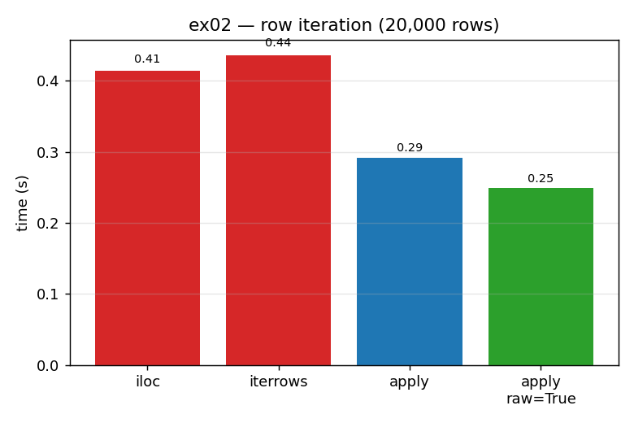

# ex02_row_iteration

There are several ways to run a function over every row of a DataFrame, and new pandas users
almost always pick one of the slow ones. This exercise runs the identical OLS slope
calculation over 20,000 rows four ways — a `for` loop with `iloc`, `iterrows`, `apply(axis=1)`,
and `apply(axis=1, raw=True)` — so you can see that the *vehicle* you choose to move over the
rows, not the arithmetic inside, is what sets the speed.

(The book uses 100,000 rows; this drill uses 20,000 so the slow `iloc` path stays comfortable
to benchmark repeatedly. The ordering and the lesson are unchanged.)

## What it measures

The same per-row OLS over 20,000 rows × 14 columns:

| method | time | speedup vs `iloc` |
| --- | ---: | ---: |
| `iloc` loop | ~0.41 s | 1.0× |
| `iterrows` | ~0.42 s | ~1.0× |
| `apply(axis=1)` | ~0.28 s | ~1.5× |
| `apply(axis=1, raw=True)` | ~0.25 s | ~1.6× |

This is the chapter's Table 7-1 in miniature. `iloc` and `iterrows` are effectively tied at
the back; `apply` is the clear step up; and `raw=True` shaves off a little more on top.

## What we found

Every time you write `df.iloc[i]` or step through `df.iterrows()`, pandas builds a brand-new
`Series` object for that row — it locates the row by index, wraps its values in a fresh object
with its own metadata, hands it back, and you bind it to a variable. Repeat that 20,000 times
and the per-row object churn, not the OLS, is where the time goes. `apply` skips the
Python-level intermediate references and is noticeably quicker for it. `raw=True` goes one
step further and hands your function the bare NumPy array underneath the row, so even
`apply`'s internal Series construction disappears.

That last point matters far beyond the small margin it wins here: a bare NumPy array is the
*only* form Numba or Cython can compile. `raw=True` is precisely what strips the
un-compilable pandas layer out of the hot path — which is what unlocks the 26× Numba win in
[ex03](../ex03_numba_compile/).

## Reading the chart



Four bars of wall-clock time in seconds. The two red bars on the left (`iloc`, `iterrows`)
stand tallest and almost equal; the blue `apply` bar drops by about a third; the green
`apply raw=True` bar is shortest. The colour coding (red = avoid, green = prefer) carries the
recommendation at a glance.

## 5 Whys

1. **Why is `apply` ~1.5× faster than `iloc`/`iterrows` for the identical calculation?**
   `iloc` and `iterrows` construct and dereference a *fresh `Series` per row* through extra
   Python machinery; `apply` feeds the function each row without those intermediate references.
2. **Why is building a per-row Series expensive?** Each dereference locates the row, allocates
   a new Series object with metadata, returns it, and rebinds it — Python-level object churn
   repeated tens of thousands of times.
3. **Why does `raw=True` shave off even more?** It skips even `apply`'s internal Series
   construction and hands the function the bare NumPy array, so the per-row allocation
   vanishes entirely.
4. **Why does passing the bare array matter beyond the small speed gain?** Numba and Cython
   can't compile a pandas `Series`, only NumPy arrays — `raw=True` removes the un-compilable
   layer and is the prerequisite for ex03's compiled fast path.
5. **Why does per-row overhead dominate when the maths is identical across methods?** The
   `lstsq` solve per row is microseconds; over 20,000 rows the constant cost of allocating
   20,000 Series objects swamps the actual computation.

**Root cause:** in pandas the row-iteration vehicle, not the per-row arithmetic, sets the
speed — eliminating per-row Python object construction is the only lever that matters, and
`raw=True` removes it completely.

## Run

```bash
.venv/bin/python chapter_7/ex02_row_iteration/ex02_row_iteration.py
# regenerate this chart:
.venv/bin/python chapter_7/visualize_exercises.py --only ex02
```
