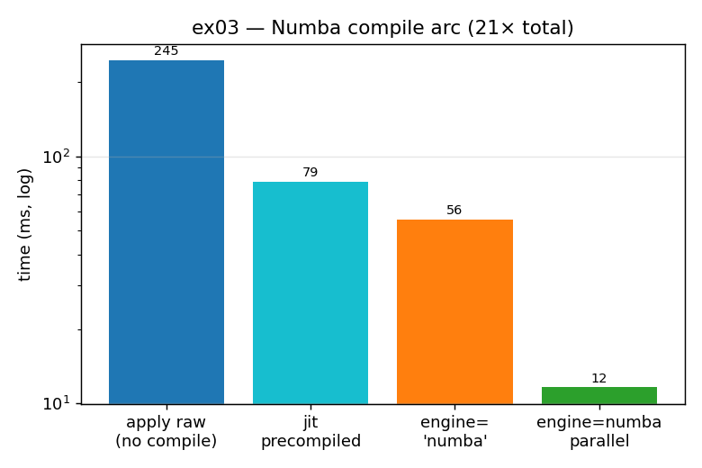

# ex03_numba_compile

[ex02](../ex02_row_iteration/) ended on the fastest *pure-pandas* option, `apply(raw=True)`,
which hands your function the bare NumPy array. This exercise picks up exactly there and asks:
now that the un-compilable pandas layer is gone, what does compiling the row function with
Numba buy us? The answer is an order of magnitude, and then another half on top of that once
we let Numba spread the rows across cores.

## What it measures

The same `raw=True` row-wise OLS over 20,000 rows, compiled four progressively more aggressive
ways. Times exclude the one-off compilation, which is paid once on the first call:

| variant | time | speedup vs uncompiled |
| --- | ---: | ---: |
| `apply(raw=True)`, no compile | ~255 ms | 1.0× |
| precompiled `numba.jit` function | ~83 ms | ~3× |
| `engine="numba"` fast path | ~59 ms | ~4× |
| `engine="numba"`, `parallel=True` | ~10 ms | **~26×** |

The book reports a 23× end-to-end speedup; here it lands around 26×. Either way the message is
the same: native compilation plus GIL-free parallelism compounds into a transformation, not a
tweak.

## What we found

The per-row body is tight numeric NumPy work, and run through the CPython interpreter it pays
bytecode-dispatch overhead on every single operation. Numba JIT-compiles that body to native
machine code, and the interpreter overhead simply evaporates — that alone is the jump from
255 ms to the 60–80 ms range. The built-in `engine="numba"` path is a touch faster than
hand-decorating the function because pandas wires the compiled function more directly into its
apply loop.

The dramatic step is `engine_kwargs={'parallel': True}`. Each row's OLS is completely
independent of every other — an embarrassingly parallel problem — so Numba's auto-parallelizer
farms partitions of rows out across the cores, and because the work is now compiled native
code rather than Python, it runs free of the GIL. That final flag is what takes ~59 ms down to
~10 ms.

The one non-negotiable condition: **this only works on NumPy storage.** Numba cannot compile a
pandas `Series`, and it cannot compile a PyArrow array either — its code generation targets
NumPy's contiguous memory layout. That is the through-line from ex02: `raw=True` gave us the
bare NumPy array, and the bare NumPy array is the entry ticket to everything here.

## Reading the chart



Four bars on a **logarithmic** y-axis (milliseconds). Reading left to right is the whole
optimization arc: the tall blue uncompiled bar, a big drop to the precompiled and
`engine="numba"` bars in the middle, then a final plunge to the short green parallel bar. The
log scale keeps all four visible at once; on a linear axis the 10 ms parallel bar would be a
sliver against the 255 ms baseline.

## 5 Whys

1. **Why does Numba take the `raw=True` apply from ~255 ms to ~10 ms?** It JIT-compiles the
   Python OLS body to native machine code, and `parallel=True` splits the rows across CPU
   cores.
2. **Why does compiling help so much here?** The per-row body is tight numeric NumPy work; run
   through the interpreter it pays bytecode-dispatch overhead on every operation, which native
   compiled code eliminates entirely.
3. **Why does it require `raw=True` / NumPy storage to work at all?** Numba can compile only
   NumPy arrays — not a pandas `Series`, not a PyArrow array — and `raw=True` is what hands it
   the bare NumPy array.
4. **Why can't Numba just compile PyArrow arrays?** Its type system and code generation target
   NumPy's contiguous memory layout; Arrow's columnar representation isn't supported by the
   compiler (at the time of writing).
5. **Why does `parallel=True` add the final jump?** The rows are embarrassingly parallel — each
   OLS is independent — so Numba's auto-parallelizer farms partitions to multiple cores, and
   the compiled path runs free of the GIL.

**Root cause:** the wins compound — native compilation kills interpreter overhead, GIL-free
parallelism uses every core — but the entry ticket is NumPy storage, since neither Numba nor
its parallel path can touch Arrow.

## Run

```bash
.venv/bin/python chapter_7/ex03_numba_compile/ex03_numba_compile.py
# regenerate this chart:
.venv/bin/python chapter_7/visualize_exercises.py --only ex03
```
