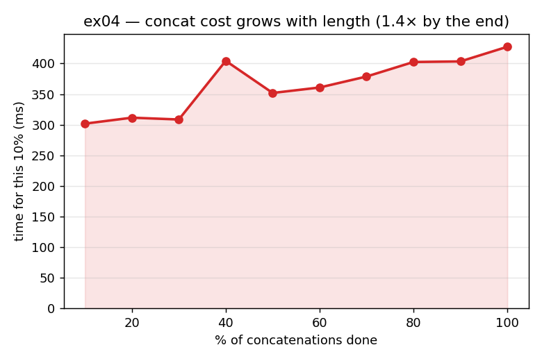

# ex04_concat_quadratic

In ex02 we carefully collected each row's result into a Python list and only built a Series at
the very end. This exercise shows *why* that ordering matters by doing the tempting thing
instead: growing the result Series one element at a time with `pd.concat` on every iteration.
It looks innocent, and it is a quadratic trap.

## What it measures

Two things. First, the headline — accumulating 8,000 per-row OLS results two ways:

| approach | time | vs list |
| --- | ---: | ---: |
| append to a list, build one Series | ~0.17 s | 1.0× |
| `pd.concat` on every iteration | ~0.64 s | ~3.8× slower |

Second, to expose *where* the cost comes from, the script times each successive 10% block of a
pure concatenation of 60,000 single elements (values precomputed, so the only thing measured
is the concat itself). The final block runs roughly **1.5× slower than the first** — each
chunk is slower than the one before it.

## What we found

A pandas Series is backed by a single contiguous array, and you cannot grow a contiguous array
in place. So every `pd.concat` has to allocate a brand-new array one element longer and copy
*all* the elements already accumulated into it. Copying N elements on iteration N, summed over
the whole run, is 1 + 2 + … + N ≈ N²/2 — classic O(N²). That is why, in the per-chunk
breakdown, each 10% block is slower than the last: the Series it has to copy keeps getting
longer.

A Python list does not have this problem. `list.append` is amortized O(1): CPython
over-allocates the backing array geometrically, so most appends touch no new memory at all,
and you pay a single allocation when you build the Series once at the end. The fix is therefore
exactly the pattern ex02 used without comment — accumulate in a list, materialize the array
once.

One honesty note worth stating plainly: at 8,000 rows the headline ratio (~3.8×) is dominated
by `concat`'s high *fixed* per-call overhead, not yet by the copy. You have to isolate the
concatenation and push to ~60,000 elements before the growing-copy term becomes the visible
driver — which is exactly what the per-chunk measurement does, and why it uses a larger,
precomputed run.

## Reading the chart



This chart is the per-chunk measurement — a reproduction of the book's Figure 7-3. The x-axis
is "% of the concatenations done" and the y-axis is the time taken for that 10% block. The line
climbs steadily from left to right: the work done in the last 10% is markedly more than the
work done in the first 10%, even though each block does the *same number* of concatenations.
The only thing that changed is how long the Series being copied has grown — which is the
quadratic signature made visible.

## 5 Whys

1. **Why does iterative `concat` (~0.64 s) take several times longer than appending to a list
   (~0.17 s)?** Every `pd.concat` builds an entirely new Series in fresh memory, one element
   longer, copying all previously accumulated values each time.
2. **Why must `concat` copy everything each time?** A Series is backed by a contiguous array;
   you can't grow it in place, so extending it means allocating a new array and copying the
   existing N elements across.
3. **Why does that make total cost grow super-linearly?** Copying N elements on iteration N,
   summed over the run, is ≈ N²/2 — so each successive concat is slower than the last, as the
   per-chunk chart shows.
4. **Why is a Python list immune?** `list.append` is amortized O(1): CPython over-allocates the
   backing array geometrically, so appends rarely copy, and you pay one allocation building the
   Series at the end.
5. **Why not just have Series over-allocate like a list?** pandas/NumPy arrays are designed for
   fixed-size contiguous storage that keeps vectorized ops cache-friendly; geometric slack
   would break that contract, so they deliberately don't.

**Root cause:** immutable contiguous arrays make incremental growth O(N²) — accumulate in an
amortized-O(1) Python list and materialize the array exactly once.

## Run

```bash
.venv/bin/python chapter_7/ex04_concat_quadratic/ex04_concat_quadratic.py
# regenerate this chart:
.venv/bin/python chapter_7/visualize_exercises.py --only ex04
```
