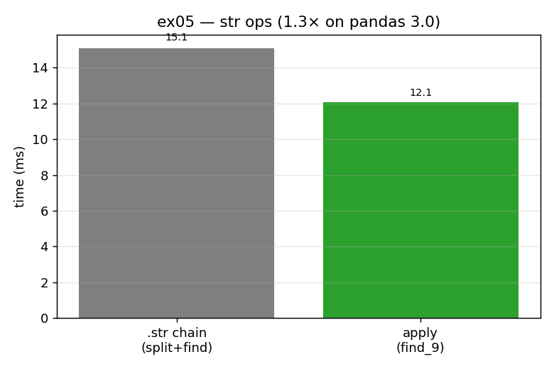

# ex05_str_apply_vs_chain

Pandas usually offers more than one way to do a job, and they rarely cost the same. This
exercise takes a small but realistic string task — find the position of the first digit `9`
after the decimal point in a column of number-strings — and solves it two ways: a chain of
pandas `.str` accessors, and a plain Python function pushed through `apply`. They return
identical answers; only the overhead differs.

## What it measures

Locating the first `9` across 50,000 strings:

| approach | time | vs chain |
| --- | ---: | ---: |
| `.str.split('.', expand=True)[1].str.find('9')` | ~15 ms | 1.0× |
| `apply(find_9)` | ~12 ms | ~1.3× faster |

The book measured a 3× gap here. On **pandas 3.0**, where Copy-on-Write is the default, the
gap narrows to roughly 1.3× — but `apply` still wins, and the reasoning behind it is unchanged.

## What we found

The `.str` chain has to build several intermediate pandas objects to get its answer. The
`split('.', expand=True)` step alone materializes a whole new DataFrame (one column for the
part before the decimal point, one for the part after), of which we then keep a single column
before running `find`. Each of those steps is a fresh pandas object with its own bookkeeping.
The `apply(find_9)` version, by contrast, does all of the string work one row at a time inside
an ordinary Python function and never constructs a new pandas object along the way.

Why is the gap smaller than the book's 3×? Pandas 3.0's Copy-on-Write removed many of the
defensive copies the chain implicitly paid for in earlier versions, so the intermediate-object
penalty is simply lighter than it used to be. That is a genuinely useful thing to have
measured: the *direction* of the advice (prefer the single readable `apply`) survives a major
version bump, even as the *magnitude* shrinks. And `apply` keeps two advantages the timing
doesn't show — `find_9` is a normal function you can unit-test in one line, and it can be
parallelized with Dask or Swifter (see [ex08](../ex08_dask_parallel_apply/)).

## Reading the chart



Two bars in milliseconds: the grey `.str` chain on the left, the green `apply(find_9)` on the
right. The green bar is shorter, but not dramatically — the title notes the ~1.3× margin on
pandas 3.0, a deliberate reminder that this particular win got smaller as the library improved.

## 5 Whys

1. **Why is `apply(find_9)` faster than the `.str` chain when both return the same answer?**
   The chain builds several intermediate pandas objects (notably `expand=True`, which
   materializes a whole DataFrame); `apply` does the work per row with no new pandas objects.
2. **Why are those intermediate objects costly?** Each is a fresh pandas structure with its own
   memory and metadata, allocated and then mostly discarded — overhead the per-row function
   never incurs.
3. **Why is the gap only ~1.3× here, not the book's 3×?** Pandas 3.0's Copy-on-Write removed
   many defensive copies the chain used to pay for, so the intermediate-object penalty is now
   lighter.
4. **Why prefer `apply` anyway, given the smaller margin?** Beyond speed, `find_9` is trivially
   unit-testable and parallelizable, and it reads as ordinary Python — easier to maintain than
   a long accessor chain.
5. **Why does the direction of the advice survive but the magnitude shrink?** The mechanism
   (fewer intermediate objects) is still real, but the library got cheaper at the thing the
   chain does badly, compressing the absolute difference.

**Root cause:** the chain's cost is the intermediate pandas objects it builds; `apply` avoids
them, so it stays faster and more maintainable even as Copy-on-Write narrows the raw timing
gap.

## Run

```bash
.venv/bin/python chapter_7/ex05_str_apply_vs_chain/ex05_str_apply_vs_chain.py
# regenerate this chart:
.venv/bin/python chapter_7/visualize_exercises.py --only ex05
```
