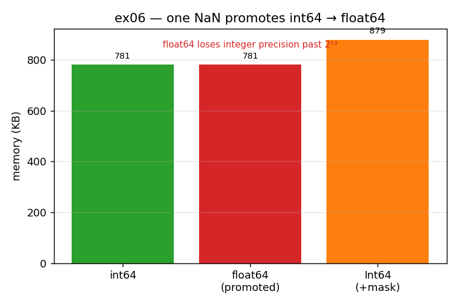

# ex06_nan_int_promotion

This exercise is about a quiet correctness hazard rather than raw speed. Drop a single missing
value into an integer column and watch what pandas does: with the default NumPy-backed storage,
the *entire* column is silently promoted from `int64` to `float64`. That promotion can lose
numeric precision, and it happens without a warning. The exercise contrasts that default
against pandas' nullable `Int64` (capital I), which keeps the integers exact by storing
missingness in a separate mask.

## What it measures

Starting from 100,000 integers and introducing one missing value:

| storage | dtype after one missing value | memory |
| --- | --- | ---: |
| default NumPy `int64` | becomes `float64` | ~781 KB |
| nullable pandas `Int64` | stays `Int64` | ~879 KB |

And a concrete precision demonstration: `2**53 + 1 = 9007199254740993` becomes
`9007199254740992` once it passes through a `float64` — the `+1` is gone.

## What we found

NaN is a concept that only exists for floating-point numbers. IEEE-754 floats reserve specific
bit patterns to mean "not a number"; a NumPy `int64`, by contrast, uses *every* bit pattern to
represent an actual integer, so there is no spare encoding left to mean "missing". Faced with a
missing value in an integer column, pandas has only one option with NumPy storage: recast the
whole column to `float64`, which *can* hold NaN.

That recast is not free of consequences. A `float64` can represent every integer exactly only
up to 2⁵³; beyond that, consecutive integers start rounding to the same float. So a column of
large identifiers — order numbers, user IDs — can be silently corrupted the moment one NaN
forces the promotion. (And had the column been a 1-byte `bool`, the smallest float it could be
promoted to is `float16`, doubling its footprint on the way up.)

The nullable `Int64` escapes the whole problem by keeping the integers in a NumPy `int64` array
*and* carrying a separate Boolean array that marks which entries are missing. The "hole" lives
outside the integers, so the integers themselves stay exact and NaN-aware at the same time. The
price is that side-car mask — about one extra byte per element, visible as the ~781 KB → ~879 KB
bump in the table. pandas didn't work this way from the start because it originally inherited
only NumPy's dtypes; the nullable extension types (`Int64`, nullable `boolean`, `StringDType`)
were added later, specifically to support missing data with three-valued logic.

## Reading the chart



Three memory bars in kilobytes: the green `int64` (no NaN possible), the red `float64`
(post-promotion, same 8-byte width but now numerically lossy), and the amber `Int64` (slightly
taller because of the per-element mask). The annotation across the top is the real point — the
red float column has *paid in precision*, not in memory, which is the failure mode that bites
silently.

## 5 Whys

1. **Why does dropping one NaN into an `int` Series promote the whole column to `float`?**
   pandas' default storage is NumPy `int64`, which has no bit pattern reserved for "missing" —
   only floats define a NaN value, so the column is recast to `float64` to hold it.
2. **Why can't an integer just encode NaN itself?** Every bit pattern of an `int64` is already a
   valid number; there's no spare encoding for "missing", unlike `float64`, which reserves
   specific bits for NaN.
3. **Why is that recast a real problem and not just cosmetic?** A `float64` represents integers
   exactly only up to 2⁵³; past that, large integers silently round to a neighbour, so ids can
   be corrupted.
4. **Why does the nullable `Int64` escape this?** It pairs a NumPy `int64` array with a
   *separate* Boolean mask marking missing entries — the hole lives outside the integers, so
   they stay exact.
5. **Why didn't pandas work this way from the start?** It originally inherited only NumPy's
   non-NaN-aware dtypes; the nullable extension types were added later to support missing data
   with three-valued logic.

**Root cause:** NaN is a float-only concept in NumPy, so an integer column has nowhere to store
"missing" — you either accept a silent precision-losing promotion to float, or carry a
side-car Boolean mask (the extension dtypes).

## Run

```bash
.venv/bin/python chapter_7/ex06_nan_int_promotion/ex06_nan_int_promotion.py
# regenerate this chart:
.venv/bin/python chapter_7/visualize_exercises.py --only ex06
```
