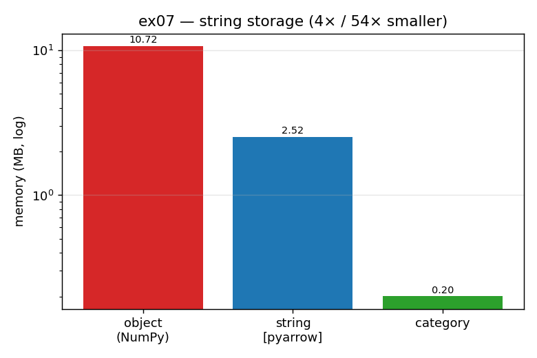

# ex07_arrow_vs_numpy_strings

Pandas 2.x added PyArrow as a storage backend alongside the original NumPy arrays, and the two
have very different strengths. This exercise makes the most lopsided of those differences
concrete: how much RAM a low-cardinality *string* column costs under NumPy's default `object`
storage, under PyArrow strings, and under pandas `category` — and then checks the *numeric*
case to show why the sensible default is "NumPy for numbers, Arrow for strings".

## What it measures

A 200,000-row column drawn from just five distinct strings (`type_a`, `type_b`, `type_c`,
`yes`, `no`):

| storage | memory | vs object |
| --- | ---: | ---: |
| `object` (NumPy) | ~10.2 MB | 1.0× |
| `string[pyarrow]` | ~2.4 MB | ~4.3× smaller |
| `category` | ~0.20 MB | ~53× smaller |

And the same 200,000 values as a numeric column:

| storage | memory |
| --- | ---: |
| `float64` (NumPy) | ~1.5 MB |
| `double[pyarrow]` | ~1.5 MB |

For numbers, the two backends are essentially a tie.

## What we found

NumPy's `object` dtype doesn't really store strings — it stores an array of *pointers* to
Python `str` objects scattered across the heap, and it keeps a separate object for every cell
even when the same five words repeat 200,000 times. That is why the object column is so heavy:
you are paying for 200,000 full Python strings plus their pointers. PyArrow instead keeps a
compact, contiguous columnar buffer, which is why it is several times smaller and faster to
operate on. And `category` goes furthest of all when the cardinality is genuinely low: it
stores each *distinct* value exactly once in a small dictionary and then represents the column
as an array of tiny integer codes — five words plus 200,000 little integers, hence the ~53×
reduction.

The numeric comparison is the other half of the lesson. For plain `float64` numbers there is no
repeated-object waste to eliminate — NumPy already stores them as a contiguous block of doubles
— so Arrow's representation lands right alongside it. This is exactly why the chapter's
practical advice is to keep numbers in NumPy and reach for Arrow on string columns. The one
caveat the book adds: if you're loading from **Parquet**, stay on Arrow regardless, because
Parquet *is* Arrow internally and converting to NumPy on the way in just burns time.

## Reading the chart



Three bars on a **logarithmic** y-axis (megabytes), for the string column. The red `object`
bar towers over the others; the blue `string[pyarrow]` bar is a few times shorter; the green
`category` bar is tiny. The log scale is what lets all three share an axis — on a linear scale
the category bar would be an invisible sliver against the 10 MB object bar, which would hide
the most dramatic saving of the three.

## 5 Whys

1. **Why does an `object` string column use several times more RAM than Arrow or category?**
   It stores a pointer to a separate Python `str` object for every cell, repeating each value
   even when only five distinct strings exist.
2. **Why does PyArrow shrink it ~4×?** Arrow keeps a compact contiguous columnar buffer instead
   of scattered Python objects and pointers.
3. **Why does `category` shrink it ~53×?** It stores each distinct value once in a dictionary
   and represents the column as an array of small integer codes — ideal for low cardinality.
4. **Why is the numeric column a tie between NumPy and Arrow?** Plain floats have no
   repeated-object waste to remove — NumPy already stores them as a contiguous block of doubles
   — so Arrow can't do better.
5. **Why does that lead to "NumPy for numbers, Arrow for strings"?** The big win is on strings
   and the numeric case is a wash, so you match each column type to the backend that helps it —
   while staying on Arrow when the source is Parquet.

**Root cause:** NumPy stores strings as scattered, repeated Python objects, which is wasteful;
Arrow and category pack them compactly. Numbers are already compact in NumPy, so there the
backends tie.

## Run

```bash
.venv/bin/python chapter_7/ex07_arrow_vs_numpy_strings/ex07_arrow_vs_numpy_strings.py
# regenerate this chart:
.venv/bin/python chapter_7/visualize_exercises.py --only ex07
```
