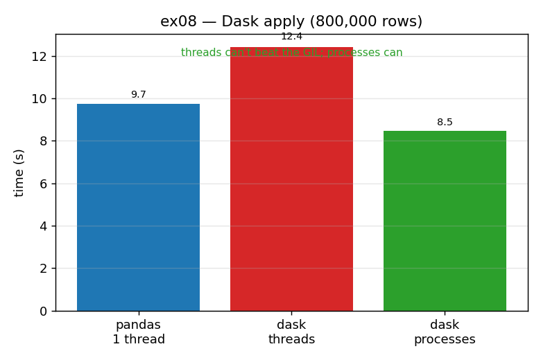

# ex08_dask_parallel_apply

Everything up to here has run on a single core. Dask is the chapter's route to using all of
them (and, beyond this drill, to datasets larger than RAM). This exercise takes the familiar
`raw=True` row-wise OLS, blows the DataFrame up to 800,000 rows, and runs it three ways: plain
single-threaded pandas, Dask with its default `threads` scheduler, and Dask with the
`processes` scheduler. The result is a clean demonstration of *why the scheduler choice is the
whole game* for GIL-bound pandas work.

## What it measures

Row-wise OLS over 800,000 rows, on a 10-core machine, split into 8 Dask partitions:

| approach | time | speedup |
| --- | ---: | ---: |
| pandas, single thread | ~9.9 s | 1.00× |
| Dask, `threads` scheduler | ~13.0 s | ~0.76× (slower!) |
| Dask, `processes` scheduler | ~8.8 s | ~1.13× |

The default thread scheduler is actually *slower* than plain pandas; only `processes` pulls
ahead.

## What we found

Dask's default scheduler uses threads, and threads share one Python interpreter — and one GIL.
A pandas row `apply` is GIL-bound (it spends its time in Python-level per-row work, not in
long GIL-releasing NumPy calls), so running it across threads gains nothing and actually loses
ground to coordination overhead. That is the ~0.76× row: more machinery, no parallelism.

Switching to the `processes` scheduler sidesteps the GIL entirely by running real worker
*processes*, each with its own interpreter. Now the cores genuinely work in parallel — but
there's a new cost: Dask has to pickle each partition and ship it to a worker, then collect the
results back. On this 800,000-row job that overhead is mostly amortized and we come out ahead,
but only modestly (~1.13×). The book sees a similarly modest gain at this kind of scale (its
80 s → 52 s example), and that is the honest shape of the result: process-based parallelism for
a cheap-per-row function wins clearly only once each partition carries *enough* CPU work to
dwarf the cost of moving its data. (Combine it with the compiled Numba function from
[ex03](../ex03_numba_compile/) and the per-partition work gets heavier and the case for
processes stronger.)

There is also a practical wrinkle this exercise has to respect: the `processes` scheduler
spawns workers, and on Python 3.14 / macOS that uses *spawn*, which re-imports the module in
each child. So the script — and the dashboard generator — must keep their real work under
`if __name__ == "__main__"`, or the children would recursively re-launch.

## Reading the chart



Three bars in seconds. The blue pandas baseline sits in the middle; the red `dask threads` bar
is the *tallest* — the visual punchline that threads made it worse — and the green
`dask processes` bar is the shortest. The annotation states the lesson directly: threads can't
beat the GIL; processes can.

## 5 Whys

1. **Why is Dask's default `threads` scheduler slower than plain single-threaded pandas?**
   pandas' row `apply` is GIL-bound, so threads can't run it in parallel and only add
   coordination overhead.
2. **Why is `apply` GIL-bound?** It spends its time in Python-level per-row work rather than in
   long, GIL-releasing C/NumPy calls, so the interpreter lock is held throughout.
3. **Why does the `processes` scheduler help where threads can't?** Separate processes each
   have their own interpreter and GIL, so the cores genuinely run in parallel.
4. **Why is the process speedup only modest (~1.13×)?** Dask must pickle each partition to its
   worker and collect results back; for a cheap-per-row function that IPC cost eats much of the
   parallel gain.
5. **Why would the case for processes get stronger with heavier work?** The pickling cost is
   roughly fixed per partition, so the more CPU work each partition carries (e.g. a compiled
   Numba body), the more the parallelism outweighs the data-movement overhead.

**Root cause:** parallelizing GIL-bound pandas needs real processes, not threads — and process
parallelism only pays once each partition's compute outweighs the cost of shipping its data to
a worker.

## Run

```bash
.venv/bin/python chapter_7/ex08_dask_parallel_apply/ex08_dask_parallel_apply.py
# regenerate this chart:
.venv/bin/python chapter_7/visualize_exercises.py --only ex08
```
