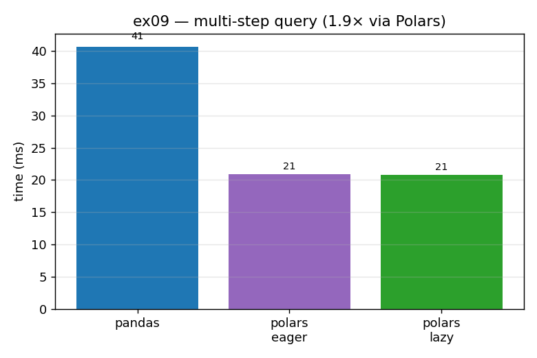

# ex09_polars_vs_pandas

Polars is the chapter's young, fast challenger to pandas. Rather than reproduce a single
operation, this exercise runs a small but realistic *pipeline* — filter rows, derive a new
column, group-by-aggregate, sort, take the top 10 — in pandas and in Polars (both its eager and
its lazy API), over 5,000,000 rows. The point is to feel the typical speed difference you get
for an equivalent set of lines, with no manual tuning on either side.

## What it measures

`filter → derive a column → groupby-aggregate → sort → head(10)` over 5,000,000 rows:

| engine | time | speedup |
| --- | ---: | ---: |
| pandas | ~41 ms | 1.0× |
| Polars (eager) | ~21 ms | ~2.0× |
| Polars (lazy) | ~21 ms | ~2.0× |

Polars comes in around twice as fast here — the low end of the "typically 2–10×" range the book
quotes for in-RAM data.

## What we found

Three design decisions explain the gap. Polars stores data only in Arrow (no dual NumPy/Arrow
machinery to maintain or convert between), it has a query optimizer baked in, and it
parallelizes across cores automatically. So the same sequence of operations spreads over the
machine and skips redundant work without the developer asking. On this 5-million-row in-RAM
frame, an equivalent pandas pipeline lands at roughly half Polars' throughput.

The eager and lazy timings are essentially identical here, and that is worth understanding
rather than glossing over. The lazy API (`.lazy() … .collect()`) lets the optimizer see the
*entire* plan before executing it, which is what enables tricks like predicate pushdown (filter
rows at the data source) and projection pushdown (read only the columns you need). But in this
exercise the data is already fully in memory and every column is used, so there is nothing for
those pushdowns to skip — the optimizer can't beat eager when there's no redundant I/O to
eliminate. Where lazy *would* pull decisively ahead is scanning from Parquet (push the filter
and column selection down into the file read) or running the experimental streaming mode on
data larger than RAM. The honest takeaway: 2× here is real, and the lazy API's bigger wins live
in scenarios this in-RAM micro-benchmark deliberately doesn't exercise.

And, as the book insists: all benchmarks tell someone else's story on their data. Run your own.

## Reading the chart



Three bars in milliseconds: the tall blue pandas bar, then the two shorter Polars bars (eager
in violet, lazy in green) at roughly half the height and nearly equal to each other. The near-
equality of the two Polars bars is itself informative — it shows that the lazy optimizer has
nothing extra to exploit on a fully-in-RAM frame where every column is read.

## 5 Whys

1. **Why is Polars ~2× faster than pandas on the same pipeline?** It stores data only in Arrow,
   runs a built-in query optimizer, and parallelizes across cores automatically — so equivalent
   code spreads over the machine with no tuning.
2. **Why does Arrow-only storage help?** It avoids maintaining and converting between two
   internal representations (NumPy and Arrow), simplifying and speeding the execution paths.
3. **Why are the eager and lazy timings identical here?** The data is fully in RAM and every
   column is used, so the optimizer's pushdowns have no redundant I/O or columns to skip.
4. **Why would lazy win bigger elsewhere?** Scanning from Parquet lets it push the filter and
   column selection into the file read, and streaming mode lets it process larger-than-RAM data
   in chunks — neither of which this in-RAM benchmark exercises.
5. **Why only ~2× and not the book's upper end of 10×?** The multiple depends heavily on the
   operation and data shape; a groupby-heavy pipeline on in-RAM numeric data is relatively
   pandas-friendly, landing at the low end of the range.

**Root cause:** Polars' Arrow-only storage, built-in query optimizer, and automatic
multicore execution make equivalent code several times faster — and its lazy API adds further
gains precisely in the I/O-bound and larger-than-RAM cases an in-RAM micro-benchmark can't show.

## Run

```bash
.venv/bin/python chapter_7/ex09_polars_vs_pandas/ex09_polars_vs_pandas.py
# regenerate this chart:
.venv/bin/python chapter_7/visualize_exercises.py --only ex09
```
