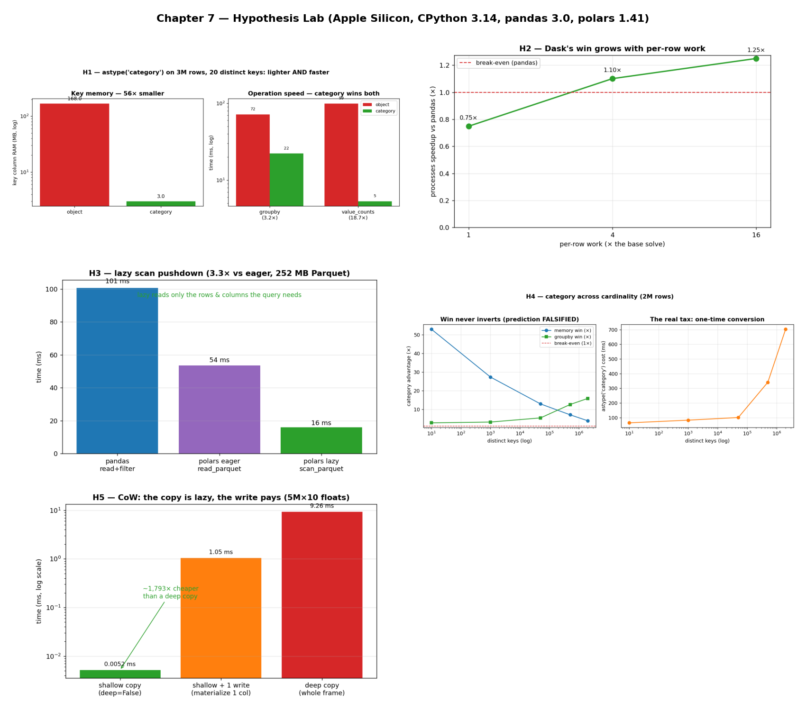

# Chapter 7 — Hypothesis Lab

Beyond reproducing the chapter's examples, these are extra falsifiable drills: state a
mechanism, predict an outcome, then benchmark to find out whether the prediction holds. Each
lives in its own folder with a runnable `bench.py` (add `--plot` to save its chart) and a
`README.md` recording the prediction, the measured numbers, and the verdict. Several of these
deliberately pick up where an exercise left off — finishing a story ex08 and ex09 could only
gesture at.

All numbers are from **Apple Silicon / CPython 3.14 / pandas 3.0 / polars 1.41** — yours will
differ.

```bash
# print results for one hypothesis
.venv/bin/python chapter_7/hypothesis/h01_category_groupby/bench.py
# add --plot to also save that folder's chart PNG
.venv/bin/python chapter_7/hypothesis/h01_category_groupby/bench.py --plot
# re-tile all five charts into the dashboard below (does NOT re-run the slow benches)
.venv/bin/python chapter_7/hypothesis/visualize.py
```

## Dashboard



Each `bench.py` saves its own chart with `--plot`; `visualize.py` tiles all five into
`hypothesis_dashboard.png` above (it only assembles the saved PNGs — H2's Dask sweep and H3's
Parquet scan are too slow to regenerate every time). Each folder's own `README.md` walks
through how to read its individual chart.

## The hypotheses

| # | Hypothesis | Prediction | Verdict |
| --- | --- | --- | --- |
| **H1** | `astype('category')` on a low-cardinality key is lighter *and* faster | RAM drops ~rows/cardinality; groupby moderately faster; value_counts faster still | **CONFIRMED** — key ~56× smaller, groupby ~3.2×, value_counts ~18.7× (3M rows, 20 keys) |
| **H2** | Dask's process win over pandas grows with per-row work | speedup rises from <1× toward the core count as work increases | **CONFIRMED** — 0.75× → 1.10× → 1.25× as per-row work goes 1→4→16× |
| **H3** | Polars `lazy` beats `eager` only when it can push into a Parquet scan | lazy ≫ eager via predicate + projection pushdown | **CONFIRMED** — lazy `scan_parquet` ~3.3× faster than eager read (252 MB file) |
| **H4** | `category` reverses to a liability as cardinality rises | memory & groupby wins shrink toward 1× and invert | **FALSIFIED** — wins never invert (mem 53×→4×, groupby 2.8×→16×); only the one-time `astype` is a real tax |
| **H5** | pandas 3.0 Copy-on-Write makes a copy lazy until first write | shallow copy ~free; write pays ~one column, not the frame | **CONFIRMED** — shallow ~1,800× cheaper than deep; first write ≈ deep ÷ 9; original stays safe |

## Why these matter

- **H4** is the standout: a plausible, mechanism-based prediction the benchmark *overturns* —
  `category` is far more robust than its folklore, winning on memory and groupby even at full
  cardinality, with the one-time conversion as its only genuine cost. The purest demonstration
  of "measure, don't assume."
- **H2** and **H3** are the honest sequels to the exercises: ex08 admitted Dask's process win
  was modest and *why*; H2 confirms the win climbs once per-row work amortizes the overhead.
  ex09 found eager == lazy in RAM and claimed lazy's edge lives in pushdown; H3 measures that
  edge on a real Parquet file.
- **H1** and **H5** anchor the chapter's two storage themes — `category` for low-cardinality
  strings, and pandas 3.0's Copy-on-Write — each turned from advice into a measured result.

Four confirmations and one instructive refutation. The refutation (H4) is where the learning
is: a confidently-held belief that the data corrected.

## 5 Whys: why run a hypothesis lab at all?

1. **Why benchmark these instead of trusting the advice?** Because one of the five (H4)
   contradicted a perfectly plausible mechanism — reasoning alone would have left that belief
   wrong, and two others (H2, H3) had *structure* (a trend, a precondition) that only
   measurement reveals.
2. **Why does sound reasoning mislead here?** Performance depends on interacting layers —
   storage representation, IPC overhead, file-format statistics, copy semantics — and intuition
   usually models only one of them.
3. **Why can't you account for all the layers up front?** They interact in version- and
   hardware-specific ways; pandas 3.0's Copy-on-Write alone moved several of this book's
   numbers (see ex05, H5).
4. **Why structure each as explicit prediction → measurement?** Writing the prediction down
   first turns a hunch into a falsifiable claim the benchmark can confirm or refute, rather than
   just producing a number.
5. **Why keep the refuted result (H4) prominent?** Because a confidently-wrong prediction the
   data overturns is the most valuable thing here — it's where the mental model gets corrected.

**Root cause:** dataframe performance is too layered and library-specific to predict reliably,
so the only trustworthy path is to hypothesize a mechanism, predict an outcome, and let the
measurement decide.
