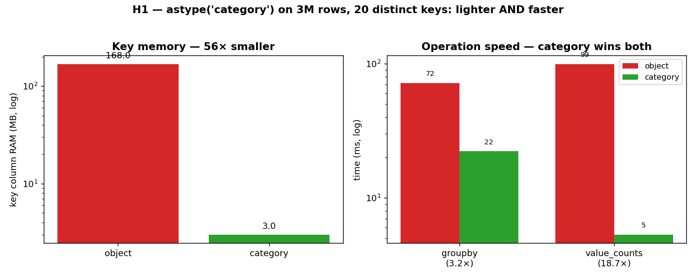

# H1 — `astype('category')`: lighter *and* faster for low-cardinality keys

The chapter's "Advice for Effective Pandas Development" section suggests that for large Series
of low-cardinality strings — think `"yes"`/`"no"`, or a handful of `type_a`/`type_b`/`type_c`
codes — you should try converting to the `category` dtype, promising both lower memory and
faster operations like `value_counts` and `groupby`. This hypothesis tests that claim head-on
by building a 3-million-row frame whose key column has only 20 distinct values, and comparing
the default `object` storage against `category` on memory and on two split-apply-combine
operations.

**Hypothesis:** converting the key to `category` cuts its memory and speeds up groupby and
value_counts at the same time.

**Prediction:** the key's RAM drops by roughly the ratio of rows to distinct values; groupby
gets moderately faster; `value_counts` — which is almost pure key-bucketing — gets faster
still.

## Run

```bash
.venv/bin/python chapter_7/hypothesis/h01_category_groupby/bench.py
.venv/bin/python chapter_7/hypothesis/h01_category_groupby/bench.py --plot   # regenerate the chart
```

## Measured (Apple Silicon, CPython 3.14, pandas 3.0) — 3M rows, 20 distinct keys

| measurement | object | category | win |
| --- | ---: | ---: | ---: |
| key column RAM | 168.0 MB | 3.0 MB | **~56× smaller** |
| `groupby('k')['v'].mean()` | 71.7 ms | 22.2 ms | ~3.2× faster |
| `['k'].value_counts()` | 99.2 ms | 5.3 ms | **~18.7× faster** |

## Reading the chart



Two panels, both on **logarithmic** axes. On the left, the key-column memory: the red `object`
bar towers at 168 MB while the green `category` bar sits at 3 MB — a reduction so large the log
scale is the only way to show both honestly. On the right, the two operations as grouped bars
(red `object`, green `category`): `groupby` shows a clear ~3× gap, and `value_counts` shows a
much wider one, the green bar barely clearing the axis floor. The right panel's two different
gap sizes are the interesting part — the speedup depends entirely on *how much* of the
operation is pure key-handling.

## Verdict: **CONFIRMED** (and then some)

Both halves of the claim hold, decisively. An `object` column stores a pointer to a separate
Python `str` for all 3 million rows even though only 20 distinct strings exist; `category`
stores those 20 strings once in a dictionary and represents the column as 3 million small
integer codes, which is why the key shrinks ~56×. The speedups follow from the same
representation: bucketing rows by an integer code is far cheaper than hashing and comparing
Python strings.

The gap between the two operations is the subtle, instructive bit. `value_counts` is *almost
entirely* key-bucketing, so swapping strings for integer codes transforms it (~19×). `groupby`
mean still has to do the actual floating-point averaging of the value column — real work that
`category` doesn't touch — so the overall win is real but more modest (~3×). The lesson
generalizes: converting to `category` helps in proportion to how much of your operation is
spent handling the key versus computing on the values.

## 5 Whys

1. **Why does `category` shrink the key column ~56×?** It stores each of the 20 distinct strings
   once and represents the column as small integer codes, instead of 3M pointers to repeated
   Python strings.
2. **Why does that also make `value_counts` ~19× faster?** Counting becomes bucketing by a
   small integer code — no string hashing or comparison — which is almost the entire cost of
   the operation.
3. **Why is the `groupby`-mean speedup smaller (~3×)?** It still has to average the float value
   column, real arithmetic that `category` doesn't change; only the key-handling part gets
   cheaper.
4. **Why does this only pay off for *low* cardinality?** The dictionary of distinct values must
   be small relative to the row count; if nearly every value were unique, the codes would be as
   numerous as the strings and the savings would vanish.
5. **Why isn't `category` the default then?** It adds bookkeeping and can be slower or heavier
   for high-cardinality or frequently-mutated columns, so pandas leaves it as a deliberate,
   measured opt-in.

**Root cause:** `category` replaces millions of repeated Python strings with a tiny dictionary
plus integer codes, so anything dominated by key-handling gets both lighter and faster — in
proportion to how much of the work is the key.
