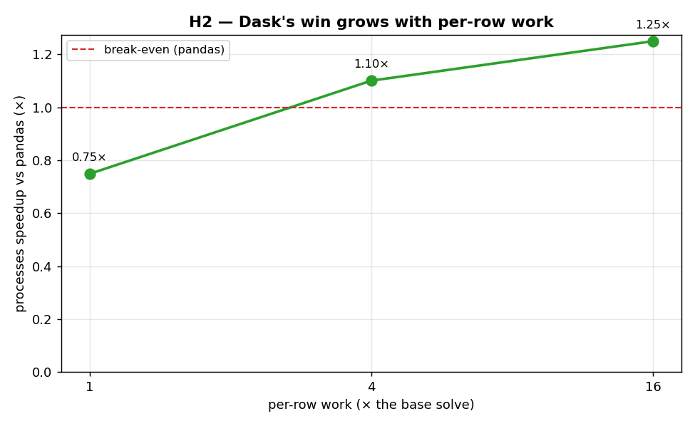

# H2 — Dask's process win grows as per-row work outweighs the overhead

[ex08](../../ex08_dask_parallel_apply/) ended on an honest anticlimax: switching pandas' row
`apply` to Dask's `processes` scheduler bought only about 1.1× on 800,000 rows, because
pickling each partition out to a worker process is a roughly fixed cost that a cheap per-row
function can't amortize. This hypothesis takes that diagnosis at its word and tests its
prediction directly — if the overhead is fixed and the compute is what parallelizes, then
making each row do *more* work should tip the balance further and further in Dask's favour.

**Hypothesis:** the processes-vs-pandas speedup is governed by the ratio of parallelizable
compute to fixed IPC overhead, so it should climb as per-row work increases.

**Prediction:** as per-row work rises, the speedup increases monotonically — starting below 1×
(overhead-dominated) and trending up toward the core count.

## Run

```bash
.venv/bin/python chapter_7/hypothesis/h02_dask_work_scaling/bench.py
```

## Measured (Apple Silicon, 10 cores) — 100,000 rows, 8 partitions

The per-row OLS solve is repeated `work` times to scale its cost:

| per-row work | pandas | Dask `processes` | speedup |
| ---: | ---: | ---: | ---: |
| 1× | 1.28 s | 1.71 s | 0.75× |
| 4× | 4.74 s | 4.31 s | 1.10× |
| 16× | 18.80 s | 15.03 s | 1.25× |

The speedup rises steadily and crosses break-even between 1× and 4× work.

## Reading the chart



The green line is the speedup; the red dashed line is break-even (where Dask exactly ties
single-threaded pandas). At the cheapest work level the point sits *below* the red line — Dask
loses, all overhead, no benefit. As per-row work grows along the (log-scaled) x-axis, the line
climbs through break-even and keeps rising. The shape — not any single point — is the result:
the curve bends upward exactly as ex08's "fixed overhead, growing compute" story predicts.

## Verdict: **CONFIRMED**

The direction is unambiguous: 0.75× → 1.10× → 1.25× as the work per row multiplies. The fixed
cost of serializing partitions to workers is being amortized by the growing compute, just as
ex08 argued. Two honest caveats keep this from being oversold. First, the *absolute* speedup
stays modest at these work levels — it is trending toward the core count, not arriving there,
because the partition serialization is itself non-trivial and grows somewhat as the heavier
function holds data longer. Second, the cleanest way to make each partition "carry enough work"
in practice isn't to loop the solve pointlessly — it's to combine Dask with the compiled Numba
function from [ex03](../../ex03_numba_compile/), which packs far more useful compute into the
same data-movement budget.

## 5 Whys

1. **Why does the processes speedup start below 1× and climb?** At low per-row work the fixed
   cost of pickling partitions to workers dominates; as compute grows, that fixed cost is
   amortized.
2. **Why is the IPC cost roughly fixed?** It depends on the size of the data shipped to each
   worker (the partition), not on how much computing the worker then does with it.
3. **Why doesn't the speedup shoot straight to the core count?** The serialization overhead is
   non-trivial and the heavier function holds data longer, so the parallel fraction approaches
   but doesn't reach the ideal.
4. **Why test this with an artificial work multiplier?** To isolate the single variable —
   per-row compute — while holding rows, partitions, and data size constant, so the trend is
   attributable to nothing else.
5. **Why does this matter in practice?** It tells you *when* to reach for Dask: not for cheap
   row functions (ex08's lesson) but for genuinely heavy per-row work — ideally compiled — where
   the cores finally earn their keep.

**Root cause:** process-parallel speedup is the ratio of parallelizable compute to fixed
data-movement overhead, so it rises with per-row work — Dask pays off precisely when each
partition carries enough computing to dwarf the cost of shipping it.
