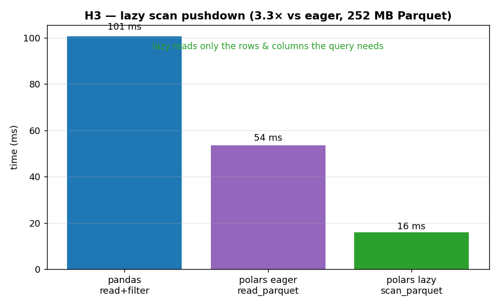

# H3 — Polars `lazy` wins where ex09 said it would: pushing work into the Parquet scan

[ex09](../../ex09_polars_vs_pandas/) compared Polars' eager and lazy APIs on a fully-in-RAM
frame and found them identical — then argued that the lazy optimizer's real advantage lives in
*pushdown*: when reading from a file, it can fetch only the rows and columns a query actually
needs, instead of loading everything and then cutting it down. That claim was a hand-wave in
ex09 because an in-memory benchmark can't exercise it. This hypothesis makes it concrete by
writing a wide Parquet file and running the same selective query as an eager read versus a lazy
`scan_parquet`.

**Hypothesis:** against a Parquet source, lazy `scan_parquet` is several times faster than
eager `read_parquet`, because predicate pushdown skips row groups and projection pushdown skips
columns at the file-read level.

**Prediction:** lazy ≫ eager (and ≫ pandas) on a query that keeps only a fraction of the rows
and a couple of the columns.

## Run

```bash
.venv/bin/python chapter_7/hypothesis/h03_polars_parquet_pushdown/bench.py
```

## Measured (Apple Silicon) — 8,000,000 rows × 6 columns, 252 MB Parquet

Query: keep 2 of the 6 columns and ~10% of the rows (`filter v > 0.9`):

| approach | time | vs eager |
| --- | ---: | ---: |
| pandas `read_parquet` + filter | 101 ms | — |
| Polars eager `read_parquet` | 54 ms | 1.0× |
| Polars lazy `scan_parquet` | 16 ms | **~3.3× faster** |

## Reading the chart



Three bars in milliseconds. The blue pandas bar is tallest (it reads the whole file into a
DataFrame, then filters and selects). The violet Polars *eager* bar is about half that — Arrow
machinery, but still loading everything first. The green Polars *lazy* bar is a third of the
eager one: it never reads what it doesn't need. The gap between the violet and green bars is the
entire point — same engine, same query, the only difference is whether the optimizer got to see
the plan *before* touching the file.

## Verdict: **CONFIRMED**

Lazy `scan_parquet` is ~3.3× faster than eager `read_parquet` on this query, exactly the win
ex09's in-RAM benchmark couldn't show. The mechanism is pushdown: because `.collect()` is
deferred, Polars sees the *whole* query plan before it reads a single byte, so it pushes the
`filter` down to skip Parquet row groups whose statistics rule them out, and pushes the column
`select` down to read only `k` and `v` rather than all six columns. Parquet's columnar,
row-group-chunked layout is what makes both pushdowns possible. The eager path forfeits all of
this: `read_parquet()` materializes the entire file first, and only then does the `filter` and
`select` run — over data that was already paid for. This is the concrete payoff behind the
chapter's note that lazy/streaming Polars and hand-tuned Dask reach similar territory: the
optimizer is doing the I/O-pruning you would otherwise hand-write.

## 5 Whys

1. **Why is lazy `scan_parquet` ~3× faster than eager `read_parquet` on the same query?** Lazy
   defers execution, so the optimizer sees the whole plan and reads only the rows and columns
   the query needs.
2. **Why can it skip rows and columns at read time?** Parquet stores data in columnar
   row-groups with per-chunk statistics, so a pushed-down filter can skip whole row groups and a
   pushed-down projection can skip whole columns.
3. **Why can't the eager path do the same?** `read_parquet()` materializes the entire file
   before any `filter`/`select` runs, so it has already paid to load data it then throws away.
4. **Why did ex09 see no eager-vs-lazy difference?** That data was already fully in RAM with
   every column used — there was nothing to prune, so the optimizer had no pushdown to apply.
5. **Why does this generalize beyond Parquet?** Any source the optimizer can push into (Parquet,
   and the streaming engine for larger-than-RAM data) lets lazy avoid work eager must do — which
   is where Polars' biggest wins live.

**Root cause:** the lazy API lets the query optimizer prune I/O *before* it happens; with a
columnar Parquet source that means reading only the needed rows and columns, which an eager
read-everything-then-filter can never match.
