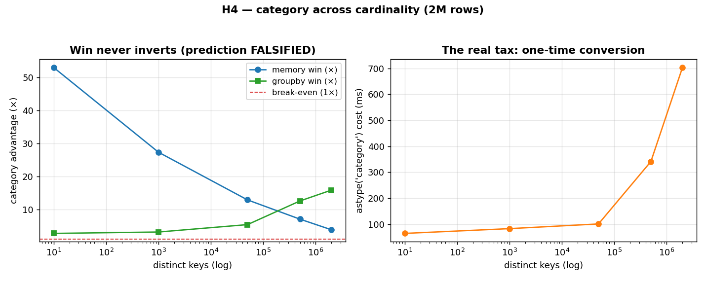

# H4 — Does `category` stop being worth it at high cardinality? (it doesn't)

[H1](../h01_category_groupby/) showed `category` is dramatically lighter and faster for a
low-cardinality key — 20 distinct values over millions of rows. The common folklore is that
this advantage reverses as the number of distinct keys climbs toward the row count: with few
repeats, the category's internal dictionary is nearly as large as the data itself, so the
memory and speed wins should erode and eventually turn into a penalty. This hypothesis sweeps
the cardinality from 10 up to the full 2,000,000 rows and watches what actually happens.

**Hypothesis:** `category`'s benefit shrinks and inverts as cardinality rises — past some point
it is no better, or worse, than plain `object` strings.

**Prediction:** the memory win falls toward 1× and the groupby win disappears; at full
cardinality `category` becomes a liability.

## Run

```bash
.venv/bin/python chapter_7/hypothesis/h04_category_cardinality/bench.py
```

## Measured (Apple Silicon, pandas 3.0) — 2,000,000 rows

| distinct keys | key memory win | groupby win | `astype` cost | payback |
| ---: | ---: | ---: | ---: | ---: |
| 10 | 53.0× | 2.8× | 64 ms | ~2.3 groupbys |
| 1,000 | 27.3× | 3.2× | 83 ms | ~2.3 groupbys |
| 50,000 | 12.9× | 5.4× | 101 ms | ~1.1 groupbys |
| 500,000 | 7.1× | 12.6× | 341 ms | ~0.6 groupbys |
| 2,000,000 (all unique) | 3.9× | 15.9× | 704 ms | ~0.5 groupbys |

## Reading the chart



Two panels. **Left:** the two "advantage" curves against distinct-key count (log x-axis). The
blue memory-win line slopes *down* as cardinality rises — but it never reaches the red
break-even line at 1×. The green groupby-win line slopes *up* — category gets relatively
*faster* the more distinct keys there are. The two lines crossing, both staying above 1×, is the
visual refutation of the prediction. **Right:** the one thing that genuinely worsens with
cardinality — the cost of the `astype('category')` conversion, which climbs steeply once the
dictionary gets large.

## Verdict: **FALSIFIED**

The prediction was wrong in the most instructive way. The memory advantage does shrink (≈53× →
≈4×) as the dictionary grows relative to the data, but it never inverts — even with every key
unique, the category column is still ~4× smaller, because `object` storage pays 8 bytes of
pointer *plus* a scattered Python string per row, while category pays one copy of each string
plus a compact integer code array. More surprising, the *groupby* win **grows** with
cardinality (≈2.8× → ≈16×): grouping by category buckets on small integer codes, whereas the
`object` path must hash and compare ever more distinct Python strings, which gets dramatically
more expensive.

So where's the catch the folklore is gesturing at? It's the **one-time conversion**. Building
the category dictionary rises from ~64 ms to ~700 ms as cardinality climbs — a real,
cardinality-sensitive tax. But the "payback" column reframes even that: because each grouped
operation saves so much, the conversion pays for itself within roughly one to two groupbys at
*every* cardinality tested. The honest conclusion is that `category` is far more robust than its
reputation for repeated analytical work; its only genuine downside is paying the conversion up
front, and that downside evaporates the moment you group more than once. (The cases where it
truly bites — frequent appends that must reconcile dictionaries, or joins across
differently-categorized frames — are about *mutation and alignment*, not the steady-state
read-heavy workload measured here.)

## 5 Whys

1. **Why doesn't the memory win invert even when every key is unique?** `object` storage costs
   an 8-byte pointer plus a scattered Python string per row; category stores each string once
   plus a compact integer-code array, so it stays smaller.
2. **Why does the groupby win *grow* with cardinality?** Grouping category buckets on small
   integer codes, while the object path hashes and compares more and more distinct Python
   strings — work that scales badly with the number of distinct values.
3. **Why does the `astype` conversion get so expensive?** Building the category dictionary means
   finding all distinct values and assigning codes; with millions of distinct strings that
   factorization is genuinely costly.
4. **Why does that conversion tax barely matter in the end?** Each grouped operation saves more
   time than a fraction of the conversion costs, so it amortizes within one or two groupbys.
5. **Why does the folklore warn against high-cardinality category at all?** The real hazards are
   mutation and alignment — appends reconciling dictionaries, joins across differently-coded
   frames — not the read-heavy groupby/memory profile this benchmark measures.

**Root cause:** category replaces repeated Python strings with one dictionary plus integer
codes, and that representation stays lighter *and* groups faster even at full cardinality — the
only cardinality-sensitive cost is the one-time conversion, which repeated grouping amortizes
almost immediately.
