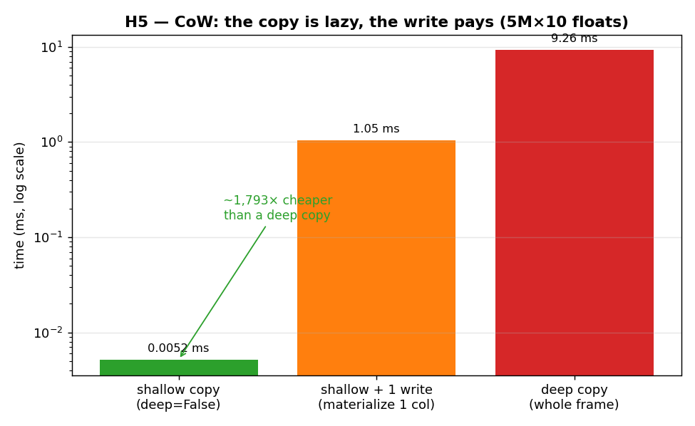

# H5 — Copy-on-Write: the copy is a cheap promise, the write pays the bill

This repo runs **pandas 3.0**, where Copy-on-Write (CoW) is the default — the very change the
book's note anticipates. CoW reworks what "copying" means: a copy no longer eagerly duplicates
the data. Instead the new frame shares the original's buffers and only triggers a real copy
when something is written, and even then only for the data actually touched. This hypothesis
measures that directly, and it is the pandas mirror of [chapter 6's lazy-allocation
drill](../../../chapter_6/hypothesis/h2_lazy_allocation/): getting the thing is cheap; the cost
arrives on first use.

**Hypothesis:** under CoW a shallow copy is nearly free, the cost is deferred to the first
write, and that write duplicates only the touched column — while the original stays safely
unchanged.

**Prediction:** shallow copy ≈ free; deep copy ≫ shallow; one post-copy write costs about a
single column (≈ deep ÷ n_columns), not a whole frame.

## Run

```bash
.venv/bin/python chapter_7/hypothesis/h05_cow_lazy_copy/bench.py
```

## Measured (Apple Silicon, pandas 3.0) — 5,000,000 rows × 10 float64 columns (400 MB)

| operation | time |
| --- | ---: |
| `df.copy(deep=False)` (shallow) | **0.0052 ms** |
| shallow copy + one `iloc` write | 1.05 ms |
| `df.copy()` (deep, whole frame) | 9.26 ms |

The shallow copy is about **1,800× cheaper** than the deep copy, and the first write costs
roughly one column's worth (≈ deep ÷ 9). And the safety check passes: after mutating the shallow
copy, the original frame is unchanged.

## Reading the chart



Three bars on a **logarithmic** y-axis (milliseconds). The green shallow-copy bar is a sliver
near the floor — sub-microsecond, because nothing is actually copied. The orange middle bar is
the first write, which materializes a single column. The red deep-copy bar stands highest,
having duplicated all ten columns up front. The log scale is essential: on a linear axis the
shallow-copy bar would be invisible — which is, of course, exactly the point.

## Verdict: **CONFIRMED**

A shallow copy under CoW barely registers because it copies no data at all — the new frame just
shares the original's column buffers and records a promise to copy-before-write. The first
mutation is what pays, and it pays narrowly: writing one cell materializes only the block
holding that column, which is why the write lands at roughly a ninth of the deep-copy cost
rather than the whole thing. The deep copy, by contrast, duplicates every column immediately.

The quietly important part is the safety check. Before CoW, sharing buffers like this was the
source of the infamous `SettingWithCopyWarning` — a write to a "copy" could leak back into the
original, or not, in ways that were hard to predict. CoW makes the cheap shallow copy *safe*: the
copy-on-write trigger guarantees the original is untouched, so you get both the performance of
sharing and the correctness of independence. That combination — cheap *and* safe — is what makes
the chapter's recommendation to move to pandas 3.0's CoW mode "well worth your time".

## 5 Whys

1. **Why is a shallow copy ~1,800× cheaper than a deep copy?** It duplicates no data — the new
   frame shares the original's column buffers and only records a promise to copy on write.
2. **Why does the first write cost only ~one column?** CoW materializes just the block holding
   the column being written, not the whole frame, so the price scales with what you touch.
3. **Why is the original left unchanged when you mutate the copy?** The copy-on-write trigger
   duplicates the shared buffer *before* applying the write, so the two frames diverge cleanly.
4. **Why was this unsafe before CoW?** Shared buffers without a copy-on-write guard meant a
   write could silently propagate to the original — the `SettingWithCopyWarning` footgun.
5. **Why does pandas default to this in 3.0?** It reduces background copies (less RAM, faster
   pipelines) *and* removes the aliasing hazard at once — a rare win on both performance and
   correctness.

**Root cause:** CoW turns "copy" into a deferred, minimal operation — free to take, paid for
only on the column you write — so you get sharing's speed and independence's safety together.
