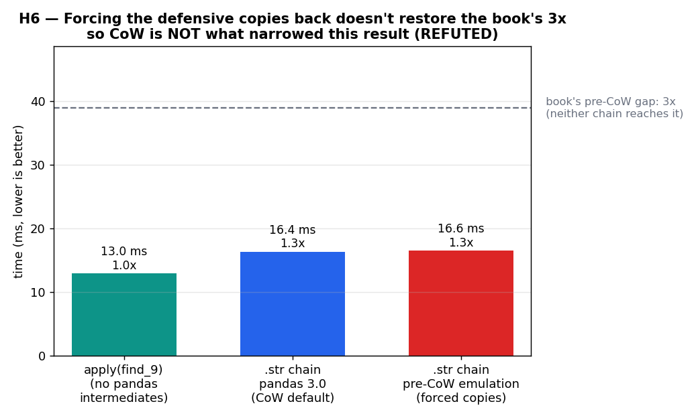

# H6 — Did Copy-on-Write narrow the book's str-chain result? Isolating it says no

[ex05](../../ex05_str_apply_vs_chain/) reproduced the book's "chained `.str` ops vs a single
`apply`" benchmark (Example 7-12). The book measured the `.str` chain at ~3x slower than
`apply(find_9)`; on this machine (pandas 3.0, Copy-on-Write the default) the gap is only ~1.3x.
Following the book's own forward-looking note about CoW, ex05 attributes that narrowing to CoW
removing the defensive copies the chain used to pay for. This hypothesis tests that attribution
head-on, and it does not survive.

**Hypothesis:** the `.str` chain's penalty over `apply` is dominated by intermediate-object
copies that CoW now elides. Restore those copies and the chain-vs-apply ratio should climb back
toward the book's 3x.

**Prediction (if true):** `ratio(chain_preCoW / apply)` >> `ratio(chain_CoW / apply)`,
approaching 3x.

## The obstacle, and the workaround

pandas 3.0 can no longer turn CoW off -- `mode.copy_on_write` is a deprecated no-op (always on),
so a clean on/off A/B is impossible. Instead we **emulate the pre-CoW world** by forcing an
explicit deep `.copy()` on every intermediate the chain produces (the `expand=True` DataFrame,
then the selected column). If the chain's cost were really the defensive copies CoW elides,
forcing them back should reopen the gap.

## Run

```bash
.venv/bin/python chapter_7/hypothesis/h06_cow_narrows_chain/bench.py
.venv/bin/python chapter_7/hypothesis/h06_cow_narrows_chain/bench.py --plot
```

## Measured (Apple Silicon, pandas 3.0) — first '9' after the decimal across 50,000 strings

| variant | time | vs apply |
| --- | ---: | ---: |
| `apply(find_9)` (no pandas intermediates) | ~13.0 ms | 1.0x |
| `.str` chain (pandas 3.0 CoW, default) | ~16.4 ms | ~1.3x |
| `.str` chain (pre-CoW emulation, forced copies) | ~16.6 ms | ~1.3x |
| book's reported pre-CoW gap | -- | 3.0x |

Forcing a deep copy of every intermediate adds about **+0.2 ms** and leaves the ratio at ~1.3x.
The defensive copies the hypothesis blamed are negligible here.

## Reading the chart



Three bars in milliseconds, with the book's 3x gap drawn as a dashed reference line near the
top. The teal `apply` baseline and the two `.str` chain bars (blue = CoW default, red = forced
copies) sit almost level with each other, and all three are far below the dashed line. The whole
point is what the red bar *doesn't* do: forcing the pre-CoW copies back does not lift the chain
anywhere near the book's 3x, so those copies were never the explanation.

## Verdict: **REFUTED**

CoW is not what narrowed this result. The chain-vs-apply gap is ~1.3x whether or not the
intermediates are defensively copied, because deep-copying two short object columns of 50,000
rows is cheap relative to the string work itself. The honest conclusion is that the narrowing
from the book's ~3x to today's ~1.3x is **general improvement** -- faster `.str` kernels and
faster hardware between the book's pandas and pandas 3.0 -- not Copy-on-Write.

This matters because it is easy to attach a plausible-sounding mechanism to a measured change
and move on. The book's CoW note is real and correct in general; it simply is not the cause of
*this particular* number, and the only way to know was to isolate it. Where CoW genuinely and
measurably changes the cost model is on copy semantics themselves: see
[h05](../h05_cow_lazy_copy/), where a shallow copy comes out ~1,800x cheaper than a deep copy
and is now safe from the old `SettingWithCopyWarning` aliasing footgun. That is the real CoW
win; the str-accessor chain is not.

## 5 Whys

1. **Why doesn't forcing defensive copies restore the book's 3x?** Because deep-copying the
   chain's intermediates (two short object columns over 50k rows) costs only ~0.2 ms -- trivial
   next to the actual string-splitting and searching.
2. **Why did ex05 (and the book's note) suspect CoW?** The book flagged CoW as a coming change
   that "reduces or eliminates many of the background copies," so a narrowed copy-heavy result
   is a natural thing to pin on it -- a plausible story that happens to be wrong here.
3. **Why is the gap ~1.3x now instead of 3x, then?** General improvement: pandas' `.str`
   implementation and the hardware both got faster between the book's version and pandas 3.0,
   compressing the absolute difference independent of CoW.
4. **Why couldn't we just toggle CoW to check directly?** pandas >= 3.0 makes CoW mandatory;
   the option to disable it is a deprecated no-op, so emulation (forced copies) is the only
   available proxy.
5. **Why keep a refuted hypothesis in the repo?** Because the refutation is the lesson: a
   correct general mechanism (CoW reduces copies) does not automatically explain any specific
   measured change, and isolating it is what tells the two apart.

**Root cause:** the str-chain narrowing is general pandas/hardware speedup, not CoW. CoW's
real, large effect lands on copy operations themselves (h05), not on this accessor chain --
and only an isolation test, not a plausible mechanism, could distinguish them.
