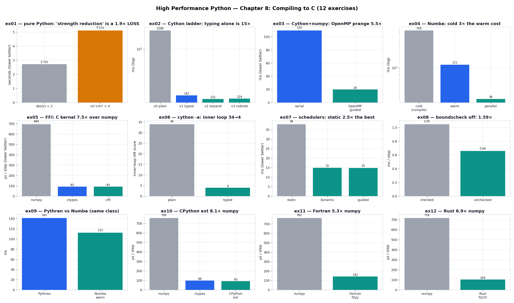

# Chapter 8 — Compiling to C: Practice Exercises

Runnable drills for *High Performance Python (3rd ed.)*, Chapter 8 — **twelve** of them. The
chapter's question is simple — once you've picked good algorithms and trimmed the data, the next
way to do less work is to stop interpreting Python and start running machine code — and it
answers it with a whole toolbox: Cython, Numba, PyPy, Pythran, and a ladder of foreign function
interfaces (ctypes, cffi, a hand-written CPython extension, f2py for Fortran, and PyO3 for Rust).
These exercises put every one that builds on this machine on the **same workload** — the CPU-bound
Julia-set generator (for the compilers) and a 2D-diffusion stencil (for the FFIs) — so the
speedups line up directly into the book's Table 8-1 and Table 8-2 instead of floating as
disconnected claims.

Each script self-reports its own timing (`timeit` / `perf_counter` via the shared `perf.py`)
and asserts its result against a correctness anchor — `sum(output) == 33,219,980` for the
1000×1000 Julia grid, or agreement to 1e-12 for the diffusion kernels — so a variant that gets
*fast* by quietly computing the *wrong* thing is caught on the spot.

Numbers below are from **CPython 3.14 / Cython 3.2 / Numba 0.65 / Pythran 0.18 / numpy 2.x /
gfortran 15 / Rust+PyO3 0.28 on Apple Silicon (10 cores)** — yours will differ, sometimes a lot.
Apple Silicon runs the pure-Python baseline about twice as fast as the book's laptop, so every
absolute figure here is roughly half the book's; the *ratios*, which are the actual lesson, hold.

```bash
.venv/bin/python chapter_8_compiling_to_c/ex02_cython_pure_python/ex02_cython_pure_python.py
```

**Core idea:** Python is slow in tight numeric loops because every operation pays a
dynamic-typing tax — a type lookup and an object dereference per step. Every tool in this
chapter removes that tax in a different way (static C types, a runtime JIT, a hand-written
kernel), and the art is matching the tool to the situation — *and measuring*, because the same
source change can help one engine and hurt another.

**Verified learnings** (measured on this machine):

1. **"Strength reduction" is engine-dependent — and a *trap* in the interpreter** (ex01).
   Replacing `abs(z) < 2` with `re²+im² < 4` drops a sqrt and is faster *compiled*, but in pure
   CPython it's ~1.9× **slower**: `abs` is one builtin call, the expanded form is many bytecodes.
2. **Typing the hot scalars is Cython's whole win; the rest is rounding error** (ex02). `cdef`
   on the loop variables buys ~15×; expanded math adds ~1.17×; disabling bounds checks on
   *list* inputs buys nothing, exactly as the book says.
3. **Memoryviews unlock both C-speed dereferences and parallelism** (ex03). Typing the inputs as
   `double complex[:]` gets serial Cython to ~108 ms; then `prange` + `nogil` + `guided` fans it
   across 10 cores for ~14 ms — a ~7.8× OpenMP win for three keywords.
4. **Numba ties hand-tuned Cython warm, but the cold start is real** (ex04). One decorator, no
   types, ~111 ms warm (≈ ex03 serial) — but the first call is 4–6× slower because it compiles
   at call time, paid fresh per process. `parallel=True` gives ~2.9×, short of Cython's OpenMP.
5. **An FFI is a doorway, not an engine** (ex05). ctypes and cffi call the same compiled C
   `evolve`, so they run at the same speed — the choice is ergonomics and safety (cffi parses
   the header; ctypes makes you hand-cast and can segfault silently). The C kernel is ~8× over
   vectorized numpy because it fuses the stencil into one temporary-free pass.
6. **The annotation report is a targeting tool, read as numbers** (ex06). `cython -a` scores each
   line by how much it calls the VM; typing collapses the inner-loop score 34→4 and the "hottest
   line" moves from the inner `while` to the outer list-build — telling you exactly where to stop.
7. **Scheduling matters only when work is uneven** (ex07). On the lumpy Julia grid, `static`
   prange is ~2.6× slower than `dynamic`/`guided`: an equal split strands a thread on the dense
   interior while others idle. For even work, `static` would win on lower overhead.
8. **`boundscheck=False` is conditional, and ex08 is the condition** (ex08). On a stencil that
   indexes a memoryview six times *per inner iteration* it's a 1.53× win — the opposite of ex02,
   where the same directive did nothing because the indexing sat in the cheap outer loop.
9. **Pythran ≈ Numba, with the opposite toll schedule** (ex09). A single `#pythran export` line
   reaches Numba-class speed; Pythran pays its compile once at build time (no per-process cold
   start), Numba pays at first call — the trade maps onto long-lived vs short-lived processes.
10. **The FFI ladder trades ergonomics, not speed** (ex05, ex10, ex11, ex12). ctypes ≈ cffi ≈ a
    hand-written CPython extension (~1.09× edge for ~10× the code) ≈ Fortran via f2py (5.2×) ≈
    Rust via PyO3 (7.6×) — all the same compiled-kernel tier; what differs is safety and effort.
    Rust matches C while moving memory/thread safety into the compiler; the CPython extension is
    the fragile last resort the chapter warns about.

---

## Exercises

Each exercise lives in its own folder with a runnable script, a `README.md`, and a `chart.png`.
Charts are generated by `visualize_exercises.py`, which reuses each exercise's own functions to
measure. The shared problem definition lives in `_julia.py` so every exercise times the
identical arithmetic on identical inputs.

| exercise | what it shows |
| --- | --- |
| [`ex01_julia_baseline`](ex01_julia_baseline/) | the pure-Python baseline; strength reduction as a 1.9× **loss** in the interpreter |
| [`ex02_cython_pure_python`](ex02_cython_pure_python/) | the Cython ladder — typing is 15×, the rest ~1× (Table 8-1) |
| [`ex03_cython_numpy_openmp`](ex03_cython_numpy_openmp/) | memoryviews + OpenMP `prange` guided, ~7.8× on 10 cores (Table 8-2) |
| [`ex04_numba_jit`](ex04_numba_jit/) | `@jit` cold vs warm vs `parallel=True` (Table 8-2) |
| [`ex05_ffi_diffusion`](ex05_ffi_diffusion/) | 2D diffusion in C via ctypes vs cffi vs numpy |
| [`ex06_cython_annotate`](ex06_cython_annotate/) | reading the `cython -a` report as scores — the targeting tool |
| [`ex07_prange_schedulers`](ex07_prange_schedulers/) | OpenMP `static` vs `dynamic` vs `guided` — why guided wins on uneven work |
| [`ex08_boundscheck`](ex08_boundscheck/) | `boundscheck=False` where it *does* help (1.53×) — the ex02 counterpoint |
| [`ex09_pythran`](ex09_pythran/) | Pythran AOT vs Numba JIT — same speed, opposite toll schedule |
| [`ex10_cpython_extension`](ex10_cpython_extension/) | the hand-written CPython extension — the "last resort" (~1.09× over ctypes) |
| [`ex11_f2py_fortran`](ex11_f2py_fortran/) | Fortran via f2py (5.2×) — auto-generated interface, the `order="F"` gotcha |
| [`ex12_rust_pyo3`](ex12_rust_pyo3/) | Rust via PyO3 (7.6×) — C speed with compile-time memory & thread safety |



The dashboard tiles all twelve (3×4) so you can read the chapter's arc at a glance. Top row, the
compilers on the Julia loop: the interpreter baseline and its strength-reduction trap (ex01), the
Cython annotation ladder (ex02), memoryviews and multicore (ex03), the Numba JIT and its
cold-start tax (ex04). Middle row: the C FFI (ex05), the annotation report as data (ex06), the
scheduler comparison (ex07), and bounds-checking where it bites (ex08). Bottom row, the rest of
the engine zoo: Pythran vs Numba (ex09), and the FFI ladder on the diffusion stencil — CPython
extension (ex10), Fortran (ex11), Rust (ex12). Each folder's own `README.md` walks through its
chart and ends with a "5 Whys" that drills from the surface number to the root cause.

```bash
# run any exercise (compiled ones build themselves on first run)
.venv/bin/python chapter_8_compiling_to_c/ex04_numba_jit/ex04_numba_jit.py
# regenerate every chart + the dashboard above
.venv/bin/python chapter_8_compiling_to_c/visualize_exercises.py
# or just one
.venv/bin/python chapter_8_compiling_to_c/visualize_exercises.py --only ex03
```

## 5 Whys: why does one workload need a whole toolbox?

1. **Why does the chapter throw four compilers and five FFIs at one Julia loop and one diffusion
   stencil?** Because each removes the same dynamic-typing tax under different constraints — AOT vs
   JIT, numpy vs pure Python, your-code-compiled vs call-someone-else's-C — and no single one fits
   every situation.
2. **Why doesn't one tool dominate?** They trade differently: Cython is fastest and most
   flexible but costs a new language and a build; Numba is near-free but pays a per-process cold
   start; an FFI is for code that was never Python to begin with.
3. **Why is matching tool to situation the real skill?** A JIT's cold start is invisible in a
   server and ruinous in a thousand-times-launched script; OpenMP scheduling matters for uneven
   work and not for even work — the right choice is set by *how the code is used*, not by raw
   benchmark numbers.
4. **Why measure every change instead of trusting the rule?** Because ex01 shows a textbook
   optimisation reversing sign between two engines — the cost model lives in the runtime, not
   the source, so only a benchmark on the target engine tells the truth.
5. **Why is compiling the last step, not the first?** The chapter's own opening: profiling and
   algorithm work come first and buy the cheap order-of-magnitude; compiling buys the next one
   for focused effort — and past that, effort climbs while returns shrink.

**Root cause:** "compile it" isn't one decision but a family of them, each removing Python's
per-operation overhead under different constraints — so the chapter is really about reading your
situation (long-lived or short? numpy or pure? your code or a library's?) and measuring the fit.

---

### A note on what's reproduced, and what isn't

Nearly every technique the chapter covers now has a full runnable, measured drill:

- **Cython** — pure-Python ladder (ex02), numpy+OpenMP (ex03), the annotation report (ex06), the
  scheduler comparison (ex07), and bounds-checking (ex08).
- **Numba** — `@jit` cold/warm/parallel (ex04), and a head-to-head with Pythran (ex09).
- **Pythran** — AOT numpy compilation (ex09).
- **Foreign function interfaces** — ctypes & cffi (ex05), the hand-written CPython C extension
  (ex10), **f2py**/Fortran (ex11), and **Rust/PyO3** (ex12).

Two build stories are worth calling out, both solved without a system-wide install touching
anything outside the project: the OpenMP runtime Apple's clang omits is sourced from this venv's
PyTorch (ex03/ex07), and the Fortran toolchain came from Homebrew's `gcc` (providing `gfortran`)
with `meson`/`ninja` added to the venv (ex11). The Rust crate builds with `maturin` into the
project venv (ex12).

Only one technique the chapter discusses is **not** given a runnable drill, for a structural
reason rather than a missing tool:

- **PyPy** is a whole alternative interpreter, not a library you import into CPython — it can't
  run inside this venv. The chapter's pure-Python result (≈ Cython for zero effort, but ~6×
  *slower* on numpy via cpyext) is reproduced by running `ex01`'s script under a separate `pypy3`
  if you install one; there's nothing to add to this repo for it.

The chapter also *names* **Transonic, Shed Skin, Nuitka, and PyCUDA/PyOpenCL** as further options
without benchmarking them; like the book, we leave those as pointers.

Companion notes: `Chapter 8 Compiling to C.md` in the Obsidian vault.
