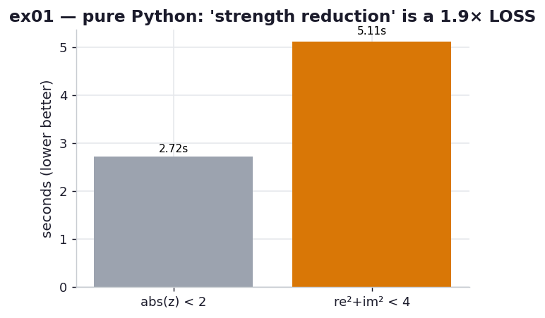

# ex01_julia_baseline

Every compiler in this chapter is measured against one workload: the CPU-bound Julia-set
generator from Chapter 2. Before reaching for any of them, this exercise does two things.
It establishes the plain-CPython baseline — the number that ex02, ex03 and ex04 all divide
into — and it tests a claim the book makes, but only ever *inside* Cython: that replacing
`abs(z) < 2` with the algebraically identical `z.real*z.real + z.imag*z.imag < 4` is faster
because it drops a square root.

The result is the kind of thing this repo exists to catch. In the interpreter the
"optimised" form is not faster. It is **almost twice as slow.**

## What it measures

One full 1000×1000 grid at `maxiter=300` (the book's exact problem), best of three rounds,
on pure CPython 3.14 — no compiler involved:

| inner-loop form | time | vs `abs` |
| --- | ---: | ---: |
| `abs(z) < 2` (the book's original) | ~2.7 s | 1.0× |
| `z.real*z.real + z.imag*z.imag < 4` (expanded) | ~5.1 s | **1.9× slower** |

Both produce the book's anchor sum exactly (`sum(output) == 33,219,980`), so they compute
the identical fractal — only the escape test is written differently. The book's laptop took
5.8 s for the `abs` form; Apple Silicon does it in ~2.7 s, but the *shape* of the result is
what matters, not the absolute figure.

## What we found

In compiled code, `re*re + im*im` is a handful of machine instructions and `abs()` on a
complex would call libm's `sqrt` — so the expanded form genuinely wins, and ex02/ex03/ex04
all confirm it. But CPython is an interpreter, and there the accounting flips. `abs(z)` is a
*single* call into one optimised C builtin. The expanded form, by contrast, is a pile of
separate bytecodes: two attribute lookups (`.real`, `.imag`), two multiplies and an add,
each its own trip around the evaluation loop, each boxing and unboxing Python float objects.
The sqrt you "saved" was never the expensive part; the dispatch you *added* was.

This is the chapter's real lesson stated in its sharpest form: the same source change can be
a pessimisation in one execution engine and a 2× win in another. You cannot reason your way
to which — you measure, on the engine you will actually ship.

## Reading the chart



Two bars, seconds, lower is better. The grey `abs` bar is the baseline; the amber expanded
bar towers ~1.9× above it. Read it as a warning label: this is the "optimisation" the book
applies, shown doing harm — because it is being run on the wrong engine. Hold this picture
in mind through ex02, where the same amber change finally pays off once the loop is compiled.

## 5 Whys

1. **Why is the expanded math slower than `abs(z)` in pure Python?** `abs(z)` is one call to
   an optimised C builtin; `z.real*z.real + z.imag*z.imag` is several attribute lookups plus
   arithmetic, each a separate bytecode through the interpreter loop.
2. **Why does a handful of extra bytecodes cost so much?** Each one boxes/unboxes Python
   float objects and re-enters the eval loop — the per-operation "dynamic typing tax" the
   chapter opens with — and the inner loop runs >30 million times.
3. **Why doesn't dropping the sqrt make up for it?** The sqrt inside `cabs` was never the
   bottleneck in interpreted code; interpreter dispatch dominates, so removing one cheap C
   operation while adding several Python-level ones is a net loss.
4. **Why does the same change win once compiled (ex02+)?** A compiler turns `re*re+im*im`
   into a few register instructions with no dispatch, while `abs` would emit a real `sqrt`
   call — so there the arithmetic cost is what's left, and less of it wins.
5. **Why can't you just reason this out instead of measuring?** Because the answer depends
   entirely on the engine's cost model (dispatch-bound interpreter vs instruction-bound
   machine code), which is invisible in the source — only a benchmark reveals it.

**Root cause:** strength reduction trades a costly operation for a cheaper one, but "costly"
is defined by the execution engine — in the interpreter the cost is dispatch, not
arithmetic, so the "cheaper" math is actually more work.

## Run

```bash
.venv/bin/python chapter_8_compiling_to_c/ex01_julia_baseline/ex01_julia_baseline.py
# regenerate this chart:
.venv/bin/python chapter_8_compiling_to_c/visualize_exercises.py --only ex01
```
