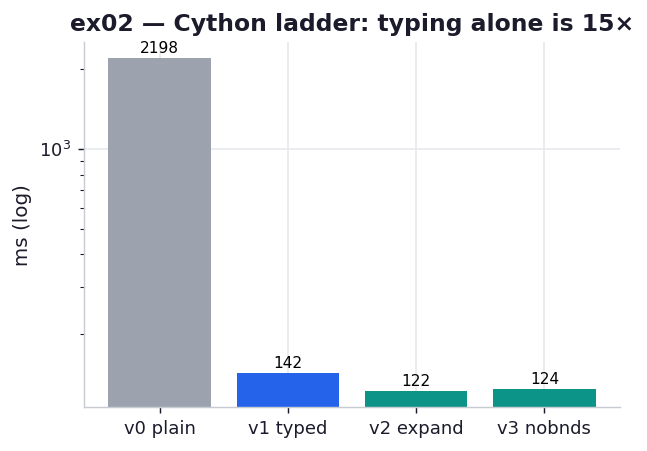

# ex02_cython_pure_python

This is the chapter's core demonstration: take the pure-Python Julia loop from ex01 and hand
it to Cython, one annotation at a time, watching where the speed actually comes from. The
`.pyx` next to this README holds four rungs of the same function, and the script compiles it
on first import (via `pyximport`, so there is no `setup.py` to run) and times each rung on the
identical 1000×1000 grid.

The point is not just "Cython is fast." It is *which change buys what* — because three of the
four edits look equally reasonable on the page, but only one of them moves the needle.

## What it measures

One full grid, best of five, Python lists as input (the "no numpy" column of Table 8-1):

| rung | what changed | time | step |
| --- | --- | ---: | ---: |
| v0 | unannotated, just compiled | ~2.2 s | — |
| v1 | `cdef` the hot scalars to C types | ~0.145 s | **15× over v0** |
| v2 | v1 + expanded math (`re*re+im*im`) | ~0.124 s | 1.17× over v1 |
| v3 | v2 + `boundscheck/wraparound` off | ~0.124 s | ~1.0× (no change) |

The book's Table 8-1 reports 0.43 s (typed) and 0.23 s (expanded); we land at 0.145 s and
0.124 s on faster hardware. Same shape, and every rung reproduces `sum(output) == 33,219,980`.

## What we found

Three findings, in order of how surprising they are.

**Typing the scalars is the whole game.** Just running the unannotated function through Cython
(v0) takes it from ex01's 2.7 s to ~2.2 s — a real but modest win from skipping interpreter
dispatch. The 15× jump comes at v1, the moment we add `cdef unsigned int i, n` and
`cdef double complex z, c`. Those four words let Cython keep the loop counter and the running
complex value in CPU registers instead of as heap-allocated Python objects, so the `z = z*z+c`
and `n += 1` updates — the lines that run tens of millions of times — become native machine
arithmetic with no reference counting.

**The expanded math, a *loss* in ex01, is now a small win.** Once the loop is compiled,
`re*re + im*im` is a few instructions and `abs` would call `sqrt`; the engine's cost model has
flipped, exactly as ex01 predicted. It's a modest 1.17× here rather than the book's ~1.9×, but
it points the same direction.

**Disabling bounds checks does nothing — and that's the lesson.** The book is explicit that on
this example it saves no time, and we confirm it: ~1.0×. The reason is structural. The inputs
are still Python `list` objects, so every `zs[i]` dereference goes back through the VM no
matter what the bounds-check directive says, and the checks that *were* removed lived in the
cheap outer loop, not the expensive inner one. This is precisely the wall ex03 climbs over by
switching the inputs to numpy memoryviews.

## Reading the chart



Four bars on a **logarithmic** axis (each gridline is 10× the one below), milliseconds. The
grey v0 bar sits an order of magnitude above the rest — the visual proof that compilation
alone, without types, leaves most of the win on the table. The drop from v0 to the blue v1 is
the headline 15×; v2 and v3 are barely shorter than v1, which is the honest, anticlimactic
truth about the last two edits on list-based code.

## 5 Whys

1. **Why does `cdef`-ing the scalars give ~15× when merely compiling gave only ~1.2×?** The
   `cdef` C types let the inner-loop updates to `z` and `n` run as register arithmetic, with no
   heap allocation, reference counting, or type dispatch per iteration.
2. **Why is an unannotated Python `int`/`complex` so expensive in the loop?** Each is a heap
   object with refcount and type pointer; every `+=` resolves operators dynamically and may
   reallocate — machinery that exists to support duck typing but is pure overhead here.
3. **Why does the expanded math help now when it hurt in ex01?** Compiled, `re*re+im*im` is a
   few register ops and `abs` would emit a `sqrt` call — so removing arithmetic finally wins,
   the opposite of the interpreter's dispatch-bound cost model.
4. **Why does disabling bounds checking save nothing here?** The inputs are Python lists, so
   each `zs[i]` still calls into the VM regardless; and the bounds checks lived in the cheap
   outer loop, not the >30M-iteration inner one.
5. **Why keep `list` inputs at all if they cap the speed?** To isolate the variable: ex02 holds
   storage fixed and varies only annotations, so the win is attributable to typing; ex03 then
   changes storage to memoryviews and shows the next jump.

**Root cause:** Cython's speed comes from giving the *hot inner-loop* operations static C
types so they leave the Python VM; edits that don't touch the inner loop (bounds checks on
list access) buy nothing, no matter how reasonable they look.

## Run

```bash
.venv/bin/python chapter_8_compiling_to_c/ex02_cython_pure_python/ex02_cython_pure_python.py
# first run compiles _cyjulia.pyx via pyximport (brief pause); later runs reuse the cached .so
# regenerate this chart:
.venv/bin/python chapter_8_compiling_to_c/visualize_exercises.py --only ex02
```
