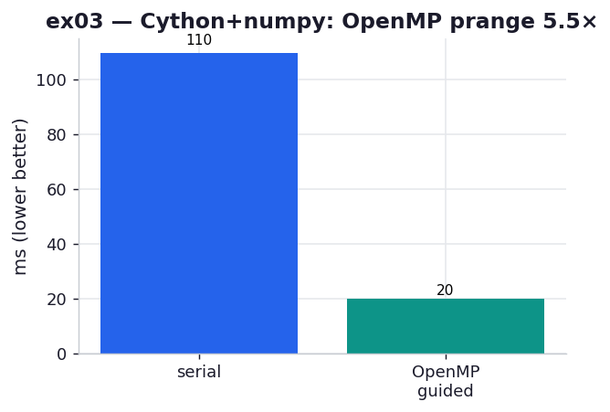

# ex03_cython_numpy_openmp

ex02 hit a wall: with Python `list` inputs, every `zs[i]` dereference goes back through the
interpreter, so no amount of scalar typing could push past ~0.12 s. This exercise removes that
wall by typing the *inputs* as numpy memoryviews (`double complex[:]`), and then — almost for
free — fans the outer loop across every core with OpenMP. It reproduces the two Cython rows of
the book's Table 8-2.

It also has the most interesting build story in the chapter, which is worth a paragraph of its
own below: getting OpenMP working under Apple's clang without installing anything system-wide.

## What it measures

One full 1000×1000 grid, best of five, complex128 memoryview inputs, on a 10-core machine:

| version | time | speedup |
| --- | ---: | ---: |
| serial (one thread) | ~108 ms | 1.0× |
| OpenMP `prange`, `schedule="guided"` | ~14 ms | **~7.8× on 10 cores** |

Parallel efficiency is ~75–80% — most of the ten cores' worth of throughput, lost only to
thread startup and the uneven per-pixel work. The book's Table 8-2 shows 0.20 s serial and
0.03 s with OpenMP; we land at 0.108 s and 0.014 s.

## What we found

**Memoryviews are what unlock the inner loop.** A `double complex[:]` is a typed view over a
contiguous block, so `zs[i]` compiles to a pointer offset in C — no VM call, no boxing. With
the dereference finally at C speed, the serial memoryview version (~108 ms) is already a touch
faster than ex02's best list version, and crucially it is now *parallelisable*: the loop body
touches only C scalars and the typed output buffer, nothing the GIL needs to protect.

**OpenMP is then almost free.** Wrapping the outer `range` in `prange`, opening a `with nogil:`
block, and asking for `schedule="guided"` is the entire change. The GIL comes off (safe here
because we only touch primitives and a memoryview), and OpenMP hands each thread a shrinking
batch of pixels. `guided` matters because Julia work is wildly uneven — points that escape
immediately cost almost nothing, points deep in the set run the full 300 iterations — so a
static even split would leave some threads idle while others grind. Dynamic, shrinking chunks
keep all ten cores busy to the end.

**The macOS OpenMP build, solved without `brew install`.** Apple's clang doesn't ship an
OpenMP runtime, which normally means `brew install libomp`. But this repo already depends on
PyTorch, and PyTorch bundles both `omp.h` and a `libomp.dylib` inside the venv. So `setup.py`
auto-discovers that runtime (checking an env override, then torch, then the usual Homebrew
paths), compiles with `-Xpreprocessor -fopenmp`, and — because torch's dylib records a bogus
absolute install-name — runs `install_name_tool` to rebind the dependency to `@rpath/libomp`
against an rpath we linked in. The upshot: the OpenMP exercise builds and runs out of the box
on this machine, with the runtime sourced entirely from the project's own venv. If no OpenMP
runtime is found anywhere, `setup.py` quietly builds serial-only (Cython guards `prange` with
`#ifdef _OPENMP`), so the exercise still runs — it just won't show the parallel win.

## Reading the chart



Two bars, milliseconds, lower is better. The blue serial bar at ~108 ms and the teal OpenMP
bar at ~14 ms — roughly an 8× drop for adding three keywords. The bars are on a linear axis
here (not log like ex02/ex04) precisely because the win is a clean multiple you can read off
by eye: the parallel bar is about one-eighth the height.

## 5 Whys

1. **Why does the memoryview version unlock a parallel speedup the list version couldn't?**
   `double complex[:]` indexing is a C pointer offset, so the loop body touches only C
   primitives — nothing the GIL must protect — which makes it safe to run `nogil` across
   threads.
2. **Why was the list version stuck even after typing the scalars (ex02)?** Each `zs[i]` on a
   Python list calls back into the VM, which holds the GIL and serialises everything; the
   dereference, not the arithmetic, was the ceiling.
3. **Why is adding OpenMP nearly free once you're here?** The hard part — making the loop body
   GIL-independent and C-typed — was already done; `prange` + `nogil` just tells the C compiler
   to emit the parallel-for it already knows how to generate.
4. **Why `schedule="guided"` rather than `static`?** Julia per-pixel cost varies enormously, so
   an even static split leaves fast-finishing threads idle; guided hands out shrinking dynamic
   chunks, keeping all cores busy through the long tail.
5. **Why only ~75–80% efficiency instead of a full 10×?** Thread spin-up, scheduler overhead,
   and memory bandwidth share are real fixed costs; on a millisecond-scale kernel they eat a
   visible slice of the ideal linear speedup.

**Root cause:** parallelism is cheap only after the loop body is GIL-free and C-typed —
memoryviews provide exactly that, so OpenMP's `prange` converts the already-compiled serial
loop into a multicore one with three keywords.

## Run

```bash
.venv/bin/python chapter_8_compiling_to_c/ex03_cython_numpy_openmp/ex03_cython_numpy_openmp.py
# first run shells out to setup.py to compile + OpenMP-link _cyjulia_np.pyx; later runs reuse the .so
# force a clean rebuild after editing the .pyx:
rm -f chapter_8_compiling_to_c/ex03_cython_numpy_openmp/_cyjulia_np*.so
# regenerate this chart:
.venv/bin/python chapter_8_compiling_to_c/visualize_exercises.py --only ex03
```
