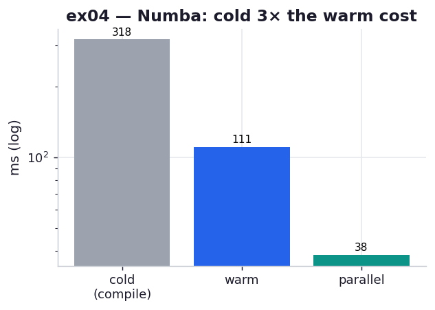

# ex04_numba_jit

Cython got us to ~14 ms, but it cost a `.pyx` file, C type annotations, a `setup.py`, and a
macOS OpenMP build adventure (ex02–ex03). Numba asks for one decorator. This exercise adds
`@jit(nopython=True)` to a plain-numpy version of the same Julia loop — no types, no separate
file — and measures the three things the chapter cares about: the cold-start compile cost, the
warm steady-state speed, and what `parallel=True` buys.

## What it measures

One full 1000×1000 grid, complex128 numpy arrays, Numba 0.65 on a 10-core machine:

| call | time | note |
| --- | ---: | --- |
| `@jit` **cold** (first call) | ~430–720 ms | compiles to machine code *during* the call |
| `@jit` **warm** (best of 5) | ~111 ms | reuses the compiled code; no recompile |
| `@jit(parallel=True)` warm | ~38 ms | `prange` across cores; ~2.9× over serial |

The cold number is the headline. The warm 111 ms matches ex03's serial Cython (~108 ms)
almost exactly — which is the chapter's whole pitch for Numba: Cython-class speed for a
fraction of the effort. The book's Table 8-2 shows 0.19 s warm and 0.05 s parallel; we get
0.111 s and 0.038 s.

## What we found

**Warm Numba ties hand-tuned Cython.** With zero type annotations, the steady-state loop runs
at ~111 ms — within noise of ex03's serial memoryview Cython. Numba reads the bytecode, infers
that `zs`/`cs` are `complex128[:]` and `output` is `int32[:]`, and emits the same tight
LLVM-compiled loop a Cython programmer would hand-build. For numeric numpy code, this is the
best effort-to-speed ratio in the chapter.

**The cold start is the catch, and it is large.** The first call is 4–6× the warm time because
compilation happens *at call time*, on the actual argument types — that's what "just in time"
means. You pay it once per process. In a long-running service that's invisible. In a script you
launch a thousand times from a shell loop, you pay it a thousand times and may never reach the
warm path — which is exactly why the chapter warns against JITs for short, frequently
relaunched programs. The parallel function compiles separately, so it has its own (even larger)
cold start, because Numba must also stand up its threading layer the first time.

**`parallel=True` helps, but less than Cython's OpenMP.** It drops the warm time to ~38 ms, a
~2.9× gain — real, but well short of ex03's ~7.8×. The book notes the same thing: Numba doesn't
expose OpenMP's scheduling choices, so it can't use the `guided` schedule that suits this
lumpy, uneven workload, and its automatic partitioning leaves more on the table. The lesson
isn't "Numba's parallelism is bad" — it's that when work per item varies a lot, *control over
scheduling* is worth something, and that's a place Cython still leads.

## Reading the chart



Three bars on a **logarithmic** axis, milliseconds. The grey cold bar dominates — the JIT tax,
made visible. The blue warm bar drops roughly an order of magnitude below it (the compile cost,
gone after call #1), and the teal parallel bar drops a bit further still. The log scale is what
lets all three share an axis: cold-to-parallel spans nearly 20×.

## 5 Whys

1. **Why is the first `@jit` call 4–6× slower than the rest?** Numba compiles the function to
   machine code *during* that first call, specialised to the argument types it observes — the
   "cold start" inherent to a JIT.
2. **Why compile at call time instead of ahead of time?** Python carries no static types, so
   Numba waits to see the concrete types (`complex128[:]` vs `int32[:]`) actually passed, then
   emits a binary specialised to them.
3. **Why is the cold cost a problem for some programs and not others?** It's paid once per
   process; a long-running service amortises it instantly, but a script relaunched many times
   pays it every launch and may finish before the warm path ever helps.
4. **Why does warm Numba match hand-annotated Cython?** Both end in LLVM/GCC-compiled native
   loops over typed arrays with no per-iteration dispatch — the same destination reached by
   different roads.
5. **Why does Numba's `parallel=True` trail Cython's OpenMP here?** Numba doesn't expose
   OpenMP's `guided` scheduler, so on this highly uneven per-pixel workload its automatic
   partitioning balances the cores less well than Cython's dynamic chunks.

**Root cause:** a JIT buys near-C speed by specialising at runtime — that runtime observation
*is* the cold-start cost, paid fresh per process — so Numba is the right tool when the process
is long-lived and the win is the warm steady state, not the first call.

## Run

```bash
.venv/bin/python chapter_8_compiling_to_c/ex04_numba_jit/ex04_numba_jit.py
# regenerate this chart:
.venv/bin/python chapter_8_compiling_to_c/visualize_exercises.py --only ex04
```
