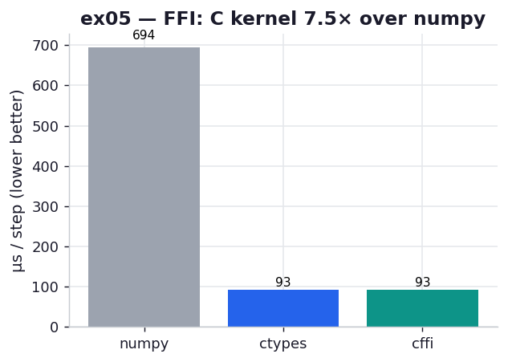

# ex05_ffi_diffusion

The first four exercises let a tool compile *your Python* down to C. This one goes the other
way: you write the C yourself, compile it to a shared library, and call it from Python. That's
a foreign function interface (FFI), and the chapter contrasts two of them — the stdlib's
`ctypes` and the friendlier `cffi` — on the same 2D-diffusion kernel from Example 8-18. A pure
numpy version is included as the reference you're trying to beat.

## What it measures

One diffusion step on a 512×512 plate (the C library's hard-coded size), best of five over 200
calls each:

| backend | per step | note |
| --- | ---: | --- |
| numpy (vectorized, no C call) | ~760 µs | the reference |
| `ctypes` → `diffusion.so` | ~96 µs | manual `argtypes`/casts |
| `cffi` → `diffusion.so` | ~94 µs | parses the C signature for you |

All three agree to 1e-12 (they compute the identical field), so the only differences are speed
and ergonomics. The C kernel is ~**8× faster than numpy**, and ctypes vs cffi is a wash — they
call the *same* compiled `evolve`, so any gap is noise.

## What we found

**ctypes and cffi are the same speed, because they do the same thing.** Both `dlopen` the same
`diffusion.so` and invoke the same `evolve` symbol; the FFI is just the doorway, not the room.
So the choice between them is entirely about how much bookkeeping you want to do by hand. With
`ctypes` you spell out `POINTER(POINTER(c_double))`, set `.argtypes` and `.restype`, and cast
every pointer yourself — and if you get a type wrong, ctypes can't tell, so you get a silent
wrong answer or a segfault rather than a Python exception. With `cffi` you hand it the literal C
signature as a string (`"void evolve(double **in, double **out, double D, double dt);"`) and it
generates the marshalling from that declaration — the same text you'd copy out of the library's
header file. For anything beyond a one-function toy, cffi's "declare it the way the header
declares it" model is the more maintainable one, which is the chapter's recommendation.

**The C kernel beats numpy because it fuses the stencil into one pass.** The numpy version is
already vectorized — no Python loop — yet it's ~8× slower, and the reason is instructive. Each
numpy step builds several temporary arrays (the four shifted neighbours, the Laplacian, the
scaled update) and walks 512×512 memory multiple times. The C loop computes each output cell in
a single fused expression over contiguous memory, with no temporaries and one pass. This is the
exact situation the chapter flags as worth dropping to C for: a tight, local, array-stencil
kernel where numpy's per-operation temporaries dominate.

A note on honesty: at 512×512 these are microsecond-scale calls, so a slice of the ctypes/cffi
cost is per-call marshalling overhead, not the kernel. On larger grids the kernel would dominate
further and the C-vs-numpy gap would widen — but the *ergonomic* comparison, which is the point,
doesn't change with size.

## Reading the chart



Three bars, microseconds per step, lower is better. The grey numpy bar towers over the two
short C-backed bars, which are nearly identical in height — the picture of "the FFI you pick
doesn't change the speed, but calling C at all changes it a lot." The two C bars being level is
the result, not a rendering accident: same compiled function, same cost.

## 5 Whys

1. **Why do ctypes and cffi run at the same speed?** They both `dlopen` and call the identical
   `evolve` in `diffusion.so`; the FFI layer only marshals arguments, it doesn't change the
   compiled code that runs.
2. **Why prefer cffi if it's no faster?** It parses the C signature you give it (straight from
   the header) and generates correct marshalling, so you don't hand-write `argtypes` and casts
   that ctypes leaves to you — fewer chances for a silent segfault.
3. **Why can a ctypes mistake segfault instead of raising?** ctypes can't verify your declared
   types against the binary (a `.so` carries no type metadata), so a wrong cast passes garbage
   bytes to C with no Python-level check.
4. **Why is the hand-written C kernel ~8× faster than vectorized numpy?** numpy materialises
   several temporary arrays per step and traverses memory multiple times; the C loop fuses the
   whole stencil into one pass over contiguous memory with no temporaries.
5. **Why not always drop to C then?** Because most code isn't a tight local stencil — for I/O,
   string work, or already-vectorized bulk numpy, a C rewrite adds build complexity and
   maintenance burden for little or no gain, as the chapter's opening cautions.

**Root cause:** an FFI is a doorway to the same compiled function, so ctypes vs cffi is an
ergonomics-and-safety choice, not a speed one — while the speed itself comes from the C kernel
fusing a stencil that numpy can only express as several temporary-array passes.

## Run

```bash
.venv/bin/python chapter_8_compiling_to_c/ex05_ffi_diffusion/ex05_ffi_diffusion.py
# first run compiles diffusion.c -> diffusion.so (cc -O3 -shared); later runs reuse it
# regenerate this chart:
.venv/bin/python chapter_8_compiling_to_c/visualize_exercises.py --only ex05
```
