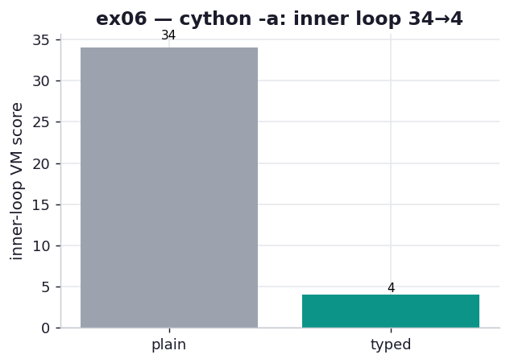

# ex06_cython_annotate

The chapter calls the Cython annotation report "your targeting system," and lists it among
the chapter's Key Insights: run `cython -a` and Cython writes an HTML file that shades each
line by how much it talks to the Python virtual machine — deep yellow for lines that call
back into CPython, white for lines that compiled to pure C. The book reads those colours by
eye. This exercise reads them as *numbers* instead: Cython embeds a per-line score in that
HTML (`class="cython line score-N"`), and we parse it so "this line is shaded" becomes "this
line scored 19," which you can compare and assert on.

We annotate two versions of the Julia loop side by side — `plain` (unannotated) and `typed`
(the `cdef` C scalars plus expanded math) — and watch the score collapse on exactly the
lines that run tens of millions of times.

## What it measures

The summed VM-interaction score per function, split into the hot inner-loop lines (the
`while` test and the `z = z*z + c` update) versus the outer/setup lines:

| version | inner-loop score | outer/setup score | hottest line |
| --- | ---: | ---: | --- |
| `plain` | 34 | 30 | `while n < maxiter and abs(z) < 2:` (19) |
| `typed` | **4** | 35 | `output = [0] * len(zs)` (13) |

This is not a timing exercise — the chapter is explicit that a high score doesn't *always*
mean slow, only that the line calls into the VM. The signal is *where* the shading is.

## What we found

Two things, and the second is the whole point.

**Typing crushes the inner-loop score, 34 → 4.** Those are the lines that execute >30 million
times for a 1000×1000 grid, so whitening them is where ex02's 15× came from. The annotation
report would have told you to focus there before you ever ran a profiler — that's its job as a
targeting tool.

**The hottest line *moves*.** In `plain`, the worst offender is the inner `while` test (score
19) — exactly the line you want to fix. In `typed`, that line is white, and the new "hottest"
line is `output = [0] * len(zs)` (score 13), which builds the result list in the *outer* loop.
And here the chapter's discipline kicks in: that line runs about a million times, not thirty
million, and it's list-building that Cython can't avoid without switching to numpy (which is
exactly what ex03 does). So the report is now telling you to *stop* — the remaining shading is
in the "don't bother" zone. Notice the outer score even ticked up slightly (30 → 35), because
`typed` adds a `cdef` line and the expanded math has more tokens; it doesn't matter, because
none of it is on the hot path.

## Reading the chart



Two bars: the summed inner-loop VM score for `plain` (grey, 34) versus `typed` (teal, 4). The
teal bar is almost gone — that collapse is the visual of "the hot loop is now C." The chart
deliberately shows only the *inner-loop* score, because that's the number that predicts the
speedup; the outer-loop shading is real but, as the chapter insists, not worth your time.

## 5 Whys

1. **Why does Cython ship an annotation report at all?** Because compiling blindly wastes
   effort — the report shows which lines still call into the VM, so you optimise the few that
   matter instead of every line.
2. **Why does a line's shading score predict where to optimise?** A shaded line emits CPython
   API calls; inside a tight loop those calls dominate runtime, so high-score inner-loop lines
   are the true hotspots.
3. **Why does typing drop the inner-loop score from 34 to 4?** The `cdef` C scalars let the
   `z`/`n` updates and the escape test compile to register machine code with no CPython calls —
   the lines go white.
4. **Why does the hottest line move to the outer `output = [0]*len(zs)`?** Once the inner loop
   is C, the only remaining VM work is building the Python result list, which lives in the outer
   loop — newly the "worst," but running ~30× less often.
5. **Why not chase that remaining outer-loop shading too?** Because it runs ~1M times vs the
   inner loop's ~30M, so whitening it (only possible by moving to numpy arrays, per ex03) buys
   little — the report is telling you to stop.

**Root cause:** the annotation report turns "where is my code slow" into "which lines call the
VM, and how often do they run" — and the win comes from whitening the *frequently executed*
shaded lines, not all of them.

## Run

```bash
.venv/bin/python chapter_8_compiling_to_c/ex06_cython_annotate/ex06_cython_annotate.py
# then open the report Cython generated, to see the colours the scores come from:
open chapter_8_compiling_to_c/ex06_cython_annotate/annot.html
# regenerate this chart:
.venv/bin/python chapter_8_compiling_to_c/visualize_exercises.py --only ex06
```
