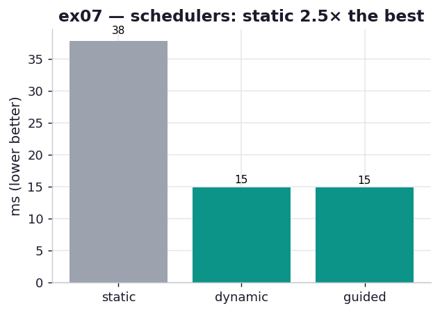

# ex07_prange_schedulers

ex03 used `schedule="guided"` in its `prange` and asserted, without proof, that it was the
right choice for this workload. This exercise supplies the proof. It compiles the same
Cython+OpenMP Julia loop three times — once each with `static`, `dynamic`, and `guided`
scheduling — and times them head to head, turning the chapter's paragraph on OpenMP
scheduling into a measurement you can see.

## What it measures

One full 1000×1000 grid, best of seven, on a 10-core machine:

| schedule | time | vs best |
| --- | ---: | ---: |
| `static` | ~37 ms | **2.6×** |
| `dynamic` | ~14 ms | ~1.0× |
| `guided` | ~14 ms | 1.0× (best) |

All three compute the identical fractal (`sum(output) == 33,219,980`); the only difference is
how OpenMP hands pixels to threads.

## What we found

The gap between `static` and the other two is large — `static` takes nearly three times as
long — and it comes entirely from *load imbalance*, not from doing more work. Here is why. The
Julia set is wildly uneven: a pixel out in the escape region exits the inner `while` after one
or two iterations, while a pixel deep in the set runs all 300. `static` scheduling splits the
million pixels into ten equal *contiguous* blocks and assigns one to each thread up front.
Because the expensive interior of the fractal is spatially clustered, one or two threads land
on it and grind through hundreds of millions of iterations while the others — handed the cheap
escape regions — finish almost immediately and then sit idle. The wall-clock is set by the
slowest thread, so all that idle capacity is wasted.

`dynamic` and `guided` fix this by handing out work at runtime: a thread that finishes its
chunk comes back for more, so no core goes idle while another is still grinding. `dynamic` uses
small fixed chunks; `guided` starts with large chunks and shrinks them, which trims scheduling
overhead while still balancing the long tail. On this workload the two are neck and neck;
`guided` edges it, which is why ex03 (and the book) reach for it. The lesson generalises: when
per-item cost is uniform, `static` is fine and has the least overhead; when per-item cost
varies a lot, dynamic scheduling is worth its small bookkeeping cost several times over.

## Reading the chart



Three bars, milliseconds, lower is better. The grey `static` bar towers over the two teal
dynamic bars, which are level with each other. The picture is "same cores, same work, very
different wall-clock" — and the difference is purely scheduling. Note this is the *only*
variable changed between bars; the kernel, the data, and the core count are identical.

## 5 Whys

1. **Why is `static` ~2.6× slower than `dynamic`/`guided` here?** It splits the grid into equal
   contiguous blocks up front, so the thread that lands on the fractal's dense interior runs
   long while the others finish early and idle.
2. **Why does an equal split cause idle threads?** The work per pixel is wildly uneven and
   spatially clustered, so equal *pixel counts* do not mean equal *time* — one block can hold
   most of the expensive points.
3. **Why do `dynamic` and `guided` avoid the idling?** They hand out work at runtime; a thread
   that finishes grabs another chunk, so cores stay busy until the whole grid is done.
4. **Why does `guided` slightly beat `dynamic`?** It starts with large chunks and shrinks them,
   so it pays less scheduling overhead early while still rebalancing the cheap-vs-expensive tail.
5. **Why not always use dynamic scheduling then?** Its per-chunk bookkeeping is pure overhead
   when work is uniform; for an even workload `static`'s zero-coordination split is actually the
   fastest.

**Root cause:** with uneven per-item work, wall-clock is set by the unluckiest thread, so the
scheduler's job is to keep every core busy — dynamic/guided rebalance at runtime, while static's
fixed split strands threads on the heavy region.

## Run

```bash
.venv/bin/python chapter_8_compiling_to_c/ex07_prange_schedulers/ex07_prange_schedulers.py
# first run compiles the three-schedule .pyx with OpenMP (same libomp discovery as ex03)
# regenerate this chart:
.venv/bin/python chapter_8_compiling_to_c/visualize_exercises.py --only ex07
```
