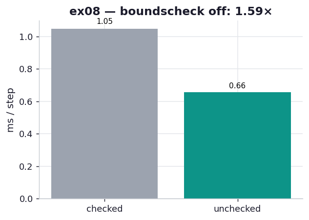

# ex08_boundscheck

ex02 tried disabling Cython's bounds checking on the Julia loop and found it changed nothing
— exactly as the book predicted. That could leave you with the wrong lesson: "bounds checking
is free, always turn it off." This exercise supplies the counter-example. It runs a kernel
where array indexing *is* the hot path — a 2D-diffusion stencil that reads five neighbours and
writes one cell on every inner iteration — and there, turning the checks off is a real,
measurable win. Same directive, opposite verdict, and the difference tells you exactly when
the chapter's tip applies.

## What it measures

A 1000×1000 diffusion grid, 30 steps per timed round, best of five:

| version | per step | speedup |
| --- | ---: | ---: |
| `boundscheck` + `wraparound` ON (Cython default) | ~1.01 ms | 1.0× |
| both OFF (`@cython.boundscheck(False)` + `wraparound(False)`) | ~0.66 ms | **1.53×** |

Both produce the identical field to 1e-12 — the only difference is whether each array access
carries a guard.

## What we found

The kernel reads `grid[i+1,j]`, `grid[i-1,j]`, `grid[i,j+1]`, `grid[i,j-1]`, and `grid[i,j]`,
then writes `out[i,j]` — six memoryview accesses, every one of them inside the doubly-nested
inner loop that runs ~998×998 times per step. With bounds checking on, each access compiles to
a comparison against the array's length (and `wraparound` adds a check for negative indices,
Python's `a[-1]` semantics). Those guards are individually cheap, but at six per iteration over
a million iterations per step they add up to a third of the runtime. Removing them lets each
access compile to a bare pointer offset — and the 1.53× falls straight out.

Put this next to ex02 and the rule becomes precise. In ex02 the same directive did nothing,
because that loop's *inner* body touched only C scalars (`z`, `n`); the only array access —
`zs[i]` — sat in the outer loop, running a million times rather than thirty million, and the
list dereference went through the VM regardless. Here the array access is the inner-loop hot
path, so the guard cost is multiplied by the inner trip count. The chapter's exact phrasing is
the test: *"disable bounds checking if your CPU-bound code is in a loop that is dereferencing
items frequently."* ex02 wasn't; ex08 is. The directive is conditional, and this is the
condition — which is also why you should turn it off only once you trust your indices, since
the guard you're removing is the one that turns an off-by-one into a clean error instead of a
silent read past the buffer.

## Reading the chart



Two bars, milliseconds per step, lower is better. The grey checked bar at ~1.0 ms, the teal
unchecked bar at ~0.66 ms — about a third shaved off by removing the guards. Compare this to
ex02's chart, where the equivalent two bars are the same height: that contrast *is* the lesson.

## 5 Whys

1. **Why does `boundscheck=False` help here when it did nothing in ex02?** This kernel indexes
   the array six times per inner iteration; ex02's inner loop touched only C scalars, with its
   single array access out in the cheap outer loop.
2. **Why does inner-loop indexing make the guards expensive?** Each access compiles to a length
   comparison (plus a sign check for wraparound); multiplied by ~1M inner iterations per step,
   that's millions of extra comparisons.
3. **Why are the guards there by default?** They turn an out-of-range index into a clean Python
   exception instead of a silent read/write past the buffer — memory safety, at a small cost.
4. **Why is it safe to remove them here?** The stencil indices are provably in range (the loops
   run `1 .. n-2`), so the checks can never fire — they're pure overhead for this access pattern.
5. **Why not disable them everywhere as a habit?** On code that doesn't index in a hot loop they
   buy nothing (ex02), and on code with computed indices they're your only guard against
   corruption — so it's a targeted tool, not a default.

**Root cause:** a bounds check costs per array access, so its total cost scales with how deep in
the loop nest the indexing sits — negligible in an outer loop (ex02), a third of runtime in a
six-reads-deep inner loop (ex08).

## Run

```bash
.venv/bin/python chapter_8_compiling_to_c/ex08_boundscheck/ex08_boundscheck.py
# the .pyx is compiled on first import by pyximport (no numpy headers needed)
# regenerate this chart:
.venv/bin/python chapter_8_compiling_to_c/visualize_exercises.py --only ex08
```
