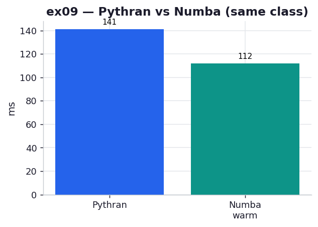

# ex09_pythran

The chapter lists Pythran among the "main options" after the big three: an ahead-of-time
compiler aimed at scientists using numpy, which "produces speedups that are very similar to
Cython but for much less work." The entire annotation burden is a single comment —
`#pythran export calc(int, complex128[:], complex128[:])` — over an otherwise plain
numpy-flavoured function. This exercise compiles the Julia loop with Pythran and times it
against Numba, the other near-zero-effort compiler in the chapter, so you can see two very
different toolchains arrive at the same place.

## What it measures

One full 1000×1000 grid, best of five:

| engine | time | when it compiles |
| --- | ---: | --- |
| Pythran (AOT) | ~146 ms | once, at build time (`pythran` CLI) |
| Numba warm (JIT) | ~113 ms | at first call, per process |
| Numba cold (for context) | ~476 ms | — |

Both match the checksum. Pythran is ~0.77× of Numba-warm here — the same class of speed, with
Numba a touch ahead on this particular loop.

## What we found

Pythran reaches Numba/Cython-class speed from a single export line and a function you'd write
anyway, with no `.pyx`, no C types, and no decorator — which is precisely the chapter's pitch.
What's worth drawing out is that its cost model is the *mirror image* of Numba's. Numba is a
JIT: it compiles at the first call, specialised to the argument types it observes, and pays
that cold start fresh in every new process (the ~476 ms here versus ~113 ms warm). Pythran is
ahead-of-time: you run the `pythran` CLI once at build time, it emits a native `.so`, and from
then on there is no per-process warm-up at all — the first call is as fast as the thousandth.

So the two aren't really competing on speed; they're competing on *when you pay the compiler*,
and that maps onto how your code is deployed. A long-running service barely notices Numba's cold
start and enjoys its zero build step. A batch of short-lived script invocations would pay
Numba's cold start every time, and there Pythran's build-time toll — paid once, in CI — is the
better trade. The book frames Pythran as "Cython results for less work"; the sharper framing
this exercise surfaces is "Numba's ease without Numba's cold start, at the price of an explicit
build step." Pythran also always releases the GIL and can emit SIMD and OpenMP, though we don't
exercise those here.

## Reading the chart



Two bars, milliseconds: Pythran (blue) and Numba-warm (teal), close in height — the visual of
"same class of speed." The chart shows the warm Numba number on purpose, because that's the
fair steady-state comparison; the cold number lives in the script output as the reminder that
Numba's bar has a one-time tax behind it that Pythran's does not.

## 5 Whys

1. **Why does Pythran match Numba/Cython from a single comment?** That `#pythran export` line
   gives it the argument types, which is all an AOT compiler needs to generate a specialised
   native C++ kernel for the loop.
2. **Why doesn't Pythran need a `.pyx` or C types like Cython?** It infers types from the export
   signature and its own analysis of the numpy-style code, rather than asking you to annotate
   every variable.
3. **Why does Pythran have no per-process cold start when Numba does?** Pythran compiles at build
   time into a `.so`; Numba compiles at first call, so Numba re-pays that compile in each new
   process while Pythran never does.
4. **Why does the build-time-vs-call-time difference matter in practice?** Short, frequently
   relaunched scripts pay Numba's cold start every run, where Pythran's one-time build (in CI)
   wins; long-lived processes amortise Numba's cold start to nothing.
5. **Why is Pythran narrower than Cython despite the easier syntax?** It targets numpy numeric
   functions and doesn't support classes or arbitrary Python, so it's a scalpel for hot kernels,
   not a general Python-to-C path.

**Root cause:** Pythran and Numba both strip the interpreter off a numeric loop for almost no
annotation; they differ only in *when the compile happens* — build time (no cold start, explicit
build) versus first call (zero build, per-process cold start).

## Run

```bash
.venv/bin/python chapter_8_compiling_to_c/ex09_pythran/ex09_pythran.py
# first run AOT-compiles julia_pythran.py with the pythran CLI
# regenerate this chart:
.venv/bin/python chapter_8_compiling_to_c/visualize_exercises.py --only ex09
```
