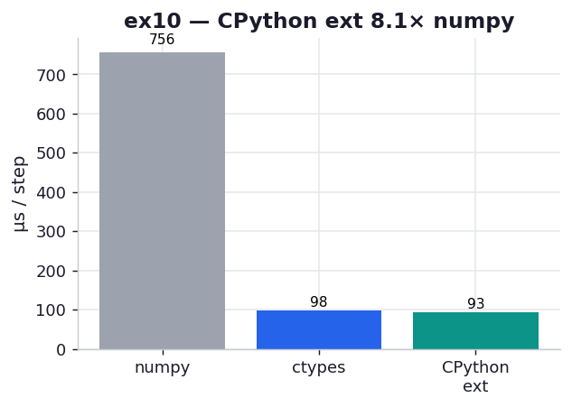

# ex10_cpython_extension

The chapter ends its FFI tour at the bottom of the abstraction ladder: writing a CPython
extension module by hand, against the raw C-API. It includes the full code "as a cautionary
tale" — roughly fifty lines of C to parse arguments, validate types and dimensions, call one
function, and manage a reference count, where ex05's cffi binding did the same job in four
lines of Python. This exercise builds that extension, calls the identical diffusion kernel
through it, and measures whether all that boilerplate buys anything.

## What it measures

One diffusion step on a 512×512 grid, best of five over 200 calls each:

| backend | per step | note |
| --- | ---: | --- |
| numpy (vectorized) | ~752 µs | the reference |
| `ctypes` → plain `.so` | ~103 µs | per-call marshalling |
| hand-written CPython ext | ~94 µs | **1.09× over ctypes** |

All three agree to 1e-12 — same kernel, three call paths.

## What we found

The hand-written extension is the fastest, but only just — about 9% over the ctypes binding to
the *same* compiled `evolve`. That edge is real and it's explainable: ctypes does its
type-casting and argument marshalling in Python on every call, while the CPython extension does
it in C, inside `PyArg_ParseTuple`, with no Python-level layer between the call and the kernel.
On a 512×512 grid the kernel itself is ~90 µs, so shaving the marshalling moves the total by a
handful of microseconds — visible in a tight benchmark, irrelevant in most programs.

And that is exactly the chapter's verdict, now measured rather than asserted. The price of that
9% is steep: every type check, dimension check, and contiguity check is spelled out by hand;
the returned array's reference count is bumped manually with `Py_XINCREF`; and the whole module
is welded to a specific CPython C-API. The book notes that much of the pain of the Python 2→3
migration lived in exactly this kind of code, because a C-API change forces a rewrite. So the
trade is: ~9% faster than ctypes, ~10× the code, and a permanent maintenance liability. The
chapter's guidance — reach for this only as a last resort, when nothing higher-level fits — is
the right read, and ex12 (Rust via PyO3) is the modern answer to "I really do need a compiled
extension, but I'd like memory safety and a sane build."

## Reading the chart



Three bars, microseconds per step, lower is better. The grey numpy bar towers over the two
C-backed bars; those two — ctypes and the CPython extension — are nearly the same short height,
the extension a hair shorter. That near-tie is the point: fifty lines of fragile C bought a
sliver over four lines of cffi calling the identical kernel.

## 5 Whys

1. **Why is the hand-written extension faster than ctypes at all?** It marshals arguments in C
   inside `PyArg_ParseTuple`, with no per-call Python-level casting layer between the call and
   the kernel.
2. **Why is the gain only ~9%?** The marshalling it removes is a few microseconds; the 512×512
   kernel itself is ~90 µs, so trimming the wrapper barely moves the total.
3. **Why is the extension so much more code than cffi?** The raw C-API makes you do everything
   by hand — argument parsing, type/shape/contiguity checks, and reference counting — that cffi
   generates from a signature string.
4. **Why is that hand-written code a maintenance risk?** It's coupled to a specific CPython
   C-API; a Python version bump (famously 2→3) can change the contract and force a rewrite.
5. **Why does the chapter include it as a "cautionary tale"?** To show that the maximum-control
   option is rarely worth its cost — the speed edge is tiny and the fragility is large, so it's a
   last resort, not a default.

**Root cause:** dropping to the raw CPython C-API removes the per-call marshalling layer for a
few microseconds' gain, but the cost is an order more code and tight version-coupling — so the
hand-written extension is minutely faster and substantially worse to live with.

## Run

```bash
.venv/bin/python chapter_8_compiling_to_c/ex10_cpython_extension/ex10_cpython_extension.py
# first run builds the extension (setup.py) and a plain .so (cc) for the ctypes baseline
# regenerate this chart:
.venv/bin/python chapter_8_compiling_to_c/visualize_exercises.py --only ex10
```
