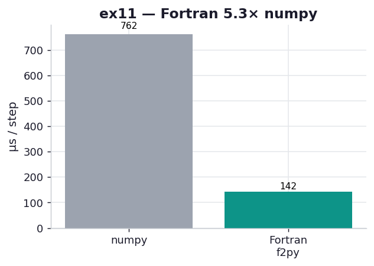

# ex11_f2py_fortran

For many scientific applications Fortran is still the gold standard — LAPACK and BLAS, the
numerical bedrock under numpy and SciPy, are Fortran — and the chapter shows how `f2py`, which
ships inside numpy, turns a Fortran subroutine into an importable Python module almost for
free. It can be that simple because Fortran's types are explicit, so f2py can parse the source
and generate the whole interface. This exercise builds the book's Example 8-22 diffusion
subroutine and calls it from Python.

## What it measures

One diffusion step on a 512×512 grid, best of five over 200 calls each:

| backend | per step | speedup |
| --- | ---: | ---: |
| numpy (vectorized) | ~775 µs | 1.0× |
| Fortran via f2py | ~149 µs | **5.2×** |

Both agree to 1e-12. The Fortran kernel lands in the same C-kernel league as ex05/ex10/ex12 —
the value here is the *interface*, not a new speed tier.

## What we found

The `!f2py` annotation comments are the whole trick, and they're what make the resulting Python
function pleasant. `intent(in)` marks the read-only inputs, `intent(inplace)` lets the kernel
write `next_grid` directly, and — the nicest one — `intent(hide)` on the grid sizes `N` and `M`
tells f2py to fill them in from the array shape and drop them from the signature. Fortran needs
those sizes explicitly; Python already knows them; `intent(hide)` reconciles the two, so the
function you call is simply `evolve(grid, next_grid, D, dt)`, with no manual size-passing and
none of the type-casting ceremony that `ctypes` demanded in ex05 or the fifty lines of
arg-parsing the CPython extension needed in ex10. f2py even auto-documents the generated module.

There is exactly one catch, and the chapter flags it loudly: **array memory order**. C and numpy
default to row-major (C order); Fortran is column-major (F order). Iterate a 2D array in the
wrong order and you turn sequential memory walks into cache-missing strides — a big slowdown — or,
worse, read the wrong elements entirely. The fix is one keyword: build the numpy arrays you hand
to Fortran with `order="F"`. This exercise does, and the result matches numpy to 1e-12; flip it
to the default C order and you'd see the kernel slow down or the assertion fail. So the f2py
experience is "frictionless interface, one layout gotcha" — which is a fair summary of why it
remains the path of least resistance for pulling battle-tested Fortran numerics into Python.

(Build note: modern numpy's f2py uses the `meson` backend, so this needs `meson`/`ninja` on
PATH and a Fortran compiler — `gfortran`, installed via Homebrew's `gcc` on this machine.)

## Reading the chart



Two bars, microseconds per step, lower is better. The grey numpy bar at ~775 µs towers over the
teal Fortran bar at ~149 µs — the ~5× drop you get from a compiled stencil over numpy's
multi-pass, temporary-allocating vectorization. The height ratio matches ex05's C kernel and
ex12's Rust, which is the point: these are all the same compiled-kernel tier reached through
different doors.

## 5 Whys

1. **Why can f2py auto-generate a clean Python interface when ctypes can't?** Fortran has
   explicit types in the source, so f2py parses them and emits a correctly-typed wrapper, where
   a compiled `.so` carries no type metadata for ctypes to read.
2. **Why does `intent(hide)` make the call so clean?** Fortran needs the array sizes as explicit
   arguments, but Python already knows the shape, so f2py fills them in and removes them from the
   signature.
3. **Why must the numpy arrays use `order="F"`?** Fortran stores 2D arrays column-major; passing
   default C-order (row-major) data makes the inner loop stride through memory, cache-missing —
   or read the wrong cells.
4. **Why is Fortran ~5× faster than vectorized numpy?** The subroutine fuses the stencil into one
   pass over contiguous memory, while numpy materialises several temporary arrays and traverses
   the grid multiple times.
5. **Why is Fortran still worth interfacing at all?** Decades of tuned numerical libraries
   (LAPACK, BLAS) are written in it, and f2py makes reusing them from Python nearly free.

**Root cause:** Fortran's explicit typing lets f2py generate the whole interface automatically,
so the only friction is the row-major/column-major mismatch — a one-keyword fix (`order="F"`) for
C-kernel-class speed.

## Run

```bash
.venv/bin/python chapter_8_compiling_to_c/ex11_f2py_fortran/ex11_f2py_fortran.py
# first run f2py-compiles diffusion.f90 (needs gfortran + meson/ninja)
# regenerate this chart:
.venv/bin/python chapter_8_compiling_to_c/visualize_exercises.py --only ex11
```
