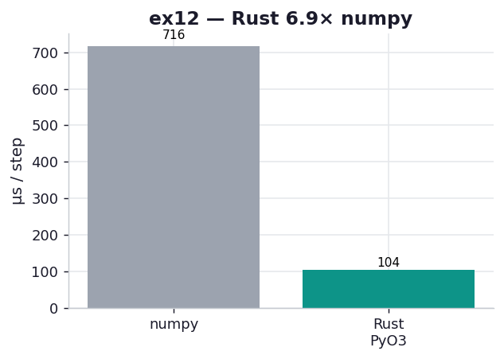

# ex12_rust_pyo3

The chapter closes with a contributed section by Itamar Turner-Trauring presenting Rust as the
modern counterpoint to the hand-written C extension of ex10: the same compiled-kernel speed,
but with memory safety and thread safety enforced by the compiler, and a real build system
(Cargo) instead of a hand-rolled `setup.py`. This exercise builds that diffusion kernel with
PyO3 and the `numpy`/`ndarray` crates via `maturin`, and times it against the same vectorized
numpy reference used throughout the FFI exercises.

## What it measures

One diffusion step on a 512×512 grid, best of five over 200 calls each:

| backend | per step | speedup |
| --- | ---: | ---: |
| numpy (vectorized) | ~757 µs | 1.0× |
| Rust via PyO3 | ~99 µs | **7.6×** |

Both agree to 1e-12. Rust lands in the same league as ex05's C (~94 µs) and ex11's Fortran
(~149 µs) — the compiled-kernel tier, reached through yet another door.

## What we found

The Rust kernel reads almost exactly like the C in ex05 — a doubly-nested loop computing the
five-point Laplacian — but two things are different under the surface, and both are the
compiler working for you. First, the `numpy` crate hands the input array to Rust as a *read-only*
`ArrayView2` and the output as a *mutable* `ArrayViewMut2`, and Rust's borrow checker guarantees
at compile time that a mutable reference can't coexist with any other reference to the same data.
That's the aliasing guarantee C simply doesn't give you, and it's the foundation of Rust's
"fearless concurrency" — the same rules that prevent the bug also make it safe to parallelise.
Second, every array index is bounds-checked, so an off-by-one is a clean panic with a message,
not the silent memory corruption or segfault you'd get from the C version's raw pointer
arithmetic.

You pay nothing in speed for those guarantees here — Rust matches the C kernel — and the
developer experience is markedly better than ex10's: `cargo add numpy` to pull a dependency, one
`maturin develop` to build and install, no manual reference counting, no hand-written
argument parsing. The chapter's framing holds up: Rust scales from large complex libraries
(Polars is mostly Rust) down to a small extension like this one, and the main costs are the
learning curve and a younger ecosystem of specialized numerical crates. One idiomatic detail
worth noticing in the API: PyO3's `evolve(grid, dt, D=1.0)` *allocates and returns* a fresh
output array rather than writing into a caller-supplied out-parameter, the Rust-native style —
a small but visible departure from the C `evolve(in, out, …)` convention in ex05 and ex10.

(Build note: this needs the Rust toolchain — `cargo`/`rustc` — and `maturin`. The crate lives in
`crate/` so its directory name doesn't shadow the installed `diffusion_rs` module; `maturin
develop` installs it into the project venv on first run.)

## Reading the chart



Two bars, microseconds per step, lower is better. The grey numpy bar at ~757 µs dwarfs the teal
Rust bar at ~99 µs — a ~7.6× drop, matching the C and Fortran kernels. The visual story across
ex05/ex10/ex11/ex12 is deliberately the same: four different compiled languages, one shared
"compiled-kernel" height, very different ergonomics behind each.

## 5 Whys

1. **Why does Rust match C's speed here?** It compiles to native machine code with the same
   fused single-pass stencil; the safety guarantees are enforced at compile time, so they cost
   nothing at runtime.
2. **Why is Rust safer than the C extension (ex10)?** The borrow checker forbids the mutable
   output view from aliasing the read-only input view, and every index is bounds-checked — so
   whole classes of C bugs (use-after-free, buffer overrun) can't compile.
3. **Why is the build so much smoother than ex10's?** Cargo manages dependencies (`cargo add
   numpy`) and maturin produces and installs the extension in one command, versus hand-writing a
   C-API module and a `setup.py`.
4. **Why does the Python function return a new array instead of taking an out-parameter?** It's
   idiomatic Rust — allocate and return ownership — and PyO3 maps that cleanly to a Python return
   value, unlike the C convention of writing into a passed-in buffer.
5. **Why isn't Rust always the answer for extensions?** A steeper learning curve and a younger
   set of specialized numerical crates; for many quick jobs cffi (ex05) is less to learn, and the
   maturity gap will close with time.

**Root cause:** Rust delivers C-kernel speed while moving memory- and thread-safety into the
compiler, so the extension that would be fragile in C (ex10) is safe by construction — at the
cost of learning the borrow checker and a younger ecosystem.

## Run

```bash
.venv/bin/python chapter_8_compiling_to_c/ex12_rust_pyo3/ex12_rust_pyo3.py
# first run compiles the crate with `maturin develop --release` (needs cargo/rustc; ~10s build)
# regenerate this chart:
.venv/bin/python chapter_8_compiling_to_c/visualize_exercises.py --only ex12
```
