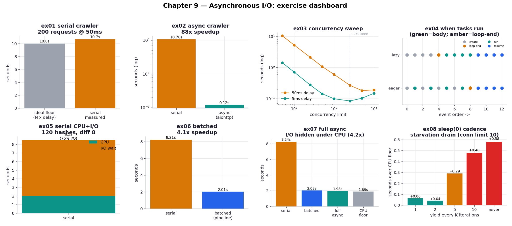
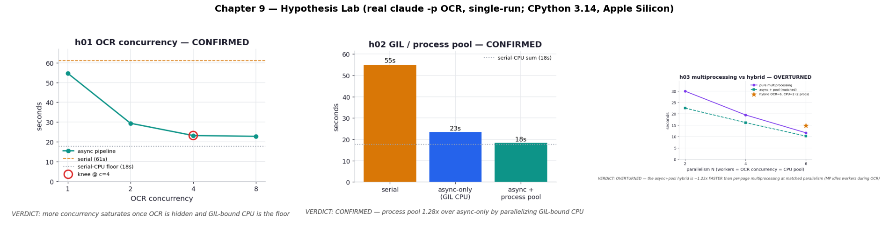

# Chapter 9 — Asynchronous I/O: Practice Exercises

Runnable drills for *High Performance Python (3rd ed.)*, Chapter 9 — **nine** of them, plus a
two-experiment hypothesis lab. The
chapter's subject is the opposite of the rest of the book: the previous chapters made code do
fewer CPU cycles, but here the bottleneck is not computation at all — it is *waiting*. When a
program reads a socket or writes to a database it stalls in **I/O wait**, holding a CPU core
while doing nothing, because the kernel, not your code, talks to the hardware. A single 1 ms
network write idles a 2.4 GHz core long enough to have run ~2.4 million instructions.
Asynchronous I/O reclaims that dead time by running other work on the same thread while the
kernel handles the device.

These exercises follow the book's two running examples on the **same local infrastructure** — a
small `aiohttp` server (`_server.py`) that sleeps a configurable number of milliseconds before
replying, standing in for a slow database or a laggy web service, and a shared workload module
(`_workload.py`) with a cache-busting URL generator and a tunable bcrypt hash. Every exercise
times the identical work, so the numbers line up into one story instead of floating as
disconnected claims, and each asserts a correctness anchor so a variant that gets "fast" by
doing the wrong thing fails loudly.

**Core idea:** Concurrency does not make any single operation faster — it stops the program from
*waiting* on one thing when it could be making progress on another. On one thread, an event loop
interleaves many I/O operations so their waits overlap; the serial *sum* of independent waits
becomes a near-constant number of overlapping waves. The art is knowing when it pays (lots of
I/O wait), how much concurrency to use (a sweet spot, not unlimited), and where to yield so CPU
and I/O overlap.

Numbers below are from **CPython 3.14 / aiohttp 3.14 / bcrypt 5.0 on Apple Silicon (10 cores)**
against a local loopback server — yours will differ. Crucially, the workload here is **scaled
down** from the book (200 requests / 120 hashes at a 50 ms delay, versus the book's 1,000 / 600
at 100 ms) so the whole suite runs in well under a minute rather than many minutes. Because our
local server has far less overhead than a real remote one and our delay is shorter, our absolute
speedups differ from the book's in both directions — the *ratios and shapes*, which are the
actual lesson, hold.

```bash
.venv/bin/python chapter_9_asynchronous_io/ex02_aiohttp_crawler/ex02_aiohttp_crawler.py
```

**Verified learnings** (measured on this machine):

1. **Serial I/O is additive; async turns the sum into a maximum** (ex01 → ex02). 200 serial
   requests at 50 ms take ~10.6 s — essentially the floor of 200 × 50 ms. The same crawl with
   `aiohttp` + `TaskGroup` finishes in ~0.12 s (two 100-connection waves), an **~89×** speedup.
   The book sees 76.6×; ours is steeper because the local server's lower overhead lets async
   recover nearly all the delay.
2. **More concurrency has a sweet spot, and for fast requests it *reverses*** (ex03). Runtime
   keeps dropping until ~250 concurrent, then flattens for a 50 ms delay — but for a 5 ms delay
   the fastest run is at 250 and it gets *slower* at 500 and 1000, as event-loop dispatch
   becomes the bottleneck. This reproduces the book's Figure 9-4 including the turnaround.
3. **Tasks don't run when created — they run when the loop gets a turn** (ex04). In a `TaskGroup`
   creation loop with no `await`, every task body runs only *after* the loop ends (at
   `__aexit__`). `asyncio.eager_task_factory` inverts this, running each body on creation up to
   its first real `await`.
4. **In a CPU+I/O serial workload, ~77% of the time is pure I/O wait** (ex05). 120 bcrypt hashes
   that each save their result serially take ~8.2 s, of which only ~1.9 s is computation; the
   rest is the program idling on the network.
5. **Batching (pipelining) recovers most of that for almost no refactor** (ex06). Queuing saves
   into bursts of 100 drops the runtime to ~2.0 s, a **~4.2×** speedup, by amortizing the delay
   across the whole batch. (The book's 6.95× is larger only because its 100 ms delay left more
   I/O to reclaim.)
6. **Full async hides the I/O *under* the CPU — within 0.08 s of the no-I/O floor** (ex07).
   Creating a save task and yielding after each hash overlaps each save with the next
   computation, collapsing ~6 s of serial I/O to ~0.08 s of overhead. At this small iteration
   count it only ties batching; the book notes the gap widens with more iterations.
7. **`await asyncio.sleep(0)` is load-bearing, and its cadence is a real knob** (ex08). Yield
   every iteration and the I/O stays hidden (+0.08 s); yield rarely or never and the saves stack
   into an end-of-run drain (+0.55–0.64 s with a constrained server). Over-yielding is cheap in a
   coarse loop but costly in a tight one.
8. **A real render→OCR→analyze pipeline shows async's ceiling once CPU is heavy** (ex09 + the
   hypothesis lab). With a real `claude -p` OCR call (I/O) and a deliberately heavy pure-Python
   analysis (CPU, ~3 s/page), the async pipeline only reaches **~2×** over serial — because
   asyncio overlaps the OCR I/O but the GIL-bound CPU stages cannot overlap. [h01](hypothesis/h01_ocr_concurrency/)
   confirms the speedup plateaus on the serial-CPU floor (knee at ~4 concurrent); [h02](hypothesis/h02_gil_process_pool/)
   confirms that offloading the CPU to a `ProcessPoolExecutor` breaks through it (1.28× over
   async-only, 3.0× over serial) — the concrete reason you eventually pair asyncio with
   multiprocessing.
9. **The async+pool hybrid even beats plain per-page multiprocessing** (h03). Predicted to tie,
   the hybrid is instead ~1.23× *faster* at matched parallelism — because running a whole page in
   one process serializes its OCR wait and its CPU, while the hybrid overlaps every OCR wait with
   other pages' CPU. Naive multiprocessing throws away the exact overlap the chapter is about.

| # | exercise | one-line takeaway |
| --- | --- | --- |
| ex01 | [serial crawler](ex01_serial_crawler/) | serial I/O time is the additive sum of every wait (~10.6 s) |
| ex02 | [aiohttp crawler](ex02_aiohttp_crawler/) | overlapping the waits gives an ~89× speedup |
| ex03 | [concurrency sweep](ex03_concurrency_sweep/) | a ~250 sweet spot; fast requests reverse past it |
| ex04 | [lazy scheduling](ex04_lazy_scheduling/) | tasks run at the first `await`, not on creation |
| ex05 | [serial CPU+I/O](ex05_serial_cpu_io/) | ~77% of a serial CPU+save workload is I/O wait |
| ex06 | [batched pipeline](ex06_batched_pipeline/) | batching recovers most of it (~4.2×) with little code change |
| ex07 | [full async](ex07_full_async/) | overlapping CPU and I/O hides the I/O almost entirely |
| ex08 | [sleep(0) cadence](ex08_sleep_zero/) | how often you yield decides whether the I/O stays hidden |
| ex09 | [OCR pipeline](ex09_ocr_pipeline/) | a real render→OCR→analyze pipeline; heavy CPU caps async at ~2× |



## Hypothesis lab

Beyond the book: three falsifiable experiments built on ex09's real pipeline (render a PDF page,
OCR it with a live `claude -p --model haiku` call, run a heavy pure-Python analysis). Their
numbers are **single-run and nondeterministic** — captured once and charted from the capture —
but the *shape* of each result is the claim. See [hypothesis/](hypothesis/).

| # | hypothesis | verdict | finding |
| --- | --- | --- | --- |
| h01 | [optimal OCR concurrency](hypothesis/h01_ocr_concurrency/) | **CONFIRMED** | speedup saturates at a knee (~c=4), plateauing on the serial-CPU floor |
| h02 | [GIL / process pool](hypothesis/h02_gil_process_pool/) | **CONFIRMED** | offloading CPU to a process pool beats async-only 1.28× — asyncio + multiprocessing compose |
| h03 | [multiprocessing vs hybrid](hypothesis/h03_multiprocessing_vs_hybrid/) | **OVERTURNED** | the async+pool hybrid is ~1.23× *faster* than per-page multiprocessing at matched parallelism — MP serializes each page's OCR and CPU; the hybrid overlaps them |



## What's reproduced, and what isn't

The chapter's two narratives both reproduce cleanly on local infrastructure: the serial → async
crawler speedup (ex01–ex02), the concurrency sweet spot *and its reversal for short requests*
(ex03), lazy task scheduling and the eager factory (ex04), and the serial → batched → full-async
ladder for the CPU+I/O workload (ex05–ex08), including the `sleep(0)` starvation failure mode.

Two honest caveats on the synthetic exercises. First, the **absolute speedups differ from the
book** because our delay is 50 ms (not 100 ms) and our loopback server has negligible network
overhead — so the crawler speedup runs *higher* than the book's while the CPU+I/O speedups run
*lower* (less I/O share to reclaim). Second, the **full-async-beats-batched-by-2× result is only
hinted at**, not shown: at 120 iterations batching and full async nearly tie, because the
advantage compounds per avoided flush and only separates at the book's larger iteration counts —
we say so in ex07 rather than inflating the number. The book's Figures 9-2, 9-3, and 9-7 are
*request-timeline* call graphs; we reproduce the underlying timings and connection-wave structure
but render them as summary charts rather than per-request Gantt traces.

The third caveat is louder and applies to **ex09 and the hypothesis lab**: those use a *real*
`claude -p` call for the OCR stage, so their numbers are **single-run and nondeterministic** —
they depend on the model, the network, and the machine, and will not reproduce to the same
seconds. We capture one real run into each `results.json` and build the charts/READMEs from it;
`task ch9:viz` reads those captures and never calls the model, and `task ch9:smoke` skips ex09 so
the smoke suite stays free. Run the real pipeline deliberately with `task ch9:ocr`. The
reproducible lesson is the *shape*: a heavy GIL-bound CPU stage caps a single-threaded async
pipeline at ~2×, and a process pool is what breaks through it.

## 5 Whys: why a single thread can beat itself at I/O

1. **Why can one thread run faster than the serial version of the same code?** Because most of
   the serial runtime is *waiting*, not computing; overlapping the waits costs no extra cores.
2. **Why are the waits overlappable?** The actual waiting happens in the kernel (on the socket),
   not in Python; while one request waits, the thread is free to start another.
3. **Why doesn't synchronous code exploit that?** A blocking call couples "issue request" to
   "await its result" — the thread has no mechanism to do other work in between.
4. **Why does an event loop fix it?** It holds a list of ready coroutines and switches between
   them at every `await`, so a coroutine in I/O wait yields the thread to one that can run.
5. **Why isn't this just as good as multiprocessing?** Because it is still one thread under the
   GIL: it hides I/O behind I/O (and behind CPU, with explicit yields), but it cannot run two
   *computations* at once — for that you need Chapter 10's processes.

**Root cause:** I/O-bound programs spend most of their life blocked in the kernel with the CPU
idle; an event loop on a single thread fills that idle time with other ready work, so concurrency
buys large speedups exactly when — and only when — there is I/O wait to reclaim.

## Running everything

```bash
# one exercise
.venv/bin/python chapter_9_asynchronous_io/ex07_full_async/ex07_full_async.py

# regenerate every chart + both dashboards (reads captures; no model calls)
.venv/bin/python chapter_9_asynchronous_io/visualize_exercises.py
.venv/bin/python chapter_9_asynchronous_io/hypothesis/visualize.py

# via the task runner
task ch9:run -- ex07_full_async/ex07_full_async.py
task ch9:viz                 # all charts + dashboards (free)
task ch9:smoke               # ex01–ex08 (ex09 skipped; no token spend)
task ch9:ocr -- --pages 6    # the REAL OCR pipeline (spends tokens via claude -p)
```

Each synthetic script (ex01–ex08) spins up its own delay-server on a free port and tears it down
on exit, so there is nothing to start by hand and runs never collide on a port. ex09 and the
hypotheses instead shell out to a real `claude -p`; they need the `claude` CLI on `PATH` and
spend tokens, so they are kept out of `smoke` and run on demand.
