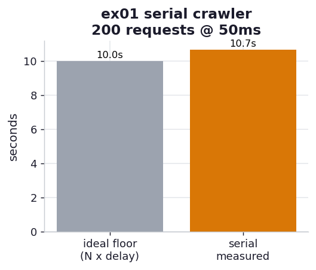

# ex01_serial_crawler

The honest floor. Before any async cleverness, we measure the naive thing: fetch a list of
URLs one at a time with the synchronous `requests` library, summing the length of every
response body. Each `session.get(url)` blocks until its response comes back, so the program
spends almost its entire life parked in *I/O wait* — holding a CPU core but doing nothing with
it while the kernel waits on the network.

Every speedup later in the chapter is quoted against this number, measured on this machine, not
against the book's laptop.

## What it measures

200 requests against a local server that sleeps 50 ms before each reply (a stand-in for a slow
database or a laggy web service):

| quantity | value | meaning |
| --- | ---: | --- |
| ideal floor (N × delay) | 10.0 s | 200 × 50 ms — what perfect no-overlap serial *must* cost |
| serial, measured | ~10.6 s | the real run |
| overhead | ~0.6 s | connection setup, the GIL, Python per-request work |

The measured time lands a hair above the ideal floor, exactly as theory predicts: there is no
interleaving, so the delays stack end to end and the only surprise is the small constant
overhead on top. The book sees the same shape at its scale — 1,000 requests at 100 ms gives a
100 s floor and a measured 101.89 s.

## What we found

**Serial I/O time is additive, and that is the whole problem.** With no overlap, the total is
the sum of every individual wait. Doubling the request count doubles the runtime; halving the
per-request delay halves it. Nothing about the work is CPU-bound — the processor is idle for
~94% of those ten seconds — yet the program cannot proceed, because it has chosen to wait for
each response before issuing the next request. That idle time is precisely what ex02 reclaims.

## Reading the chart



Two bars in seconds. The grey "ideal floor" is the arithmetic lower bound for a serial crawler
(requests × delay); the amber "serial measured" is the actual run. They are nearly the same
height — the gap between them is all the overhead a real program carries, and it is small. The
lesson is in how *tall both bars are*: ten seconds to do work that, as the next exercise shows,
can finish in a tenth of a second.

## Run

```bash
.venv/bin/python chapter_9_asynchronous_io/ex01_serial_crawler/ex01_serial_crawler.py
```

(Absolute seconds scale with the request count and delay set in `_workload.py`, and with your
machine; the *ratio* to the async version is the durable lesson.)

## 5 Whys

1. **Why does the serial crawler take ~N × delay?** Each request blocks until its response
   arrives before the next one is issued, so the per-request waits never overlap — they add up.
2. **Why must each request block?** `requests.get` is synchronous: it calls into the kernel,
   suspends the thread until the socket has data, and only then returns control to your loop.
3. **Why does the thread suspend instead of doing other work?** A synchronous call has no
   notion of "other work" — there is no event loop holding a list of other things to run, so
   the one thread has nothing to do but wait.
4. **Why is the CPU idle during that wait?** The bottleneck is the network round-trip (here, an
   artificial 50 ms sleep), which is orders of magnitude slower than the CPU; the processor
   finishes its tiny bit of work in microseconds and then stalls.
5. **Why is that idle time recoverable at all?** Because the waiting is happening in the
   kernel, not in our code — if we could hand the CPU a *different* request to start while this
   one waits, the waits would overlap instead of stack.

**Root cause:** Synchronous I/O couples "issue a request" to "wait for its result" on a single
thread, so independent waits are forced into a sequence; the idle CPU during each wait is the
reclaimable resource the rest of the chapter goes after.
