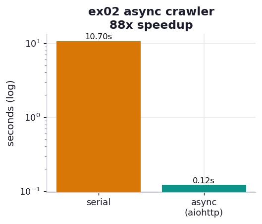

# ex02_aiohttp_crawler

The same crawl, made asynchronous — and the headline result of the chapter. The code barely
changes from ex01: instead of calling `process` in a loop, we wrap each fetch in a `TaskGroup`
task and let the event loop run them concurrently. Still one thread, still one CPU, still a
shared memory space. The only difference is that while one coroutine sits in I/O wait, the loop
hands control to another that is ready to run — so the per-request 50 ms delays *overlap*
instead of stacking.

## What it measures

200 requests at 50 ms, serial vs. async, both timed on this machine in the same run so the
speedup is a real ratio:

| version | time | shape |
| --- | ---: | --- |
| serial (`requests`) | ~10.8 s | 200 waits, end to end |
| async (`aiohttp` + `TaskGroup`) | ~0.12 s | 2 waves of ~50 ms |
| **speedup** | **~89×** | |

`aiohttp.ClientSession` caps simultaneous connections at 100 by default, so 200 requests run in
two waves of ~50 ms each rather than one giant burst — which is why the async time is ~0.1 s
(two delays) and not 0.05 s (one). The book reports a 76.6× speedup on its 1,000-request crawl;
ours is steeper because our local server carries less overhead than a real remote one, so the
serial baseline is "purer" delay and the async version recovers nearly all of it.

## What we found

**Concurrency converts a sum into a maximum.** Serial cost is the *sum* of all waits; async
cost is closer to the *largest batch* of waits that run together. With a 100-connection cap and
200 requests, that is two batches — so the runtime collapses from "200 × 50 ms" to "2 × 50 ms"
plus dispatch overhead. The single thread never runs two requests at the literal same instant;
it just refuses to sit idle, always having another request in flight during any given wait.

**The connection cap is a real ceiling, not a formality.** The two-wave structure is visible in
the timing: the async run takes about two delays, not one, because the 101st request cannot
start until one of the first 100 frees its slot. ex03 turns that cap into a dial and finds
where raising it stops helping.

## Reading the chart



Two bars on a **logarithmic** y-axis (seconds). The log scale is necessary because the two
values differ by almost two orders of magnitude — on a linear axis the async bar would be an
invisible sliver at the baseline. The serial bar towers; the teal async bar sits far below it.
The title carries the measured speedup for this run.

## Run

```bash
.venv/bin/python chapter_9_asynchronous_io/ex02_aiohttp_crawler/ex02_aiohttp_crawler.py
```

## 5 Whys

1. **Why is the async crawler ~89× faster than serial?** The per-request waits overlap instead
   of stacking, so total time drops from the sum of all delays to roughly the number of waves
   times one delay.
2. **Why do the waits overlap?** Each `await` inside a `process` task yields control to the
   event loop, which immediately advances another task that is ready — so many requests sit in
   their 50 ms wait simultaneously.
3. **Why is the runtime ~2 delays and not 1?** `aiohttp` defaults to 100 simultaneous
   connections; 200 requests therefore run in two waves, and each wave pays one delay.
4. **Why cap connections at 100 at all?** Real servers enforce their own connection limits and
   degrade under floods; the client cap keeps you from opening connections that would just queue
   on the server side (the subject of ex03).
5. **Why doesn't the single thread become the bottleneck here?** Because the work *per request*
   is trivial — read the body, measure its length — so the event loop can dispatch all 200 far
   faster than the 50 ms I/O takes to complete. When that stops being true, concurrency stops
   helping (ex03's reversal).

**Root cause:** An event loop lets one thread keep many I/O requests in flight at once, turning
the serial *sum* of independent waits into a near-constant number of overlapping waves — the
exact mechanism that hides I/O wait behind other I/O.
