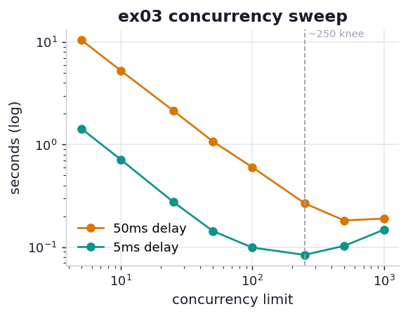

# ex03_concurrency_sweep

How many requests should you keep in flight at once? The naive answer — "as many as possible,
set the limit to N and pay one delay total" — is wrong, and this drill reproduces the book's
Figure 9-4 to show why. We sweep the connection limit across a wide range for two server
delays (a slow 50 ms "database" and a fast 5 ms "cache") and record total runtime. We use 1,000
requests so that low limits genuinely run in many waves.

## What it measures

1,000 requests, total seconds at each connection limit:

| limit | 50 ms delay | 5 ms delay |
| ---: | ---: | ---: |
| 5 | 10.6 s | 1.30 s |
| 10 | 5.30 s | 0.71 s |
| 25 | 2.16 s | 0.26 s |
| 50 | 1.11 s | 0.14 s |
| 100 | 0.58 s | 0.086 s |
| 250 | 0.26 s | **0.078 s** ← best |
| 500 | 0.18 s | 0.100 s |
| 1000 | 0.17 s | 0.133 s |

## What we found

**Diminishing returns set in, exactly where the book says.** For the 50 ms delay, doubling the
limit roughly halves the time up to ~100, but past 250 the curve flattens hard: 250 → 0.26 s,
500 → 0.18 s, 1000 → 0.17 s. You are paying ever more concurrency for ever less benefit, because
once you can keep the I/O pipe full, adding more in-flight requests only adds bookkeeping.

**For short requests the curve doesn't just flatten — it *reverses*.** This is the subtler and
more striking finding. With a 5 ms delay, the fastest run is at limit **250** (0.078 s); push to
500 and it gets *worse* (0.100 s), and at 1000 worse still (0.133 s). Faster responses flood the
event loop's completion queue at a higher rate, so the single-threaded Python dispatch becomes
the bottleneck sooner — and beyond the sweet spot, the overhead of juggling a thousand
coroutines outweighs any I/O it hides. The book's words: "short requests seeing their highest
benefit from concurrency much sooner." We see precisely that, including the turnaround the book
only hints at.

**The takeaway is a default, not a formula.** A reasonable fixed concurrency (100–250) captures
nearly all the benefit for both delays without risking the reversal. "Unlimited" is a trap.

## Reading the chart



Two curves on **log–log** axes (connection limit vs. seconds). The amber curve (50 ms) slides
down and then flattens into a near-horizontal tail past a few hundred — diminishing returns.
The teal curve (5 ms) descends, bottoms out around 250, and then *ticks back up* — the dispatch
ceiling. The dashed vertical line marks the ~250 region where both curves stop rewarding more
concurrency. Log axes are what let a 60× spread in both runtime and limit share one readable
frame.

## Run

```bash
.venv/bin/python chapter_9_asynchronous_io/ex03_concurrency_sweep/ex03_concurrency_sweep.py
```

## 5 Whys

1. **Why does raising the concurrency limit stop helping past ~250?** Once enough requests are
   in flight to keep the I/O pipe saturated, more in-flight requests add scheduling work without
   adding overlap — the bottleneck moves from I/O wait to event-loop dispatch.
2. **Why does dispatch become the bottleneck?** For every completed request the loop must wake
   the coroutine, advance it, handle the result, and reschedule — all pure Python bytecode
   running on one core under the GIL.
3. **Why can't that dispatch scale across cores?** The GIL serializes Python bytecode to a
   single thread; I/O releases the GIL, but the loop's own dispatch code reclaims it, so it is
   bounded by one core's throughput.
4. **Why does the 5 ms curve reverse while the 50 ms curve only flattens?** Shorter delays
   return completions ten times faster, filling the dispatch queue ten times faster, so the
   single-core ceiling is hit at lower concurrency — and past it, the per-coroutine overhead
   actively costs time.
5. **Why is a fixed 100–250 a good default rather than tuning per case?** It sits at the knee
   for both fast and slow backends, capturing most of the win while staying clear of the
   reversal and of overloading the downstream server.

**Root cause:** Async I/O converts an I/O-bound problem into a *dispatching* problem; the event
loop's single-threaded Python scheduler is the new ceiling, and once concurrency outruns what
one core can dispatch faster than I/O completes, more concurrency stops helping — and for fast
requests, starts hurting.
