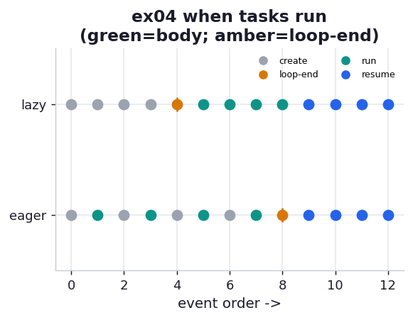

# ex04_lazy_scheduling

The chapter's most counterintuitive claim, made concrete: inside a `TaskGroup`, creating a task
runs none of its code. `tg.create_task(coro)` hands the loop a promise, not a running request.
The coroutine's body does not advance until the event loop gets a turn — and the loop only gets
a turn when the currently running code hits an `await`. A `for` loop full of `create_task`
calls with no `await` in its body never yields, so every task sits queued until the
`TaskGroup`'s `__aexit__` awaits them all at once.

This drill makes that ordering visible, then flips on `asyncio.eager_task_factory` to show the
opposite behavior.

## What it measures

We record an event log as four tasks are created and run, with markers for task creation, the
end of the creation loop, and the first line of each task body. We do it twice — default (lazy)
scheduling and eager scheduling — and report *where in the log the first task body runs*
relative to the loop-end marker.

| mode | first task body runs at | loop-end marker at | ordering |
| --- | ---: | ---: | --- |
| default (lazy) | position 5 | position 4 | bodies run **after** the loop |
| `eager_task_factory` | position 1 | position 8 | bodies run **during** the loop |

## What we found

**Default tasks are lazy: nothing runs until the loop yields.** In the lazy log, all four
`create` lines come first, then `loop-end`, and only then do the four task bodies run. The
creation loop contains no `await`, so the event loop never gets control inside it; the first
suspension point is the `async with` block's `__aexit__`, which is where every queued task
finally springs to life. This is exactly why the async crawler in ex02 needed no
`await asyncio.sleep(0)` — its task-creation loop was so fast that "everything fires at the
`TaskGroup` exit" cost nothing. It is also why ex07's CPU-heavy loop *does* need that yield.

**`eager_task_factory` inverts it: bodies run on creation, up to the first real `await`.** In
the eager log, each `create` is immediately followed by that task's first body line, *before*
the loop ends. The factory runs a new task synchronously until its first genuine suspension
point, which is a meaningful optimization when a task often has no async work to do at all
(e.g. a cache hit that returns without ever touching the network).

## Reading the chart



Two rows of dots, one per scheduling mode, laid out left-to-right in event order. Colour
encodes the event kind: grey = task created, amber = end of the creation loop, green = a task
body starts, blue = a task resumes after its `await`. In the **lazy** row the green dots all sit
to the *right* of the amber loop-end marker — bodies run after the loop. In the **eager** row the
green dots are interleaved with the grey creates, *left* of loop-end — bodies run during the
loop. The horizontal position of green relative to amber is the entire story.

## Run

```bash
.venv/bin/python chapter_9_asynchronous_io/ex04_lazy_scheduling/ex04_lazy_scheduling.py
```

## 5 Whys

1. **Why doesn't `tg.create_task(coro)` run any code?** `async def` functions are generators
   under the hood; calling one builds a coroutine object without advancing past the first
   suspension point. `create_task` only schedules it.
2. **Why does a coroutine need an external driver?** Generator semantics require an explicit
   `send()` to advance; there is no background thread. The event loop is that driver, calling
   `send(None)` when it schedules the task.
3. **Why does the loop get no chance to run tasks inside the `for` loop?** The creation loop
   contains no `await`, so it never yields control; the loop can only run other tasks when the
   running coroutine suspends.
4. **Why does `TaskGroup.__aexit__` finally run them?** `async with` exit is itself an `await` —
   the first suspension point reached — so it hands the loop its first chance to dispatch all
   the queued tasks.
5. **Why does `eager_task_factory` change the answer?** It drives each new task synchronously up
   to its first real `await` at creation time, so tasks with no async work finish immediately
   instead of waiting for a loop turn — saving a scheduling round-trip.

**Root cause:** Python coroutines are lazy, pull-driven generators, and task *creation* is
deliberately decoupled from task *execution* so the event loop — not the caller — decides when
each runs; tasks therefore start only when the loop gets a turn, which by default is at the
first `await`.
