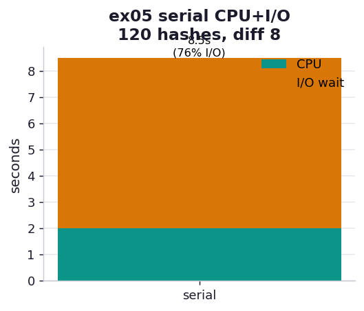

# ex05_serial_cpu_io

The chapter's second running example, in its serial form. Now the program is not just fetching
data — it is *computing* something (a CPU-bound bcrypt hash) and saving each result to a
"database" (our delay server) before moving on. This mirrors any real pipeline where you crunch
a value and must persist it: a hash, a feature vector, a model score. The serial version pays
the full I/O delay after *every* hash, and that wait is pure waste — the CPU could be computing
the next hash during it.

This is the baseline for ex06 (batched) and ex07 (full async).

## What it measures

120 bcrypt hashes at difficulty 8, each result POSTed to a server that sleeps 50 ms:

| quantity | value | meaning |
| --- | ---: | --- |
| total (CPU + I/O) | ~8.2 s | hash, save, wait, repeat |
| CPU only (saves disabled) | ~1.9 s | the same 120 hashes with no I/O |
| I/O floor (N × delay) | 6.0 s | 120 × 50 ms of unavoidable serial waiting |
| **I/O wait share** | **~77%** | fraction of total spent waiting on the network |

bcrypt difficulty 8 costs ~16 ms per hash on this machine — within a millisecond of the book's
Table 9-1 (17 ms). The book's run at difficulty 8 with 600 iterations and a 100 ms save spends
~85% of its time in I/O; our 50 ms save gives a still-dominant 77%.

## What we found

**Most of the runtime is the program doing nothing.** Strip the I/O out and the same 120 hashes
finish in ~1.9 s; add the serial saves back and it balloons to ~8.2 s. The extra ~6.3 s is the
program sitting in I/O wait, one 50 ms pause at a time, with the CPU idle the entire while. That
is the headroom ex06 and ex07 attack.

**The I/O share depends entirely on the CPU/I/O balance — know your workload.** Because the save
delay (50 ms) is roughly three times the hash cost (16 ms), I/O dominates. Crank the bcrypt
difficulty up and the picture inverts: at difficulty 12 (~255 ms/hash) the 50 ms save is a
rounding error, and speeding up the I/O would buy almost nothing. The book makes the same point
— if your CPU task takes hours and your I/O takes seconds, optimizing the I/O is wasted effort.
Measure the balance before choosing where to spend engineering.

## Reading the chart



A single stacked bar in seconds: the teal segment is the irreducible CPU time (the 120 hashes),
and the amber segment stacked on top is the I/O wait. The amber dominates — about three-quarters
of the bar — which is the visual statement of the problem. The annotation gives the total and
the I/O percentage. ex06 and ex07 shrink that amber segment toward zero.

## Run

```bash
.venv/bin/python chapter_9_asynchronous_io/ex05_serial_cpu_io/ex05_serial_cpu_io.py
```

## 5 Whys

1. **Why does the serial CPU+I/O run take ~4× the CPU-only time?** After every hash it issues a
   save and blocks ~50 ms for the reply, and those 120 waits add up to ~6 s of pure idling on
   top of ~1.9 s of computation.
2. **Why does it block after every hash?** The synchronous `requests.post` returns only once the
   response arrives; the loop cannot start the next hash until it does.
3. **Why is blocking there wasteful?** The next hash is completely independent of the previous
   save's result — the CPU could compute it *during* the wait, but serial code gives it no way
   to.
4. **Why is I/O 77% of the total and not more or less?** It is the ratio of save delay (~50 ms)
   to per-hash CPU (~16 ms): the slower the I/O relative to the CPU, the larger its share.
5. **Why does that ratio decide which optimization matters?** If I/O dominates (as here),
   overlapping it with CPU is the big win; if CPU dominates, the I/O is already hidden in the
   noise and the effort belongs elsewhere (Chapter 10's multiprocessing).

**Root cause:** Serial code forces a strict sequence of independent CPU and I/O steps, so the
I/O wait — here ~77% of the runtime — is laid end-to-end against the CPU work instead of
underneath it; the entire point of the next two exercises is to slide the I/O under the CPU.
