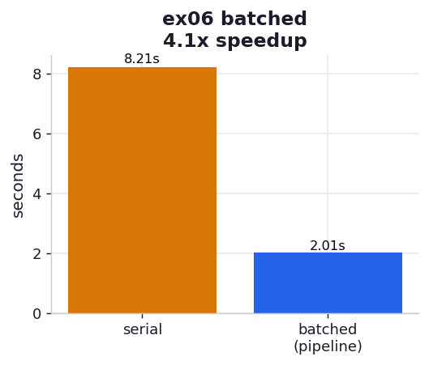

# ex06_batched_pipeline

The pragmatic middle path. Going fully async means refactoring your whole call chain into
coroutines; this exercise shows you can capture most of the win without that. Instead of saving
each result the instant it is computed, we queue results and flush them to the database in
concurrent bursts. When the queue reaches `batch_size`, an `AsyncBatcher` spins up a short-lived
event loop, fires all those saves at once, waits for them together, and lets the CPU loop
resume. This pattern is also called **pipelining**.

The surrounding program barely changes: you swap `save(result)` for `batcher.save(result)` and
wrap the loop in a context manager so the final partial batch flushes on exit.

## What it measures

120 bcrypt hashes at difficulty 8, batch size 100, saves to a 50 ms server:

| version | time | note |
| --- | ---: | --- |
| serial (ex05) | ~8.2 s | one 50 ms wait per hash |
| batched (this) | ~2.0 s | two flushes, ~100 saves each |
| **speedup** | **~4.2×** | with almost no structural change |

The book reports ~6.95× for this step. Ours is smaller, and the reason is instructive: the book
saves over a 100 ms link while we use 50 ms, so I/O is a smaller share of our total (77% vs.
85%) and there is simply less I/O to reclaim. The *technique* is identical; the *ceiling* is set
by how much of your runtime was I/O to begin with.

## What we found

**Batching amortizes the delay across the whole batch.** Serial pays 50 ms per result; batched
pays ~50 ms per *hundred* results, because the hundred saves in a flush all wait concurrently.
With 120 hashes that is two flushes, so the I/O contribution drops from ~6 s to ~0.1 s and the
runtime falls to roughly the CPU time plus a little. The general structure of the program is
untouched — exactly the property that makes pipelining the right *first* move before committing
to a fully async rewrite.

**The flush still stops the CPU — that is the catch ex07 fixes.** While a batch is flushing, the
CPU loop is paused; it does no hashing during the ~50 ms burst. Batching shrinks how *often* you
pay that pause (once per batch instead of once per result) but does not overlap the pause with
computation. ex07's fully async version does, which is why it edges this one out and why the gap
grows with more iterations.

**The batch size must match the server's throughput.** Our server handles 100 concurrent saves;
batching at 100 fits it. Batch far larger and the server queues the overflow, adding latency;
batch at 1 and you are back to serial. The book makes the same point — pipelining only helps to
the extent the downstream service can actually absorb the burst.

## Reading the chart



Two bars in seconds: the amber serial baseline (~8.2 s) and the blue batched run (~2.0 s). The
batched bar lands near the CPU-only floor because the I/O has been compressed into two quick
bursts. The title carries the measured speedup. Compare its height to ex07's "full async" bar —
they are close, because at this iteration count batching already hides most of the I/O.

## Run

```bash
.venv/bin/python chapter_9_asynchronous_io/ex06_batched_pipeline/ex06_batched_pipeline.py
```

## 5 Whys

1. **Why is batching ~4× faster than serial?** It pays one ~50 ms wait per batch of 100 saves
   instead of one per save, so the I/O contribution shrinks from ~6 s to ~0.1 s.
2. **Why can 100 saves share one wait?** The flush issues them concurrently into a temporary
   event loop and `await`s them together, so their 50 ms delays overlap rather than stack.
3. **Why only ~4× and not the book's ~6.95×?** Our save delay is 50 ms, not 100 ms, so I/O was
   a smaller fraction of the total to begin with — there was less to reclaim.
4. **Why does the CPU still stop during a flush?** The batcher runs the flush synchronously
   (`asyncio.run`) between hashes; the CPU loop is blocked until the burst completes.
5. **Why accept that pause at all?** Because it buys most of the speedup for almost none of the
   refactoring effort — a deliberate trade of a little performance for a lot of simplicity,
   ideal when you don't need the last ounce of speed.

**Root cause:** Pipelining batches independent I/O into concurrent bursts, amortizing the
per-request delay across the whole batch; it leaves the CPU briefly idle during each flush,
which is the one thing the fully async solution removes.
