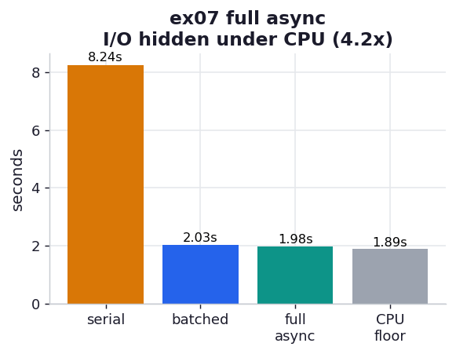

# ex07_full_async

The full solution: hide the I/O *inside* the CPU time so it nearly vanishes from the wall clock.
Batching (ex06) still stops the CPU dead during each flush. This version keeps one long-lived
`ClientSession` and, after each hash, creates a save task and then yields once with
`await asyncio.sleep(0)`. That yield is the whole trick — it gives the event loop a moment to
push the in-flight saves forward *while the next hash is being computed*. The I/O for hash N
overlaps the CPU work for hash N+1, so at steady state the I/O barely registers.

## What it measures

120 bcrypt hashes at difficulty 8, saves to a 50 ms server, against serial, batched, and the
pure-CPU floor:

| version | time | vs. full async |
| --- | ---: | --- |
| serial (ex05) | ~8.2 s | ~4.2× slower |
| batched (ex06) | ~2.0 s | ~1.02× slower |
| **full async (this)** | **~1.94 s** | — |
| CPU floor (no I/O) | ~1.86 s | I/O fully hidden would land here |

The full async run sits just ~0.08 s above the pure-CPU floor. That gap *is* the I/O cost — and
it is almost nothing. Practically all 120 saves happened underneath the hashing.

## What we found

**The I/O becomes nearly free.** The whole 6 s of serial I/O collapses into a ~0.08 s overhead
over the CPU-only time, because every save runs during a later hash's computation rather than in
a dedicated pause. This is the chapter's strongest result: overlapping CPU and I/O on one thread
recovers almost all of the wasted wait.

**At this scale, batched and full async nearly tie — and that is honest.** Both land near 2 s
because 120 iterations is small: batching's two flush-pauses cost little, so full async only
edges it (~1.02×). The book sees full async run its I/O ~2× faster than batched, and explicitly
notes the gap *widens with more iterations* — every batch flush loses a little CPU time that the
fully async version never gives up. Our near-tie is the small-N end of exactly that trend, not a
contradiction of it. Run 600 or 6,000 hashes and the full async version pulls ahead.

**`asyncio.sleep(0)` is load-bearing, not decoration.** Without it the CPU loop never awaits
anything real, so the saves all fire at the `TaskGroup` exit and the I/O is added back onto the
end instead of hidden. ex08 dissects exactly that.

## Reading the chart



Four bars in seconds: amber serial, blue batched, teal full async, grey CPU floor. The serial
bar towers; the other three cluster low. The point of the chart is the gap between the teal
"full async" bar and the grey "CPU floor" — they are nearly the same height, which means the I/O
has been almost entirely tucked under the computation.

## Run

```bash
.venv/bin/python chapter_9_asynchronous_io/ex07_full_async/ex07_full_async.py
```

## 5 Whys

1. **Why does full async land within 0.08 s of the CPU-only floor?** Each save runs concurrently
   during a later hash's computation, so the I/O overlaps the CPU instead of pausing it.
2. **Why does the overlap happen?** The `await asyncio.sleep(0)` after each hash yields to the
   event loop, which advances the pending save tasks before the next hash begins.
3. **Why doesn't it reach the floor exactly?** The event loop itself has overhead — scheduling,
   context switches, the final drain at `TaskGroup` exit — so a small residue of I/O cost
   remains.
4. **Why does it only tie batched here instead of beating it 2×?** With just 120 iterations,
   batching's two flush-pauses are cheap; the full async advantage compounds per flush avoided,
   so it shows up clearly only at larger iteration counts.
5. **Why not always go fully async, then?** It requires refactoring the entire call chain into
   coroutines and hand-placing yields; when batching already hides most of the I/O (small N, or
   I/O a minor share), that engineering cost may not be worth the last few percent.

**Root cause:** A single thread can overlap CPU and I/O if the CPU loop periodically yields, so
the fully async solution slides each save underneath later computation and reduces the I/O cost
to event-loop overhead — the closest you get to free I/O without a second process.
