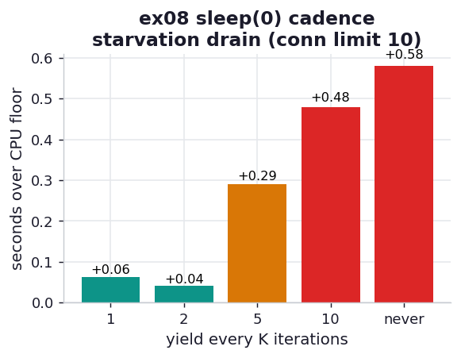

# ex08_sleep_zero

The one line that makes ex07 work, turned into a dial. ex07 dropped an
`await asyncio.sleep(0)` after every hash and got near-perfect CPU/I/O overlap. Here we vary how
*often* that yield happens — every iteration, every 2, every 5, every 10, and never — and watch
what each choice costs. `sleep(0)` doesn't actually sleep; it schedules a zero-delay wakeup and
suspends, forcing one trip through the event loop so pending I/O can advance.

To make the cost of *not* yielding visible, we deliberately constrain the "database" to a small
connection limit (10), so the queued saves drain in many waves rather than one. With a generous
limit the end-of-run drain is a single wave and the penalty hides in the noise — which is itself
the book's point that a low-throughput server erases the benefit of async.

## What it measures

120 hashes at difficulty 8, saves to a 50 ms server capped at 10 connections; runtime over the
pure-CPU floor (~1.85 s) for each yield cadence:

| yield cadence | time | over CPU floor |
| --- | ---: | ---: |
| every 1 | ~1.93 s | +0.08 s |
| every 2 | ~1.92 s | +0.07 s |
| every 5 | ~2.18 s | +0.32 s |
| every 10 | ~2.40 s | +0.55 s |
| **never** | **~2.50 s** | **+0.64 s** |

## What we found

**Yield too rarely and the I/O stacks onto the end.** With a 10-connection server, 120 saves
need 12 waves to drain. Yielding every iteration keeps those waves draining *during* the hashing,
so the overhead stays ~0.08 s. Yield only every 10 — or never — and the loop never gives the
saves enough turns; they pile up and drain at the `TaskGroup` exit, adding ~0.55–0.64 s of
sequential I/O that the CPU could have hidden. The never-yield case is the failure mode the
chapter warns about, reproduced cleanly: the I/O is *added back on* instead of overlapped.

**Yielding more often than necessary costs almost nothing here — but that is workload-specific.**
"Every 1" and "every 2" are within noise of each other, because each hash already takes ~16 ms,
so one extra context switch per ~16 ms of work is negligible. The book's advice to yield "every
50–100 ms of CPU work" rather than every iteration is aimed at *tight* inner loops, where the
per-iteration body is microseconds and a yield every pass would let scheduling overhead dwarf
the real work. Our loop is coarse enough that over-yielding is cheap; in a fine loop it would not
be. The general rule stands: yield often enough to keep I/O draining, not so often that
switching dominates.

## Reading the chart



Bars of *overhead over the CPU floor*, one per yield cadence, left (frequent) to right (never).
Colour grades the cost: green where the I/O is well hidden (+<0.15 s), amber as it slips, red for
the starved end. The bars climb left-to-right — the less often you yield, the more I/O drain
lands at the end. The flat green pair on the left (every 1, every 2) shows that over-yielding is
nearly free at this loop granularity.

## Run

```bash
.venv/bin/python chapter_9_asynchronous_io/ex08_sleep_zero/ex08_sleep_zero.py
```

## 5 Whys

1. **Why does never yielding add ~0.64 s?** With no `await`, the event loop never runs the queued
   saves until the `TaskGroup` exits, so all 12 drain waves happen at the end instead of under
   the hashing.
2. **Why does the loop need an explicit yield?** asyncio is cooperative: the loop can only switch
   tasks at an `await` boundary, and a CPU loop has no natural `await` to offer.
3. **Why is cooperative scheduling used instead of preemption?** Switching only at `await` points
   means code between two `await`s is race-free without locks — a deliberate simplification over
   preemptive threads.
4. **Why does `sleep(0)` work as the yield despite not sleeping?** It schedules a zero-delay
   callback and suspends the coroutine; the loop then runs all pending callbacks — the queued
   saves — before resuming, a pure yield with no wall-clock cost.
5. **Why yield every ~50–100 ms rather than every iteration in general?** Each yield is a real
   context switch; in a tight microsecond loop, yielding every pass would make scheduling
   overhead dwarf the work — though in this coarse 16-ms-per-hash loop the cost is negligible.

**Root cause:** Cooperative scheduling replaces the OS preemptor with the programmer's own
`await` rhythm, so in CPU-heavy code you must insert yields by hand; too few starves the I/O into
an end-of-run drain, too many wastes time switching, and the sweet spot tracks the I/O's drain
rate against the loop's CPU cost.
