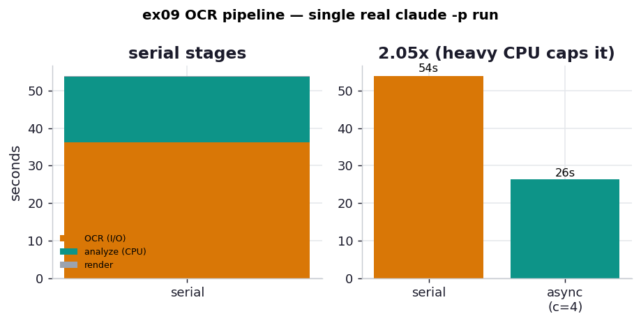

# ex09_ocr_pipeline

A real, three-stage CPU+I/O pipeline — the chapter's lesson taken off the synthetic delay-server
and onto an actual workload. Each page of a PDF (`sample.pdf`, a 34-page *React Best Practices*
book) flows through:

1. **render** (CPU) — rasterize the page to a PNG with `pypdfium2`; tens of milliseconds, holds
   the GIL.
2. **OCR** (I/O) — transcribe the image with a real `claude -p --model haiku` call; a separate
   process, **seconds** per page, during which the event loop is free.
3. **analyze** (CPU) — a deliberately heavy, pure-Python keyword-cluster analysis (all-pairs
   Levenshtein over a fixed vocabulary, finding near-duplicate terms); ~3 s per page, holds the
   GIL.

We run the whole thing two ways — strictly serial, and as an async pipeline that overlaps the
OCR calls — and compare against the serial baseline.

> **These numbers are single-run and nondeterministic.** The OCR stage is a live LLM call, so
> its latency depends on the model, the network, and the machine, and will differ every run. We
> capture one real run into `results.json` and build this README and the chart from it. The
> reproducible lesson is the *shape* — a heavy CPU stage caps how much an async pipeline can win,
> because asyncio overlaps I/O with I/O but cannot overlap CPU with CPU. The two hypotheses
> (`h01`, `h02`) pin that down.

## What it measures

6 pages, `claude -p --model haiku`, OCR concurrency 4 (one captured run):

| quantity | value |
| --- | ---: |
| serial total | 53.9 s |
| &nbsp;&nbsp;— OCR (I/O) | 36.2 s (67%) |
| &nbsp;&nbsp;— analyze (CPU) | 17.4 s (32%) |
| &nbsp;&nbsp;— render (CPU) | 0.33 s (1%) |
| async pipeline (c=4) | 26.3 s |
| **speedup** | **2.05×** |

The heavy analysis stage is the whole point of the design: with a trivial analysis the OCR was
99% of the time and any async pipeline got a near-linear speedup. With ~3 s of GIL-bound CPU per
page, I/O is only ~67% of the serial run, and the async speedup is capped at **2.05×** — not
because the OCR didn't overlap (it did), but because the CPU stages of different pages cannot run
at the same time under the GIL, and they block the event loop while they run.

## What we found

**Async overlaps the I/O but not the CPU.** The async pipeline keeps up to four `claude`
subprocesses in flight, so the 36 s of serial OCR collapses to roughly one or two waves. But the
17 s of analysis is pure Python: only one page's analysis can run at a time, and while it runs
the event loop is blocked, so it neither overlaps other analyses nor advances pending OCR. The
async total (~26 s) is therefore floored near "overlapped OCR + serial CPU," and the speedup
stalls at ~2×. This is the exact wall the book points at when it says you eventually need
`multiprocessing` — explored directly in [h02](../hypothesis/h02_gil_process_pool/).

**The pipeline still does real work.** Across the 6 pages the analysis extracted 164 words and
the document's top terms — *components, best, practices, component, smart, dumb* — a faithful
fingerprint of a book chapter on smart/dumb React components. The speed came from structure, not
from skipping work; both runs produced the same transcripts and stats.

## Reading the chart



Left: the serial bar broken into its stages — a tall amber OCR segment (I/O) with a substantial
teal analyze segment (CPU) stacked on it, making visible that CPU is now a real third of the
work, not a rounding error. Right: serial total vs. the async pipeline, with the async bar landing
a bit below half — the ~2× ceiling a single-threaded event loop hits once a heavy GIL-bound CPU
stage enters the pipeline.

## Run

```bash
# real capture (spends tokens; writes results.json)
.venv/bin/python chapter_9_asynchronous_io/ex09_ocr_pipeline/ex09_ocr_pipeline.py --pages 6 --concurrency 4
```

`--pages` goes up to 34; `--concurrency` sets how many OCR calls overlap. The visualizer reads
`results.json` and never calls the model itself, so regenerating the chart is free.

## 5 Whys

1. **Why is the async speedup only ~2× when OCR was 67% of the time?** Async overlaps the OCR
   I/O, but the remaining 32% is GIL-bound CPU that cannot overlap, so it becomes a hard floor.
2. **Why can't the CPU stages overlap?** They are pure Python; the GIL lets only one thread
   execute bytecode at a time, so two pages' analyses cannot run simultaneously in one process.
3. **Why does the CPU stage also slow the OCR?** While a coroutine runs ~3 s of analysis without
   awaiting, the event loop is blocked and cannot advance the other pages' pending OCR calls.
4. **Why not just yield more during analysis?** A pure-Python tight loop has no natural `await`;
   sprinkling `sleep(0)` helps the loop breathe but still runs the CPU work serially on one core
   — yielding shares the core, it does not add one.
5. **Why is multiprocessing the real fix?** Separate processes have separate GILs, so render and
   analyze can run truly in parallel on multiple cores while the event loop handles the OCR I/O —
   which is exactly what [h02](../hypothesis/h02_gil_process_pool/) tests.

**Root cause:** A single-threaded event loop hides I/O behind I/O, but a heavy pure-Python CPU
stage holds the GIL — so once CPU is a real share of the pipeline, async alone is floored by the
serial sum of that CPU work, and only multiple processes can push past it.
