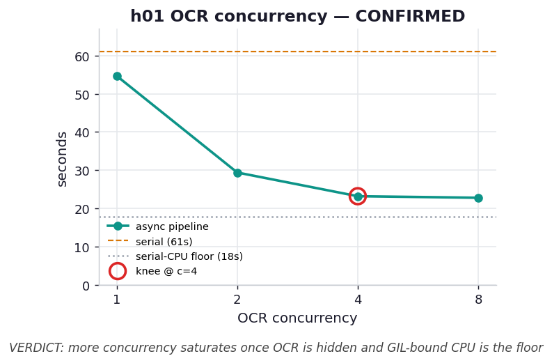

# h01 — Is there an optimal number of concurrent OCR calls?

**Hypothesis.** In the render→OCR→analyze pipeline (ex09), raising the OCR concurrency speeds
things up only until the *other* bottleneck takes over. Each page also carries a heavy,
GIL-holding CPU analysis (~3 s), so once enough OCR calls overlap to hide most of the I/O, the
serialized CPU work becomes the floor and more concurrency buys nothing. We predicted runtime
drops from serial, falls steeply through low concurrency, then flattens — ex03's diminishing
returns, but with the plateau set by **CPU contention** rather than event-loop dispatch.

**Predicted outcome.** Time decreases with concurrency up to a knee (around where overlapped OCR
≈ total serial CPU), then plateaus; it does *not* keep falling toward `OCR_per_page`, because the
CPU stages cannot overlap under the GIL.

> Single-run, nondeterministic numbers — the OCR stage is a live `claude -p --model haiku` call.
> The claim is the *shape* (a knee, then a plateau), not the exact seconds.

## What we measured

6 pages of `sample.pdf`, one captured run:

| configuration | total | vs. serial |
| --- | ---: | ---: |
| serial | 61.0 s | 1.0× |
| async c=1 | 54.7 s | 1.12× |
| async c=2 | 29.4 s | 2.07× |
| async c=4 | 23.2 s | 2.63× |
| async c=8 | 22.8 s | 2.68× |
| *serial-CPU floor* | *17.9 s* | *(the asymptote)* |

## Verdict: CONFIRMED

The curve does exactly what the hypothesis said. Doubling concurrency from 1 to 2 to 4 nearly
halves the time twice over, but from **4 to 8 it barely moves** (23.2 s → 22.8 s) — and the
plateau sits just above the **17.9 s serial-CPU floor**, not down near a single OCR call. Once
four OCR subprocesses overlap, essentially all the I/O is already hidden behind other I/O; what
remains is ~18 s of pure-Python analysis that can only run one page at a time under the GIL.
Adding a fifth, sixth, or eighth concurrent OCR call cannot speed that up, because the bottleneck
is no longer the network — it is a single CPU core executing Python bytecode.

This is the same knee-shaped story as ex03, with a different cause. In ex03 the ceiling was the
event loop's own dispatch throughput; here it is the serialized CPU stage. The practical rule is
identical: pick a modest concurrency at the knee (here 4) and stop — beyond it you pay
coordination overhead for no gain. To push the floor itself *down*, you have to attack the CPU,
which is what [h02](../h02_gil_process_pool/) does.

## Reading the chart



Total seconds vs. OCR concurrency (log-2 x-axis). The teal curve plunges from c=1 to c=4, then
flattens. The amber dashed line is the serial baseline (61 s); the grey dotted line is the
serial-CPU sum (18 s) — the asymptote the curve bends toward but cannot cross. The red ring marks
the knee at c=4, the last concurrency that still earns its keep.

## Reproduce

```bash
# real capture (spends tokens; writes results.json)
.venv/bin/python chapter_9_asynchronous_io/hypothesis/h01_ocr_concurrency/benchmark.py --pages 6
# redraw the chart from the captured results (free)
.venv/bin/python chapter_9_asynchronous_io/hypothesis/h01_ocr_concurrency/benchmark.py --plot
```

## 5 Whys

1. **Why does runtime stop dropping past c=4?** By then the overlapped OCR is shorter than the
   serial CPU sum, so the CPU stage — not the I/O — sets the total.
2. **Why is the CPU stage serial?** The analysis is pure Python; the GIL admits one bytecode
   thread at a time, so different pages' analyses cannot run together in one process.
3. **Why doesn't more OCR concurrency help the CPU?** OCR concurrency only overlaps *I/O* waits;
   it does nothing for CPU work, which is already the binding constraint.
4. **Why does the plateau sit above the CPU floor, not on it?** Some OCR wait and event-loop
   overhead remain on top of the serialized CPU, and the CPU stage occasionally blocks the loop
   from advancing OCR.
5. **Why is a modest concurrency the right default?** It reaches the knee where I/O is hidden,
   while avoiding the coordination cost and downstream-rate-limit risk of opening more
   connections that cannot speed up a CPU-bound floor.

**Root cause:** Concurrency hides I/O behind I/O, so it only pays until the I/O is hidden; past
that, a GIL-serialized CPU stage is the floor, and no amount of OCR concurrency can lower it.
