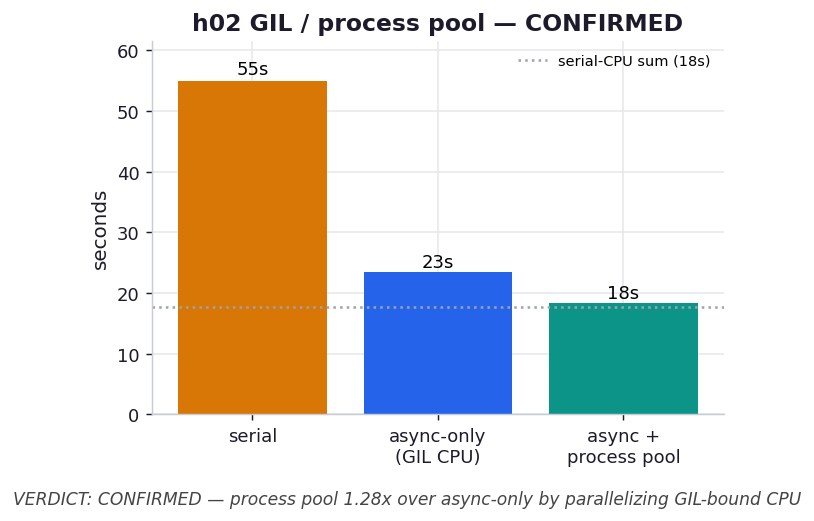

# h02 — Does a process pool help once the CPU stages are heavy? (The GIL question.)

**Hypothesis.** Pure asyncio overlaps each page's OCR I/O with other pages' work, but it cannot
overlap the two **CPU** stages (render, analyze) of different pages, because pure-Python code
holds the GIL — only one coroutine's CPU work runs at a time, and while it runs the event loop is
blocked. So when the CPU stages are heavy (~3 s of GIL-bound edit-distance analysis per page),
async-only is floored by the *sum* of all CPU work. Offloading render+analyze to a
`ProcessPoolExecutor` runs them in separate interpreters with their own GILs, truly in parallel,
while the event loop stays free to juggle the OCR subprocesses.

**Predicted outcome (CONFIRMED).** async + process pool beats async-only by roughly the CPU work
it parallelizes; both beat serial. This is the concrete reason the book says you eventually need
`multiprocessing`: asyncio hides I/O behind I/O, but not CPU behind CPU.

> Single-run, nondeterministic numbers (live `claude -p`). The *ordering* is the claim.

## What we measured

6 pages, OCR concurrency 4, 4 CPU worker processes, one captured run:

| configuration | total | vs. serial |
| --- | ---: | ---: |
| serial | 54.9 s | 1.0× |
| async-only (GIL CPU) | 23.4 s | 2.35× |
| async + process pool | 18.3 s | 3.00× |
| *serial-CPU sum* | *17.8 s* | |

Process pool vs. async-only: **1.28×**.

## Verdict: CONFIRMED

Async-only lands at 23.4 s — and h01 already showed that is a floor it cannot beat, because
~18 s of analysis runs one page at a time under the GIL. Move that analysis (and the render) into
a four-process pool and the time drops to **18.3 s**, a 1.28× gain over async-only and 3.0× over
serial. The pooled run sits right on the **17.8 s serial-CPU sum**, which is the tell: the CPU
work is now running in parallel across four cores (so it is no longer the sum but ~sum/4), and
what remains on the critical path is the overlapped OCR plus pool overhead. The event loop, freed
of the GIL-bound analysis, juggles the OCR subprocesses without being blocked.

This is the honest, important caveat to the whole chapter. Chapters 1–9 sell asyncio as the way
to reclaim I/O wait, and it is — but only for the I/O. The moment a real CPU stage enters the
pipeline, a single-threaded event loop is capped by that stage's serial cost, and the way past it
is a second mechanism: multiple processes, each with its own GIL, which is precisely what
Chapter 10 is about. asyncio and multiprocessing are not competitors here; they compose — asyncio
for the OCR I/O, a process pool for the CPU.

A fair note on the size of the win: 1.28× is real but modest, because OCR I/O is still the larger
share (~37 s of work overlapped into ~13 s) and the pool adds pickling and process-startup
overhead. Crank the analysis heavier (raise `CPU_ROUNDS`) and the gap widens; make it trivial and
the pool's overhead would make it a *loss* — which is the same "know your workload" lesson the
serial CPU+I/O exercise (ex05) opened with.

## Reading the chart



Three bars: serial (55 s, amber), async-only (23 s, blue), async + process pool (18 s, teal). The
grey dotted line is the serial-CPU sum (18 s). Async-only stalls well above it — held up by
serial CPU — while the pooled bar reaches it, because the CPU has been spread across processes and
only the overlapped OCR remains.

## Reproduce

```bash
# real capture (spends tokens; writes results.json)
.venv/bin/python chapter_9_asynchronous_io/hypothesis/h02_gil_process_pool/benchmark.py --pages 6
# redraw the chart from the captured results (free)
.venv/bin/python chapter_9_asynchronous_io/hypothesis/h02_gil_process_pool/benchmark.py --plot
```

## 5 Whys

1. **Why does the process pool beat async-only?** It runs the GIL-bound render/analyze in
   separate interpreters, so different pages' CPU work executes in parallel instead of serially.
2. **Why can't async-only parallelize that CPU?** One process has one GIL; asyncio is cooperative
   concurrency on a single thread, so CPU work never runs two pages at once.
3. **Why does the pooled run land on the serial-CPU sum line?** With CPU now ~sum/4 and OCR
   overlapped, the critical path is roughly the larger of those two plus overhead — here close to
   the (now-parallel) CPU plus the overlapped OCR.
4. **Why is the win only 1.28×?** OCR I/O is still the bigger share and the pool adds pickling and
   process-startup cost; the CPU it parallelizes is a third of the work, so Amdahl caps the gain.
5. **Why does this matter for the chapter?** It marks the boundary of asyncio: it reclaims I/O
   wait but cannot reclaim CPU time on one core — past that you need the multiple processes of
   Chapter 10.

**Root cause:** The GIL serializes pure-Python CPU work within a process, so a single-threaded
event loop can hide I/O but not CPU; spreading the CPU stages across processes is the only way to
lower the CPU floor, which is why heavy CPU+I/O pipelines need asyncio *and* multiprocessing
together.
