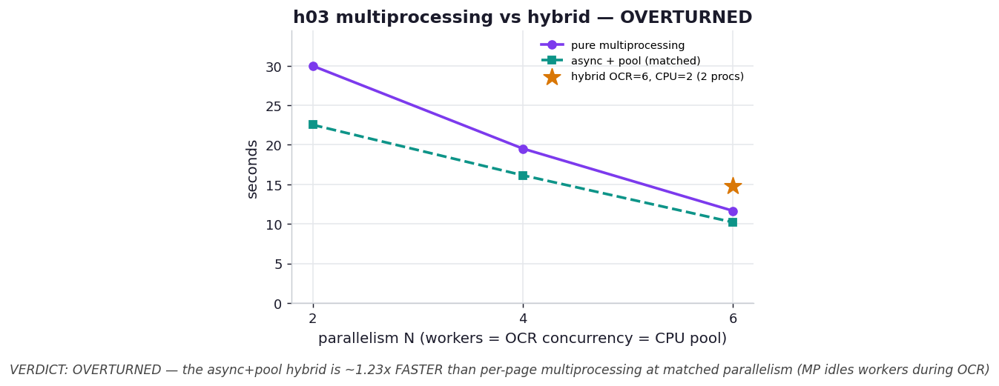

# h03 — Would pure multiprocessing beat the async+pool hybrid?

**The question.** h02 added a process pool to the async pipeline to break the GIL-bound CPU
floor. But the pages are completely independent — so why use asyncio at all? Just hand each page
(render + blocking OCR + analyze) to its own worker process with `ProcessPoolExecutor.map`. It is
simpler. Is it faster?

**Hypothesis (what I predicted).** At *matched parallelism*, pure multiprocessing would roughly
**tie** the async+pool hybrid — both bounded by the same max(overlapped OCR, CPU / workers) — and
the hybrid's only edge would be using fewer processes (its OCR concurrency comes from coroutines,
not processes).

> Real `claude -p` per page per config — single-run, nondeterministic. The ordering is the claim.

## What we measured

6 pages, one captured run. "N" sets workers = OCR concurrency = CPU pool size for both:

| N (matched) | pure multiprocessing | async + pool hybrid | hybrid speedup |
| ---: | ---: | ---: | ---: |
| 2 | 30.0 s | 22.5 s | **1.33×** |
| 4 | 19.5 s | 16.2 s | **1.21×** |
| 6 | 11.7 s | 10.2 s | **1.14×** |
| | *serial baseline: 56.4 s* | | |

Decoupled efficiency point: hybrid with **OCR=6 but only 2 CPU workers** → 14.8 s, vs.
pure-MP with **6 processes** → 11.7 s.

## Verdict: OVERTURNED — and in the more interesting direction

My prediction of a tie was wrong. The hybrid is **consistently faster** than pure multiprocessing
at matched parallelism — by 14% to 33%, averaging **~1.23×** — not tied. The reason is the
chapter's entire thesis, showing up as a structural difference:

**Pure per-page multiprocessing cannot overlap I/O with CPU; the hybrid can.** In pure-MP, a
worker runs one page start to finish: render → block ~7 s on `claude` (CPU idle the whole time) →
~3 s of analysis. Within that worker, the OCR wait and the CPU work are strictly sequential, and
they stay sequential across every page that worker handles. With N=2 and 6 pages, each worker
spends ~21 s waiting on OCR *and* ~9 s computing, back to back, for ~30 s.

The hybrid breaks that coupling. The event loop keeps N OCR calls in flight while the process
pool chews through the analyses of pages whose OCR already returned — so the ~9 s of CPU is
hidden *underneath* the ~21 s of OCR wait instead of tacked after it. That is exactly "overlap CPU
and I/O," the thing ex07 taught, and naive per-page multiprocessing throws it away by making each
worker do both stages in sequence. The gap is widest at low N (1.33× at N=2), where each worker
serializes the most pages, and narrows as N rises and there are fewer pages per worker to
serialize (1.14× at N=6).

**The decoupling is real but not free when CPU is heavy.** The hybrid can run 6-way OCR with only
2 CPU workers — a third of the processes pure-MP needs for 6-way OCR. But here it costs time:
14.8 s vs. pure-MP(6)'s 11.7 s, because with the analysis this heavy, two CPU workers (~9 s of
serial-ish CPU) become the floor. Decoupling I/O concurrency from CPU parallelism pays off most
when the CPU stage is *light* relative to the I/O — then you get the high I/O concurrency for
almost no processes. When CPU is heavy, you still want a core-sized pool.

**Honest correction to my back-of-envelope.** While answering "would multiprocessing speed it
up?" I ran a quick scratch test where pure-MP with 6 workers (10 s) beat the hybrid with 4 (18 s)
— but that compared *6 processes to 4*. At matched worker count, the hybrid wins. The earlier
number was a parallelism mismatch, not a paradigm win; this experiment is the controlled version.

## Reading the chart



Seconds vs. matched parallelism N. The violet line (pure multiprocessing) sits **above** the teal
dashed line (hybrid) at every N — the hybrid is faster throughout, the gap shrinking as N grows.
The amber star is the decoupled hybrid (OCR=6, CPU=2): it lands above the hybrid line at N=6,
slower than pure-MP(6) in time but using 2 worker processes instead of 6.

## Reproduce

```bash
.venv/bin/python chapter_9_asynchronous_io/hypothesis/h03_multiprocessing_vs_hybrid/benchmark.py --pages 6
.venv/bin/python chapter_9_asynchronous_io/hypothesis/h03_multiprocessing_vs_hybrid/benchmark.py --plot
```

## 5 Whys

1. **Why is the hybrid faster than pure multiprocessing at matched N?** Pure-MP runs each page's
   OCR and analysis sequentially in one worker; the hybrid overlaps OCR I/O with CPU across pages.
2. **Why can't pure-MP overlap them?** Its unit of work is a whole page, so a worker blocks on the
   ~7 s OCR with the CPU idle, then does the analysis — never both at once.
3. **Why does the hybrid avoid that idle?** Coroutines hold the OCR waits cheaply on one thread
   while the process pool runs analyses of already-OCR'd pages, so the CPU work fills the I/O wait.
4. **Why does the advantage shrink as N rises?** With more workers there are fewer pages per
   worker to serialize, so pure-MP wastes proportionally less time blocked — at N=6 each worker
   handles one page and there's little sequencing left to lose.
5. **Why is the decoupled hybrid (6,2) slower despite fewer processes?** With heavy CPU, two
   workers can't keep up; the analysis becomes the floor. Decoupling helps most when CPU is light.

**Root cause:** Multiprocessing-per-page parallelizes *across* pages but serializes I/O and CPU
*within* each page, discarding the overlap that is the whole point of async; the async+pool hybrid
keeps that overlap and adds CPU parallelism, so it is both faster at matched parallelism and more
flexible in how it spends processes.
